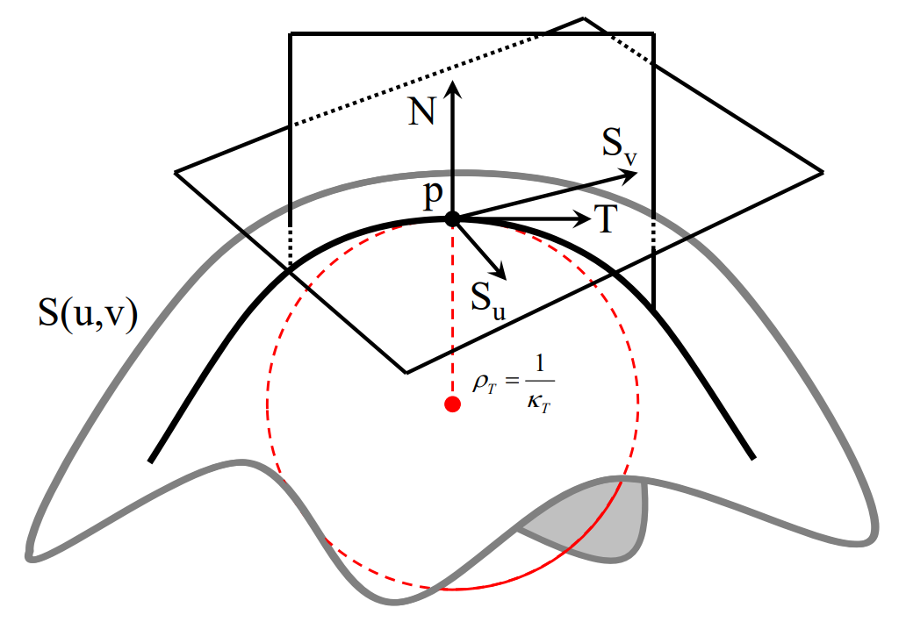
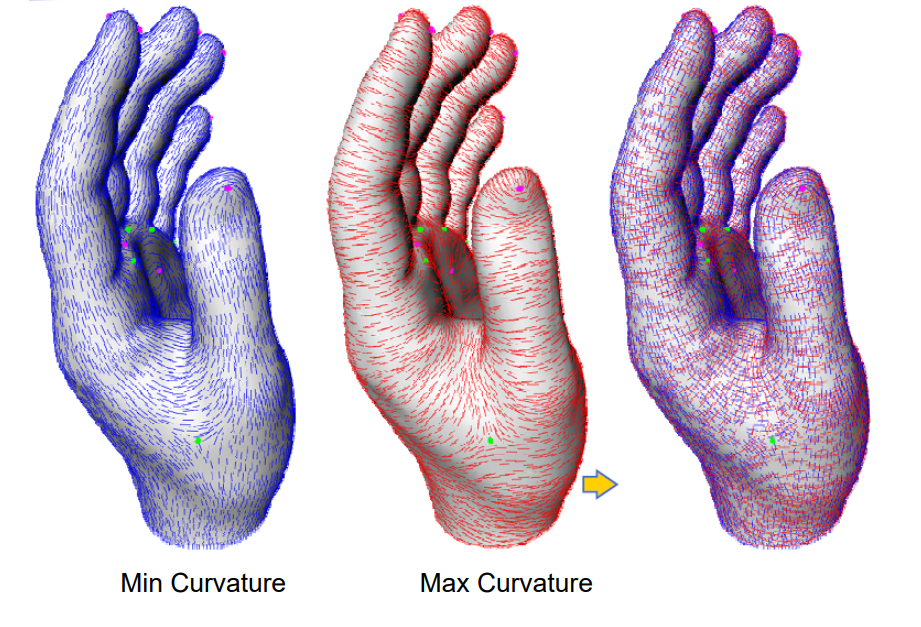
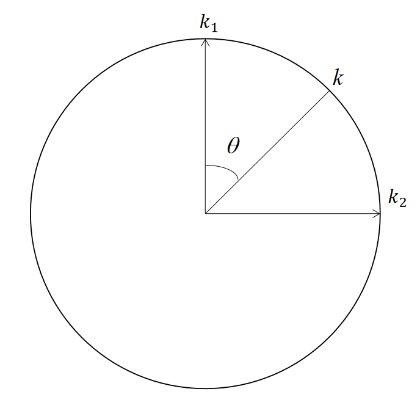
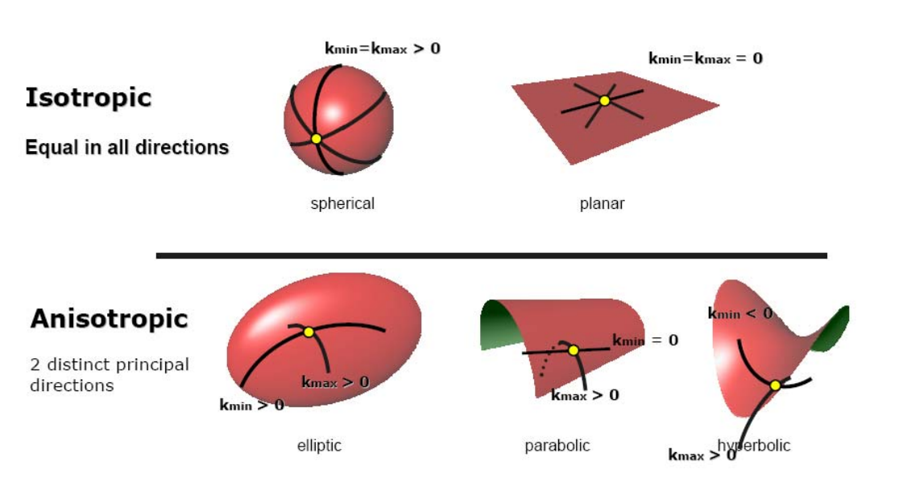
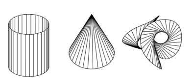
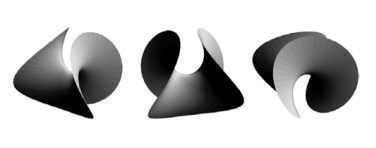
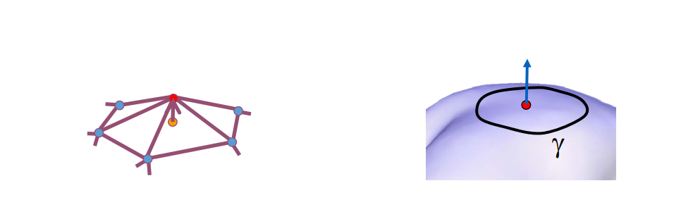

# 曲面的微分几何    

  

## Point p

Point p on the surface at \\((u_0,v_0)\\)     

## Tangent \\(S_u\\)

Tangent \\(S_u\\) in the u direction      

$$
S_u=\frac{\partial S(u,v)}{\partial u}
$$     

## Tangent \\(S_v\\)

Tangent \\(S_v\\) in the v direction     

$$
S_v=\frac{\partial S(u,v)}{\partial v}
$$

## Plane of tangents T    

$$
T=uS_u+vS_v
$$

> \\(S_u 和 S_v\\) 张成一个平面，称为切平面。     

## Normal N    

$$
N=\frac{S_u\times S_v}{||S_u\times S_v||}
$$

## Curvature

方向曲率：曲率是随着方向变化的    

> N 所在平面与曲面相交，得到平面曲线，有对应的曲率空间曲面的切线和曲率都是基于特定方向的。    

# 曲面的曲率   

## 主曲率 Principal Directions   

两个方向（正交）曲率：最大曲率\\(𝜅_1\\)和最小曲率\\(𝜅_2\\)     

其他方向曲率：  

$$
k=k_1\cos ^2\theta +k_2\sin ^2\theta
$$

> \\(\theta \\)是当前曲率方向与\\(K_1\\)方向的夹角。   

  
  

## 高斯曲率     

$$
k=k_1k_2
$$

等距变换不变量：曲面发生变形，但曲面上任意两点间距离不变。   

可展曲面：处处高斯曲率为0的曲面。其展开为平面时不会发生变形。  
有三类可展曲面：柱面、锥面、切线面      

  

> 切线面：任意空间曲线的所有切线构成的面。     

## 平均曲率    

$$
k=\frac{k_1+k_2}{2}
$$

处处平均曲率为0的曲面：**极小曲面**      

  

# 平均曲率流定理   
    

$$
\delta _i=\frac{1}{d_i} \sum _{\nu\in N(i)}(\nu_i-\nu)
$$

$$
\frac{1}{len(\gamma )} \int _{\nu\in \gamma }(\nu_i-\nu)ds
$$

$$
\lim_{len(\gamma ) \to 0} \frac{1}{len(\gamma )} \int _{\nu\in \gamma }(\nu_i-\nu)ds=H(\nu_i)n_i
$$

\\(\gamma \\)代表红点的邻域外围封闭曲线。    
\\(V_i 是红点， V是\gamma \\)上的点。    
\\( len(\gamma) \\)代表曲线长度。    
\\(H(V_i)为 V_i\\) 的平均曲率。     

当曲线长度趋于0，其极限是一个常值。常值的方向为法向，大小为平均曲率。  

本文出自CaterpillarStudyGroup，转载请注明出处。
https://caterpillarstudygroup.github.io/GAMES102_mdbook/  
