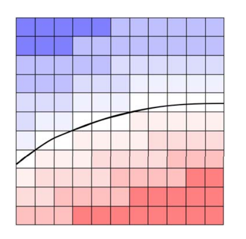
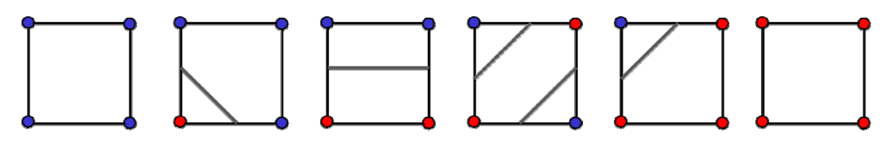
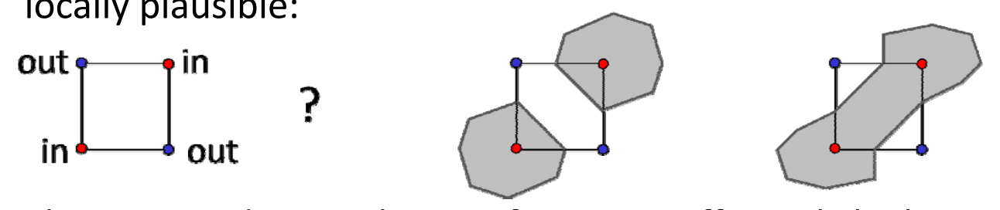
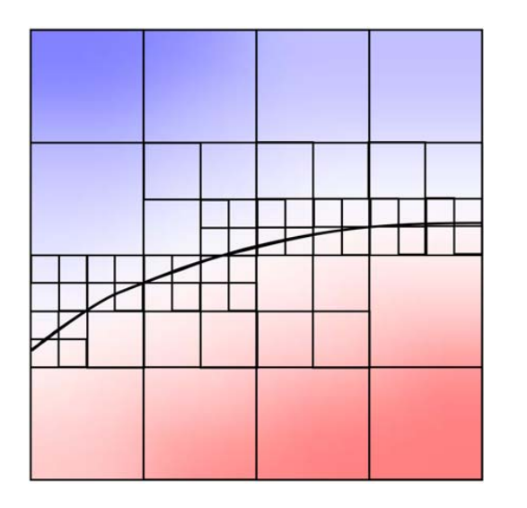

# 隐式曲线的绘制   

输入：一个二元隐式函数\\(z=f(x,y)\\)     
输出：值为\\(0(或a)\\)的等值线\\(z=0\\)（或\\(z-a=0\\)）    

目的：     
• 将隐式曲线转化为参数形式、离散曲线（多边形）形式     
• 绘制曲线    

# Marching Cubes算法 [Siggraph1987]    

隐式曲线绘制的最常用方法，网上能找到很多开源实现代码    

## 思想（2D: Marching Squares）    

• 在一些离散格子点上求值     
• 然后利用局部连续性插值出值为0的点     
• 按一定的顺序连接这些点形成离散曲线    

    

    

> 当格子点足够密，曲线性质基本上符合格子性质。 

## 歧义情况   

In some cases, different topologies are possible which are all locally plausible:      

 

解决方法：  
1.This is an undersampling artifact，可通过提高分辨率（加密）解决      
2.判断函数导数

# Adaptive / hierarchical grids

Perform a quadtree / octree tessellation of the domain (or any other partition into elements)     
Refine **where more precision is necessary** (near surface, maybe curvature dependent)      
Associate basis functions with each cell (constant or higher order)     

 

本文出自CaterpillarStudyGroup，转载请注明出处。
https://caterpillarstudygroup.github.io/GAMES102_mdbook/
