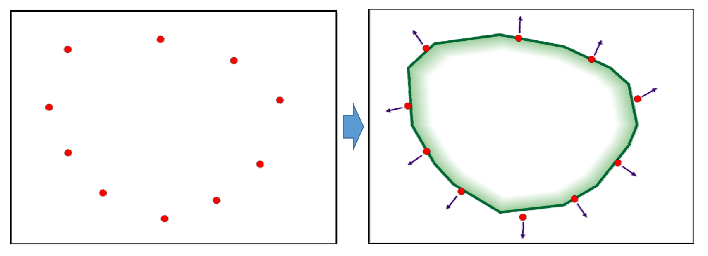
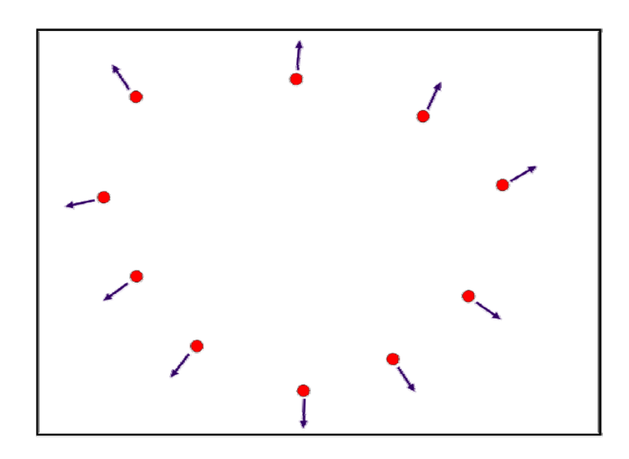
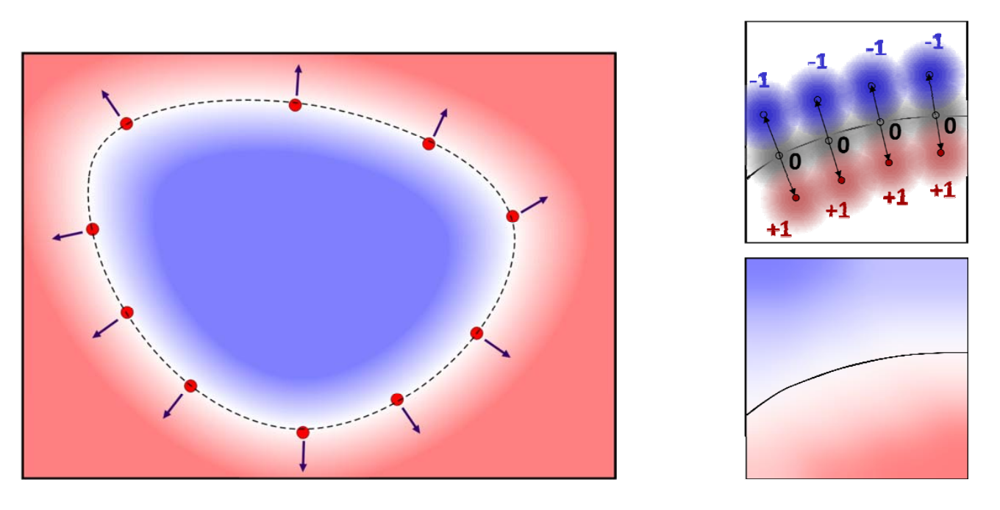
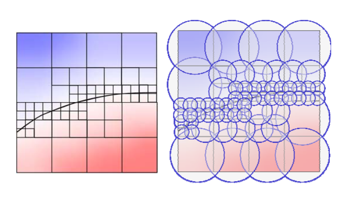

# 隐式曲线的拟合问题   

输入：平面上的一些点（**设采样自封闭曲线**），一般还需给定或估计点的法向信息       
输出：拟合这些点的一个隐式函数，该隐式函数所表达的曲线就是拟合曲线       

    

> 假设输入点是无序的，因此无法用细分方法     
基本思想：  
> 1. 根据已知点设计隐式曲线应满足的约束。使如：
$$
f(x)=0,f(x+n)=1,f(x-n)=-1
$$     
也可以根据先验知识构造其它约束，约束越多，拟合越好。 
> 1. 根据约束进行拟合或插值。     

# 拟合问题的求解步骤    

## 1. 估计法向

利用邻近点来估计切平面   

    

## 2. 拟合一个二元函数

在型值点上值为0，外部（法向方向的点）为正，内部为负    

    

# 隐式函数构造方法   

• Blobby molecules    
• Metaball     
• RBF based method     
• Multi‐level partition of unity implicits (MPU)  
> 自适应的RBF  
   
• Poisson reconstruction method  
> 不仅拟合点，还拟合点的梯度  
   
• Screened Poisson method     
• …       
    

> 图1是 MDU,图2是 Melaball   