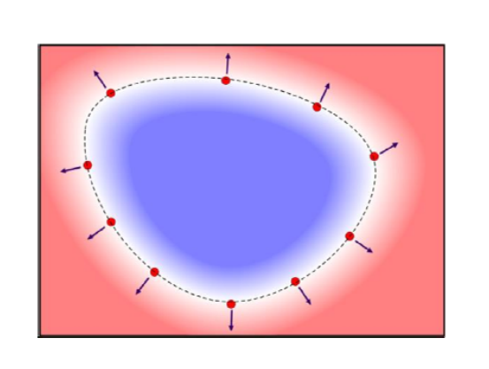
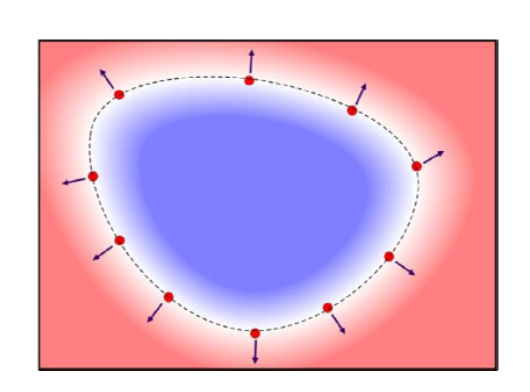

# 隐式函数    

* 自变量\\(x\\)和应变量\\(y\\)的关系非显式关系，是一个隐式的关系（代数方程）：  

$$
f(x,y)=0
$$

* 比如：     
• \\(𝑎𝑥+𝑏𝑦+𝑐=0\\)    
• \\(𝑥^2+𝑦^2=1\\)   
• \\(𝑦^2=𝑥^3+𝑎𝑥+𝑏\\)   
• \\(𝑥𝑦^2+ln(𝑥 \\) \\(sin𝑦-𝑒^{y-\sqrt{x} })=\cos (x-\sqrt{x^3-2y} )\\)

> 所有满足该代数方程的点的轨迹是条曲线  

# 隐函数定理   

Implicit Function Theorem:     
• Given a **differentiable** function     

$$
𝑓:ℝ^n ⊇ 𝐷 → ℝ, 𝑓(𝒙^{(0)})=0,\frac{\partial }{\partial x_n} f(x^{(0)})=\frac{\partial }{\partial x_n} f(x_1^{(0)},\cdots ,x_n^{(0)})\ne 0
$$

• Within an 𝜀‐neighborhood of\\( 𝒙^{(0)}\\) we can represent the
zero level set of 𝑓 completely as a heightfield function \\(𝑔 𝑔:ℝ^{(n-1)} → ℝ\\) such that for  \\(𝒙-𝒙^{(0)}<𝜀 \\) we have:     

$$
f(x_1,…,x_{n-1},g(x_1,…,x_{n-1}))=0 
$$

and   

\\(f(x_1,…,x_{n})\ne 0 \\) everywhere else     
• The heightfield is a diffrentiable \\((𝑛 -1)\\)‐manifold and
its surface normal is the colinear to the gradient of 𝑓.     

# 隐式曲线    

• 将隐函数升高一维，看成是\\(x\\)和\\(y\\)的二元函数    
\\(z=f(x,y), \\)     
\\(x,y\in [a,b]\times [c,d]\\)

• 则该隐式曲线为上述二元函数的0等值线（平面\\(z=0\\)与\\(z=f(x,y)\\)的交线）   

$$
f(x,y)=0
$$
• \\(f(x,y)=0\\), 曲线上；    
• \\(f(x,y)<0\\), 曲线的左侧（内部）；    
• \\(f(x,y)>0\\), 曲线的右侧（外部）；   

 

# 隐式函数表达    

 - 已知一条封闭曲线，如何构造隐式函数表达？     
    - General case     
      - Non‐zero gradient at zero crossings     
      - Otherwise arbitrary     
    - Signed implicit function:    
      - sign (𝑓): negative inside and positive outside the object (or the other way round, but we assume this orientation- here)
    - Signed distance field (SDF)    
      - |𝑓|= distance to the surface    
      - sign(𝑓): negative inside, positive outside    
    - Squared distance function    
      - 𝑓 = \\((distance to the surface)^2\\)   

 

# Differential Properties   

  - Some useful differential properties:       
     - We look at a surface point 𝒙, i.e.\\( 𝑓(𝒙)=0\\).      
      - We assume \\(𝛻𝑓(𝒙)\ne 0\\).     
    - The unit normal of the implicit surface is given by:    
 \\( 𝑛(𝒙)=\frac{\nabla  f(x) }{||\nabla f(x)|| } \\)
       - For signed functions, the normal is pointing outward      
       - For signed distance functions, this simplifies to 𝒏(𝒙)=𝛻𝑓(𝒙)     

# Differential Properties   

  - Some useful differential properties:
    - The mean curvature of the surface is proportional to the divergence of the unit normal:   
\\(-2𝐻(𝒙)=𝛻⋅𝒏(𝒙)=\frac{𝜕}{𝜕𝑥} n_x(x)+\frac{𝜕}{𝜕y}ny(x)+\frac{𝜕}{𝜕z}n_z(x)\\)
\\(=𝛻 ⋅\frac{𝛻𝑓(𝒙)}{||𝛻𝑓(𝒙)||} \\)

    - For a signed distance function, the formula simplifies to:     

$$
-2𝐻(𝒙)=𝛻 ⋅ 𝛻𝑓(𝑥)=\frac{𝜕^2}{𝜕𝑥^2} f(x)+\frac{𝜕^2}{𝜕y^2}f(x)+\frac{𝜕^2}{𝜕z^2}f(x)=𝛻𝑓(𝑥)
$$

