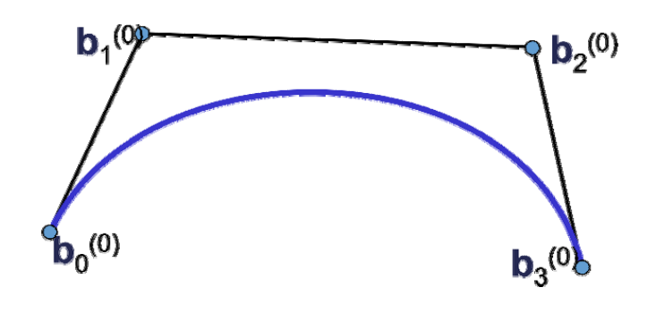
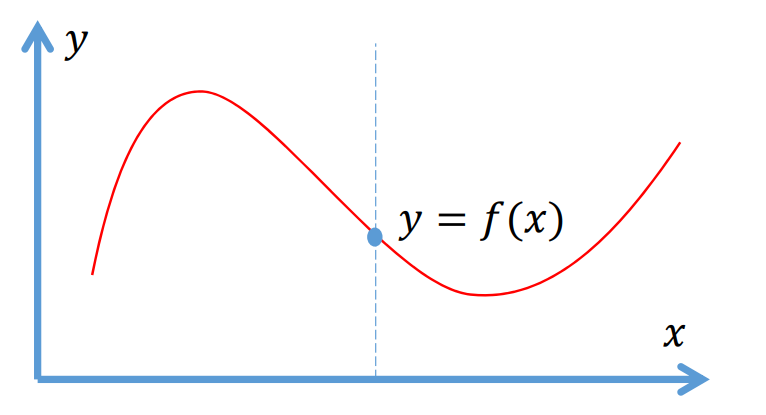
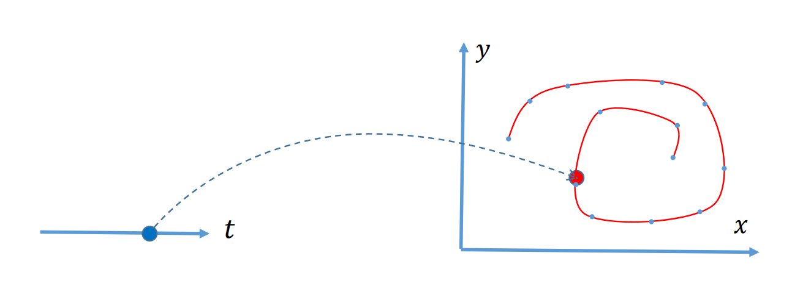

# 隐式曲线   

# 回顾：参数曲线   

• 曲线定义在一个单参数\\(t\\)的区间上，有\\(t\\)上的基函数来线性组合控制顶点来定义    

$$
x(t)=\sum_{i=0}^{n} B^n_i(t)b_i
$$

 

> 曲线的性质来源于**基函数**的性质

# 回顾：平面曲线的定义方法  
 - 显式函数
   $$
   f:R^1\longrightarrow R^1
   $$
 
   $$
    y=f(x)
   $$

     - 点\\((𝑥,𝑓(𝑥)),𝑥∈[a,b]\\)的轨迹     

       
 - 参数曲线   
   \\(p:R^1\longrightarrow R^2\\)      
   \\(x=x(t)\\)    
   \\(y=y(t)\\)     
     - 点\\((𝑥(𝑡),𝑦(𝑡)),𝑡∈[𝑎,𝑏]\\)的轨迹    

    
