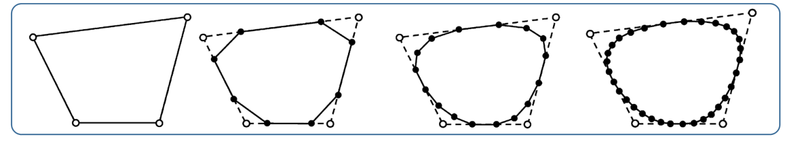

# 隐式曲线   

# 回顾：参数曲线   

曲线定义在一个单参数\\(t\\)的区间上，有\\(t\\)上的基函数来线性组合控制顶点来定义    

$$
x(t)=\sum_{i=0}^{n} B^n_i(t)b_i
$$

 

> 曲线的性质来源于**基函数**的性质

# 回顾：平面曲线的定义方法  

## 显式函数

$$
f:R^1\longrightarrow R^1
$$

$$
y=f(x)
$$

    
> &#x1F446; 点\\((𝑥,𝑓(𝑥)),𝑥∈[a,b]\\)的轨迹     

## 参数曲线   

\\(p:R^1\longrightarrow R^2\\)      
\\(x=x(t)\\)    
\\(y=y(t)\\)     

 
> &#x1F446; 点\\((𝑥(𝑡),𝑦(𝑡)),𝑡∈[𝑎,𝑏]\\)的轨迹    

## 隐式函数    

自变量\\(x\\)和应变量\\(y\\)的关系非显式关系，是一个隐式的关系（代数方程）：  

$$
f(x,y)=0
$$

比如：     
• \\(𝑎𝑥+𝑏𝑦+𝑐=0\\)    
• \\(𝑥^2+𝑦^2=1\\)   
• \\(𝑦^2=𝑥^3+𝑎𝑥+𝑏\\)   
• \\(𝑥𝑦^2+\ln(𝑥 \\) \\(\sin 𝑦-𝑒^{y-\sqrt{x} })=\cos (x-\sqrt{x^3-2y} )\\)

> 所有满足该代数方程的点的轨迹是条曲线  

    

## 细分曲线      

    

> 前三种是连续表达，第四种是线段表达。    
连续表达在数学上容易表达。但在应用上有局限。   

本文出自CaterpillarStudyGroup，转载请注明出处。
<https://caterpillarstudygroup.github.io/GAMES102_mdbook/>

