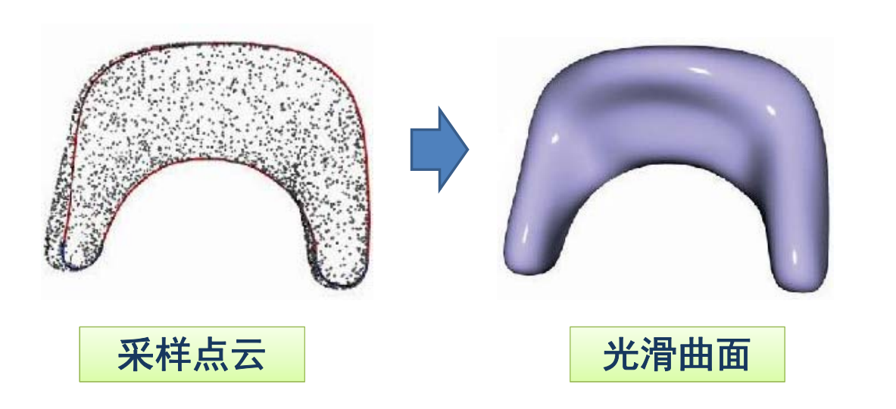

# 问题：如何求满足要求的函数？

• 大部分的实际应用问题  
– 可建模为：找一个映射/变换/函数  
– 输入不一样、变量不一样、维数不一样  
• 如何找函数的三步曲：  
– ___到哪找___？  
• 确定某个函数集合/空间  
– ___找哪个___？  
• **度量**哪个函数是好的/“最好”的  
– ___怎么找___？  
• 求解或优化：不同的优化方法与技巧，既要快、又要好…  
• 【注】这里先暂时限定为单变量的函数形式  

> &#x1F50E; [51：11]  
> &#x2705; 大部分的实际问题可建模为：找一个映射/变换/函数  

  

# 曲线/曲面拟合问题

• 输入：一些型值（采样）点集  
• 输出：一条拟合这些点集的曲线/曲面  
 

# 数据拟合  

## 拟合(Fitting)问题 

• 输入：一些观察的数据点  
• 输出：**反映这些数据规律的函数**\\(y=f(x)\\)   

> &#x1F50E; [55：12]

## 1. 到哪找？

- **选择一个函数空间**  
– 线性函数空间\\(A=span(B_{0}(x), \ldots, B_{n}(x))\\)  
- 多项式函数 \\(span  (1, x, x^{2}, \ldots, x^{n})\\)  
- \\(RBF\\)函数
- 三角函数

- **函数表达为**

$$
-f(x)=\sum_{k=0}^{n} a_{k} B_{k}(x) 
$$  

– 求\\(n+1\\)个系数\\((a_{0}, \ldots, a_{n})\\)   **待定系数**

> ## step 1：确定函数集合/空间。  
选定一组基函数，  
如果目标是周期函数，选择三角函数会比较合适  
把\\(f(x)\\)表达基函数 \\(\times\\) 系数  
一组系数能确定一个\\(f(x)\\)    

## 2. 找哪个？ 

- 目标1: 函数经过每个数据点（**插值**）

$$
-y_{i}=f\left(x_{i}\right),i=0,1,\ldots,n
$$  

  

## 3. 怎么找？

- 目标1: 每个数据点都要**插值** (零误差)  

$$
-y_{i}=f\left(x_{i}\right), i=0,1, \ldots, n
$$  

- 联立, 求解线性方程组：

$$ 
 -\sum_{k=0}^{n} a_{k} B_{k}\left(x_{i}\right)=y_{i}, i=0,1, \ldots, n 
 $$

- 求解\\((n+1) \times(n+1)\\)线性方程组  
- \\(n\\)次Langrange插值多项式  
– 病态问题: 系数矩阵条件数高时, 求解不稳定  

## Lagrange插值函数

• 插值\\(n+1\\)个点、次数不超过\\(n\\)的多项式是存在而且是唯一的  
– （ \\(n +1\\)个变量， \\(n +1\\)个方程）  
$$
p_{k}(x)=\prod_{i \in B_{k}} \frac{x-x_{i}}{x_{k}-x_{i}}
$$  

插值函数的**自由度** = **未知量**个数 - **已知量**个数   

> &#x1F50E; [57:54]  
> &#x2705; 度量与优化  
> 目标1：函数经过每个数据点（插值）  
求解：把数据代入\\(y=f(x)\\)，即可求出系数    
求解方法：\\(n\\)次 Langnange 插值多项式    
插值函数的**自由度** = **未知量**个数 - **已知量**个数     

## 2‐2. 找哪个？

目标2：函数尽量靠近数据点（**逼近**）

$$
\min \sum_{i=0}^{n}\left(y_{i}-f\left(x_{i}\right)\right)^{2} 
$$

 

## 3‐2. 怎么找？

- 目标2: 函数尽量靠近数据点(**逼近**)  

$$
\min \sum_{i=0}^{n}\left(y_{i}-f\left(x_{i}\right)\right)^{2} 
$$

- 对各系数求导，得法方程（线性方程组）　　

$$
AX=b　　
$$  

**最小二乘法**  
- 问题：  
－点多，系数少？   
－点少，系数多？

> &#x2705; 求解：求 G 的极小值，即求它的拐点。  
对各系数求导，得法方程(Normal Equation)  
$$
\frac{\partial G}{\partial a_1} = 0 \\\\
\frac{\partial G}{\partial a_2} = 0 \\\\
\cdots \\\\
\frac{\partial G}{\partial a_n} = 0 \\\\
$$
> 线性方程组用最小二乘法  
  
问题：  
- 点多，系数少？
> &#x2705; 欠拟合  
  
- 点少， 系数多？
> &#x2705; 过拟合  

# Recap：拟合‐‐插值或逼近

# Overfitting（过拟合）

• 误差为0，但是拟合的函数并无使用价值！  

# 欠拟合或过拟合

• 如何选择**合适的基函数**？  

  
• 需要根据不同的应用与需求，不断尝试（不断“**调参**”）

> &#x1F50E; [1：07：10]  

• 需要根据不同的应用与需求，不断尝试  
（不断“**调参**”）  

> &#x2705; 需要根据场景调会找到合适的基函数  

# 避免过拟合的常用方法

> &#x1F50E; [1：08：47]  

• 数据去噪  
– 剔除训练样本中噪声   \\(y=\sum_{i=0}^{n} w_{i} B_{i}(x)\\)   

• 数据增广  
– 增加样本数，或者增加样本的代表性和多样性  
• 模型简化  
– 预测模型过于复杂，拟合了训练样本中的噪声  
– 选用更简单的模型，或者对模型进行裁剪  
• 正则约束  
– 适当的**正则项**，比如方差正则项、稀疏正则项  

> &#x2705; 后面列举了常用正则项  

# 岭回归正则项

• 选择一个函数空间  
– 基函数的线性表达  

$$
W=\left(w_{0}, w_{1}, \ldots, w_{n}\right)
$$

$$
y=f(x)=\sum_{i=0}^{n} w_{i} B_{i}(x)
$$

• 最小二乘拟合 
$$
\min _{W}\|Y-X W\|^{2}
$$

- **Ridge regression**（**岭回归**）
$$ 
\min_{W} -XW\left |  \right | ^2+\left \| W \right \| ^2_2
$$

# 稀疏学习：稀疏正则化
 
• 冗余基函数（过完备）  
• 通过优化来选择合适的基函数  
– 系数向量的\\( L_0 \\)模（ **非0元素个数**）尽量小  
– **挑选**（“**学习**”）出合适的基函数  
$$
\min_{a} \left |  \right |Y -XW\left |  \right | ^2+\mu\left \| W \right \| ^2_2
$$

$$
\min_{a}\left |  \right | Y -XW\left |  \right | ^2,s.t\left \| W \right \| _0\le \beta  
$$

> &#x2705; \\(||W||_0\\)表示 W 中的非零元素个数
> 最小化\\(||W||_0\\)（优化问题）或把它限制在可接受范围内（约束问题）  
或11 Who 的  

# 从另一角度：压缩感知

  

• 已知\\(y\\)和\\(Φ \\)，有无穷多解\\(x  \\)  
• 对于**稀疏**信号\\(x\\)，可通过优化能完全**重建**\\(x\\)   
– 在一定条件下 \\((on Φ) \\)[Candes and Tao 2005]   
**\\(L_0 \\)优化**   
min\\(\left \| x \right \| _0\\)

s.t.Φ\\(x=y\\)

> &#x1F50E; [1：13：20]    

# 思考：非函数型的曲线拟合？

> &#x1F50E; [1：15：40]    

> &#x2705; 下节课讲 
