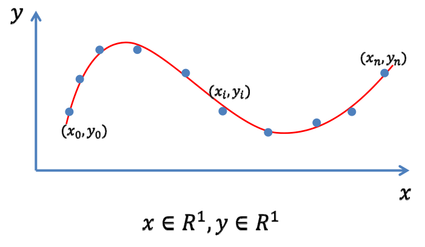
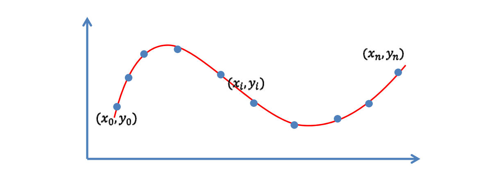
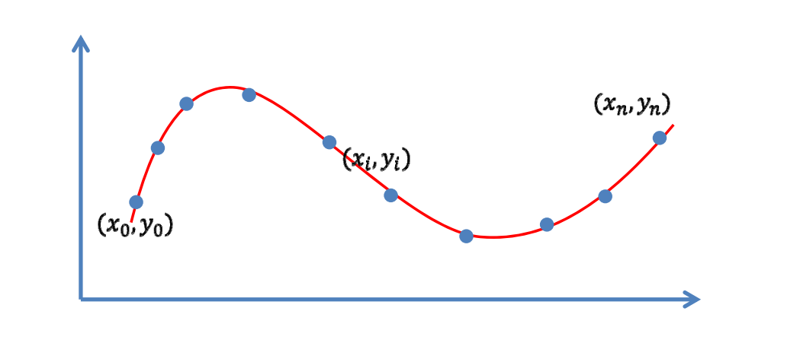
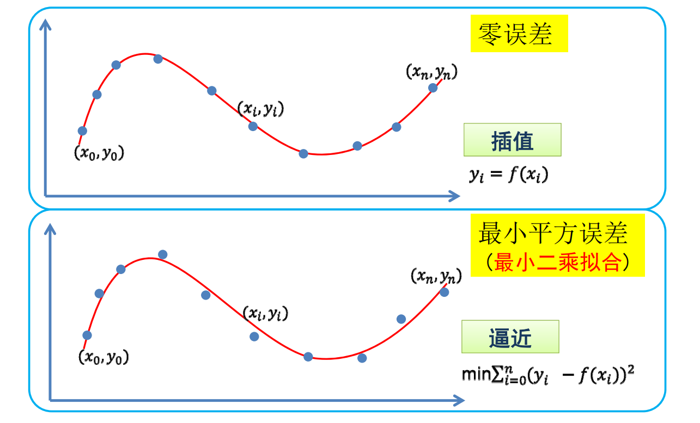
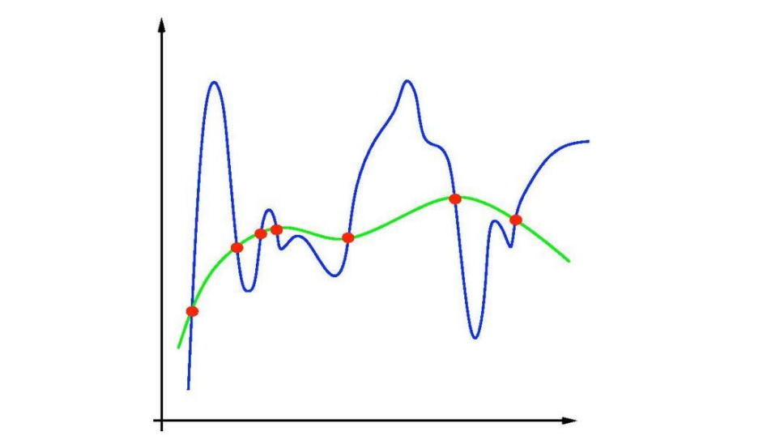
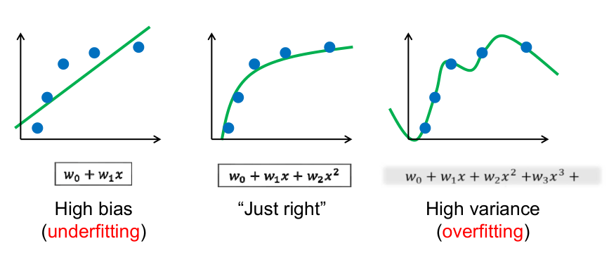
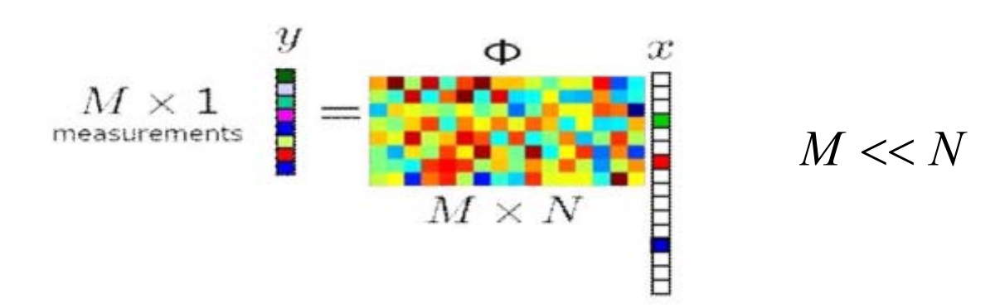
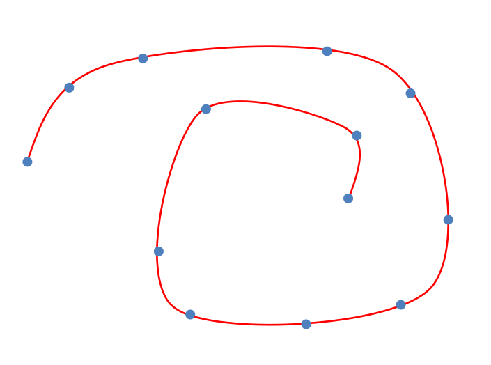

# 问题：如何求满足要求的函数？

> &#x1F50E; [51：11]  

• 大部分的实际应用问题  
- 可建模为：找一个映射/变换/函数  
- 输入不一样、变量不一样、维数不一样  
• 如何找函数的三步曲：  
- ___到哪找___？  
    - 确定某个函数集合/空间  
- ___找哪个___？  
    - **度量**哪个函数是好的/“最好”的  
- ___怎么找___？  
    - 求解或优化：不同的优化方法与技巧，既要快、又要好…  

# 数据拟合  

## 拟合(Fitting)问题 

• 输入：一些观察的数据点  
• 输出：**反映这些数据规律的函数**\\(y=f(x)\\)    

> &#x1F50E; [55：12]

## 1. 到哪找？

- **选择一个函数空间**  
  - 线性函数空间\\(A=span(B_{0}(x), \ldots, B_{n}(x))\\)  
    - 多项式函数 \\(span  (1, x, x^{2}, \ldots, x^{n})\\)  
    - \\(RBF\\)函数
    - 三角函数

> &#x2705; 选定一组基函数。  
如果目标是周期函数，选择三角函数会比较合适  
把\\(f(x)\\)为表达基函数 \\(\times\\) 系数  
一组系数能确定一个\\(f(x)\\)    

- **函数表达为**

$$
f(x)=\sum_{k=0}^{n} a_{k} B_{k}(x) 
$$  

– 求\\(n+1\\)个系数\\((a_{0}, \ldots, a_{n})\\)   

> &#x2705; 把待定系数\\((a_{0}, \ldots, a_{n})\\)求解出来，这个函数就算是找到了。   

## 2. 找哪个？ && 怎么找？ 目标1

目标1: 函数经过每个数据点（**插值**） 

$$
y_{i}=f\left(x_{i}\right),i=0,1,\ldots,n
$$  

  

联立, 求解线性方程组：

$$ 
 \sum_{k=0}^{n} a_{k} B_{k}\left(x_{i}\right)=y_{i}, i=0,1, \ldots, n 
$$

> &#x2705; [57:18]把\\(x_i\\)和\\(y_i\\)代入公式。可得线性方程组    
$$
A_a = b
$$
其中，\\(A 是 x_i 代入 B_k (x_i)得到的矩阵。a 是系数组成的向量。b 是 y_i\\) 组成的向量。 

求解\\((n+1) \times(n+1)\\)线性方程组，可使用\\(n\\)次Langrange插值多项式  

病态问题: 系数矩阵条件数高时, 求解不稳定  
> 条件数指矩阵的奇异值中最大的与最小的之间的比例。    

### Lagrange插值函数

• 插值\\(n+1\\)个点、次数不超过\\(n\\)的多项式是存在而且是唯一的  
– （ \\(n +1\\)个变量， \\(n +1\\)个方程）  
$$
p_{k}(x)=\prod_{i \in B_{k}} \frac{x-x_{i}}{x_{k}-x_{i}}
$$  

插值函数的**自由度** = **未知量**个数 - **已知量**个数   

> 有\\(n+1\\)的点，有\\(n\\)阶多项式逼近，有唯一解。  
系数矩阵即上面的 A。       

## 3 找哪个？&&怎么找？目标2

目标2：函数尽量靠近数据点（**逼近**）

$$
\min \sum_{i=0}^{n}\left(y_{i}-f\left(x_{i}\right)\right)^{2} 
$$

 

> 由于设备误差、存储误差，导致数据不精确。     
因此曲线不必要一定经过点，而是靠近就可以。   
逼近是指，不要求\\(y_i\\)与\\(f(x_i)\\)严格相等，但希望误差尽量。   
\\((\cdot )^2\\)是度量距离的一种方式。可替换。   
除了考虑距离是否合理，还要考虑是否好优化。   
因此\\((\cdot )^2\\)最常用。   　 

> &#x2705; 把目标函数看作是以系数为参数的函数 G    
$$
G (a_o, a_1,\dots, a_n) = {\textstyle \sum_{i=0}^{n}} (y_i-f(x_i))^2
$$

> 求解：求 G 的极小值，即求它的拐点。  
对各系数求导，得法方程(Normal Equation)  
$$
\frac{\partial G}{\partial a_1} = 0 \\\\
\frac{\partial G}{\partial a_2} = 0 \\\\
\cdots \\\\
\frac{\partial G}{\partial a_n} = 0 \\\\
$$

此方法称为**最小二乘法**  
  
问题：  
- 点多，系数少？
> &#x2705; 表达能力不够，欠拟合  
  
- 点少， 系数多？
> &#x2705; 过拟合  

# Recap：拟合‐‐插值或逼近

> &#x2705; 通过使用逼近而不插值  
  
# Overfitting（过拟合）

• 误差为0，但是拟合的函数并无使用价值！  

# 欠拟合或过拟合

• 如何选择**合适的基函数**？  

  
• 需要根据不同的应用与需求，不断尝试（不断“**调参**”）

> &#x1F50E; [1：07：10]  

• 需要根据不同的应用与需求，不断尝试  
（不断“**调参**”）  

> &#x2705; 需要根据场景调会找到合适的基函数  

# 避免过拟合的常用方法

> &#x1F50E; [1：08：47]  

• 数据去噪  
– 剔除训练样本中噪声  
• 数据增广  
– 增加样本数，或者增加样本的代表性和多样性  
• 模型简化  
– 预测模型过于复杂，拟合了训练样本中的噪声  
– 选用更简单的模型，或者对模型进行裁剪  
• 正则约束  
– 适当的**正则项**，比如方差正则项、稀疏正则项  

> &#x2705; 后面列举了常用正则项  

# 岭回归正则项

• 选择一个函数空间  
– 基函数的线性表达  

$$
W=\left(w_{0}, w_{1}, \ldots, w_{n}\right)
$$

$$
y=f(x)=\sum_{i=0}^{n} w_{i} B_{i}(x)
$$

• 最小二乘拟合 
$$
\min _{W}||Y-X W||^{2}
$$

- **Ridge regression**（**岭回归**）
$$ 
\min_{W}||Y -XW\left |  \right | ^2+\mu\|| W|| ^2_2
$$

# 稀疏学习：稀疏正则化
 
• 冗余基函数（过完备）  
• 通过优化来选择合适的基函数  
– 系数向量的\\( L_0 \\)模（ **非0元素个数**）尽量小  
– **挑选**（“**学习**”）出合适的基函数  
$$
\min_{a} \left |  \right |Y -XW\left |  \right | ^2+\mu\|| W|| _0
$$

$$
\min_{a}\left |  \right | Y -XW\left |  \right | ^2,s.t|| W || _0\le \beta  
$$

> [1:10:14]过完备：基函数过冗余或线性相关。
> &#x2705; \\(||W||_0\\)表示 W 中的非零元素个数  
> 最小化\\(||W||_0\\)（优化问题）或把它限制在可接受范围内（约束问题）    
> 公式一是优化问题、公式二是约束问题。

# 从另一角度：压缩感知

  

• 已知\\(y\\)和\\(Φ \\)，有无穷多解\\(x  \\)  
• 对于**稀疏**信号\\(x\\)，可通过优化能完全**重建**\\(x\\)   
– 在一定条件下 (on Φ)[Candes and Tao 2005]   
**\\(L_0 \\)优化**   

$$
\min ||x||_0\\\\
s.t. Φx=y
$$

> &#x1F50E; [1：13：20]    
已知信号 \\(x\\) 是高维稀疏的,通过采样矩阵\\(\phi\\)作用于\\(x \\)可得到低维向 \\(y\\),且根据y和\\(\phi\\)中恢复出\\(x\\)。    
压缩感知常用于信号采集。

# 思考：非函数型的曲线拟合？

> &#x1F50E; [1：15：40]    

> &#x2705; 一个 \\(x\\) 对应多个 \\(y\\) ,因此不是函数。 
