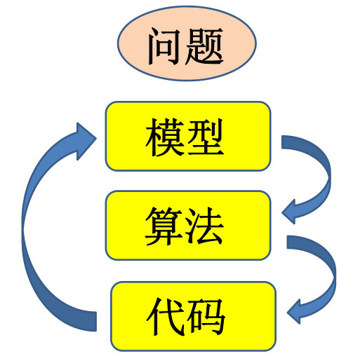
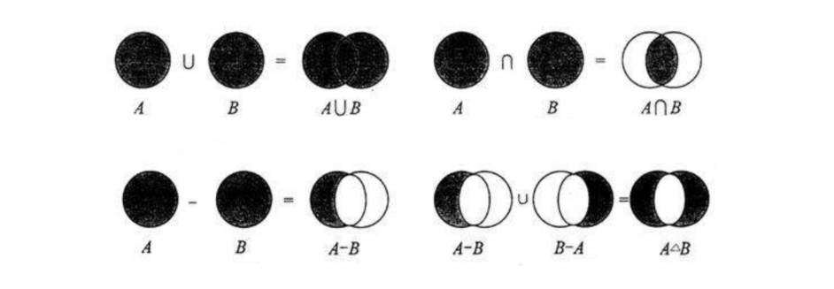
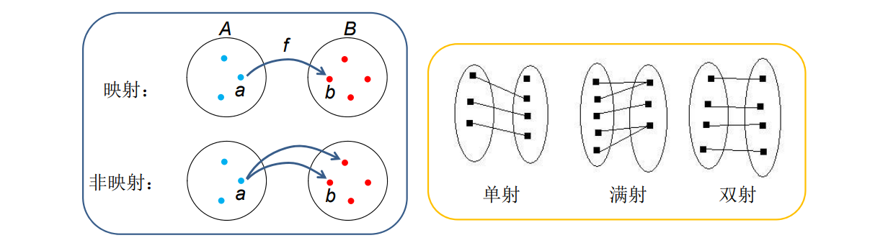
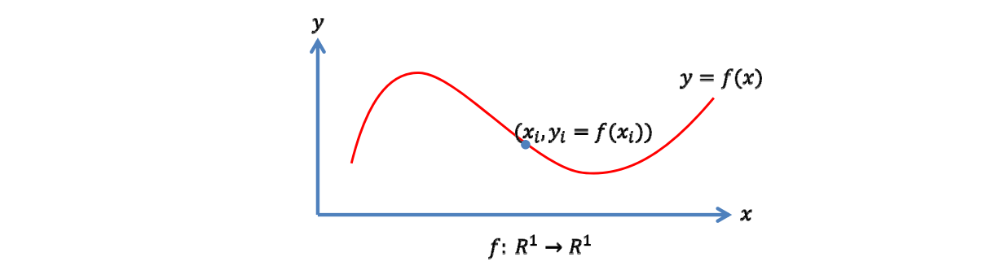
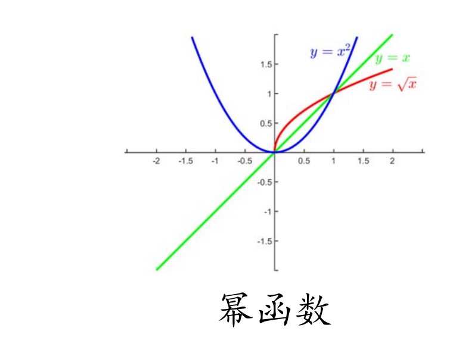
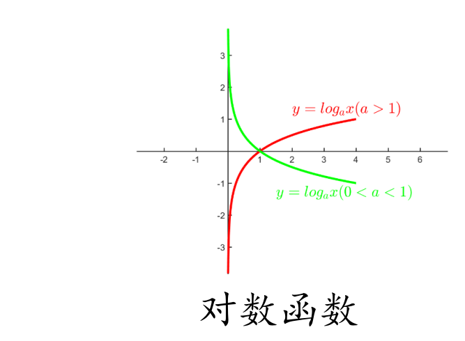
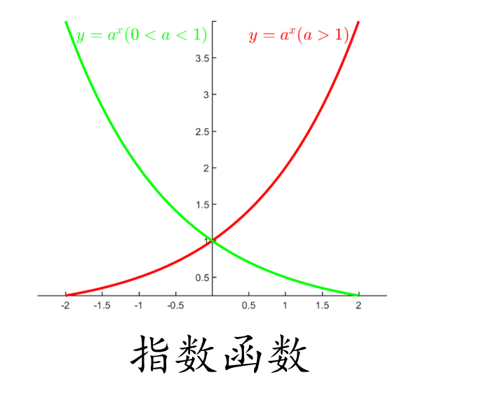
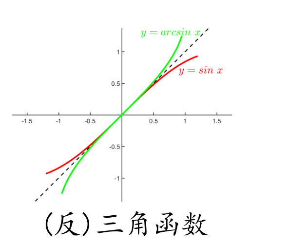
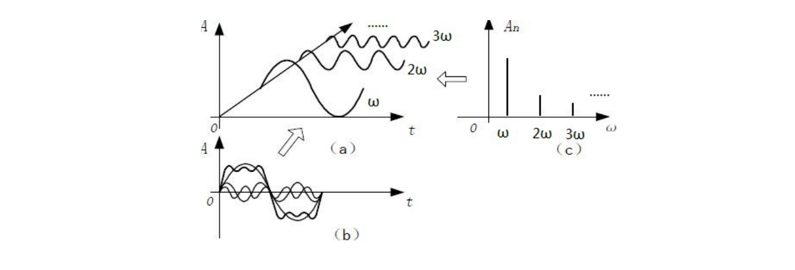
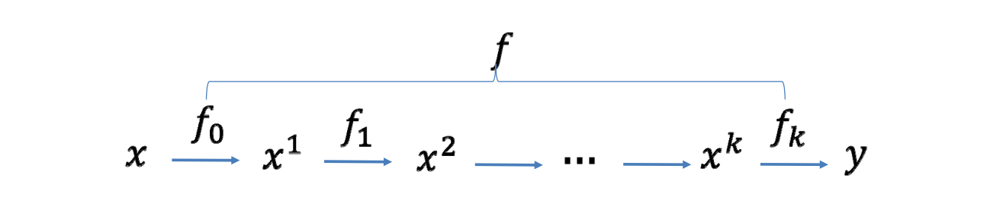

# 数学的应用：用数学语言进行建模

> &#x1F446; 科学研究的过程

> &#x2705; 问题→模型->算法-代码   
其中，**对问题建模**的能力是最重要的

# 集合

• 集合：一堆具有同样性质的对象（称为元素）  
• 基数（个数）：集合中元素的个数  
– 有限集，比如A={1,2,3,4}  
– 无限集  
• 可数集：自然数集N、有理数集Q  
• 不可数集：实数集R、无理数集R\Q  
• 运算：交、并、差  

> 部分数学基础跳过。  
集合、映射、函数、函数集合，赋范空间、傅里叶级数、函数复合

# 线性空间

• 元素之间有运算：加法、数乘  
• 线性结构：对加法和数乘封闭  
– 加法交换律、结合律，数乘分配律，…  
• 基/维数：  

$$
L=span( B_{1},B_2,\dots,B_n)=  \sum_{k=1}^{n}a_kB_k
$$

– 每个元素表达为n个实数，即一个向量  
$$
(a_{1},a_{2},\dots,a_{n})
$$    

• 例子：  
– 欧氏空间：1D实数、2D平面、3D空间、…  
– n次多项式  

# 映射 (mapping)  
两个非空集全A和B的映射\\(f:A\to B\\):对A中的任何一个元素\\(a\\)，有唯一的一个B中的元素\\(b\\)与之对应，记为\\(f(a)=b\\)  
– \\(b\\)称为\\(a\\)的象， \\(a\\)称为\\(b\\)的原象  
– \\(A\\)称为定义域，\\(B\\)称为值域  
  

# 函数 (Function)
• 非空实数集之间的映射称为（一元）函数\\(y=f(x)\\)，或变换
• 函数的图像（函数的可视化）：所有有序对\\((x,f(x))\\) 组成的集合　　
 

# 一元函数

• 有哪些函数？  
– 幂函数  
   
– 三角函数    
– 对数函数  
  
– 指数函数 
  
– 三角函数  
– 反三角函数  
  

– …    

# 函数的集合（函数空间）

• 用若干简单函数（“基函数”）线性组合张成一个函数空间

$$
-L=span\left (f_1,f_2,\dots ,f_n \right ) =({\textstyle \sum_{i=1}^{n}} a_if_i(x)|a_i\in R)
$$

— 每个函数就表达（对应）为\\(n\\)个实数，即系数向量\\((a_1,a_2,\dots ,a_n)\\)

> 幂基 
   $$
   ( x^{k},k=0,1,\dots ,n ）
$$  $$
f(x)=\sum_{k=0}^{n} w_{k} x^{k}
$$    
多项式函数空间  

> 三角函数基      
$$
f(x)=a_{0}+\sum_{k=1}^{n}\left(a_{k} \cos k x+b_{k} \sin k x\right)
$$
 三角函数空间  

**空间的完备性：这个函数空间是否可以表示（逼近）任意函数？**

# 赋范空间    
- 内积诱导范数、距离
$$
-\langle f, g\rangle=\int_{a}^{b} f(x) g(x) d x
$$  
- 度量空间: 可度量函数之间的距离  
\\(-L p\\) 范数  
- 赋范空间 + 完备性 = 巴拿赫空间  
- 内积空间（无限维）+ 完备性 = 希尔伯特空间
# 万能逼近定理：

Weierstrass逼近定理  
• 定理1：闭区间上的连续函数可用多项式级数一致逼近  
• 定理2：闭区间上周期为\\(2π\\)的连续函数可用三角函数级数一致逼近  
对 \\( [a, b]  \\)上的任意连续函数\\(g\\), 及任意给定的\\(\varepsilon>0 \\), 必存在\\(n\\) 次代数多项式\\(f(x)=\sum_{k=0}^{n} w_{k} x^{k} \\), 使得
$$
\min _{x \in[a, b]}|f(x)-g(x)|<\varepsilon.
$$  

# 傅里叶级数
$$
f(t)=A_{0}+\sum_{n=1}^{\infty}\left[a_{n} \cos (n \omega t)+b_{n} \sin (n \omega t)\right]
$$

$$
f(t)=A_{0}+\sum_{n=1}^{\infty} A_{n} \sin n w t+\psi_{n}
$$

# 更复杂的函数：函数复合
  

$$
f=f_{k}{ }^{\circ} f_{k-1}{ }^{\circ} \ldots{ }^{\circ} f_{0}
$$ 

$$
\frac{1}{1+\left(\frac{2 x}{1+x^{2}}\right)^{2}}
$$

$$
f(x)=\frac{e^{x}}{x^{2}+1}
$$

