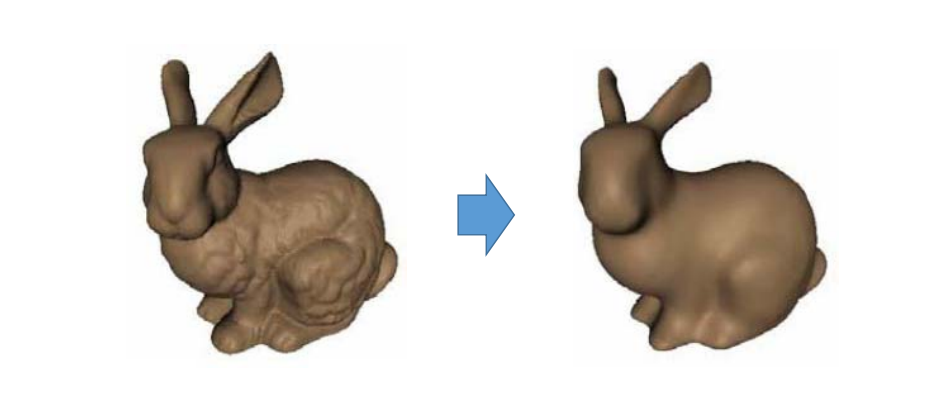
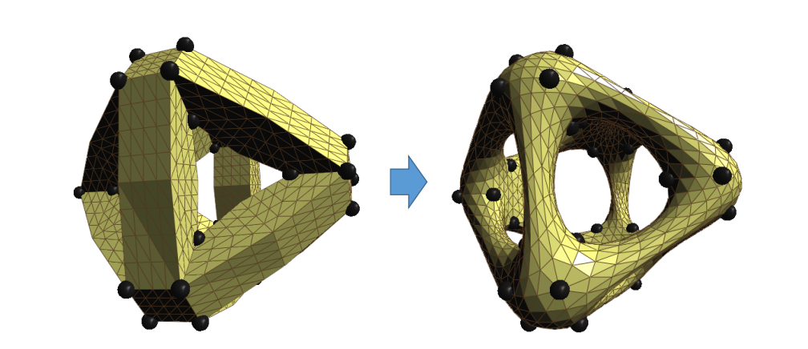
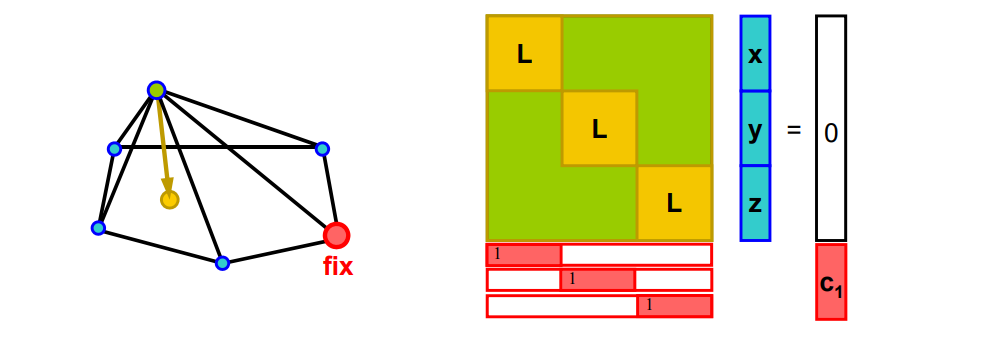
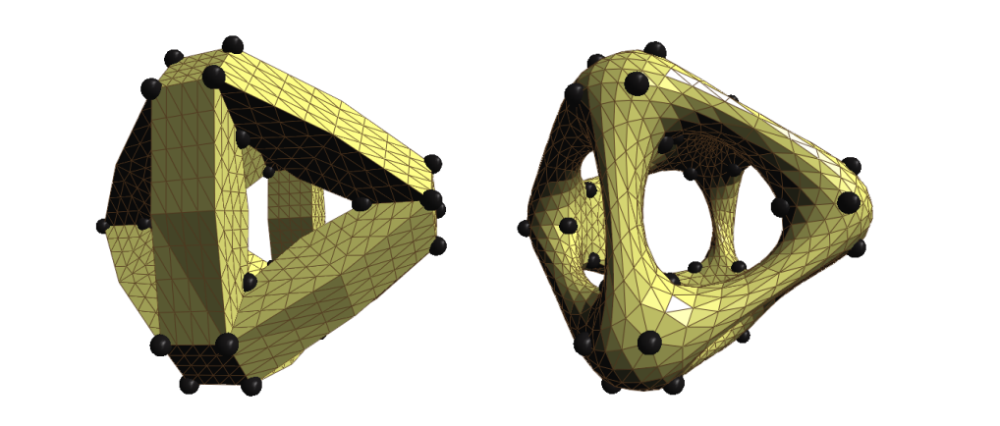
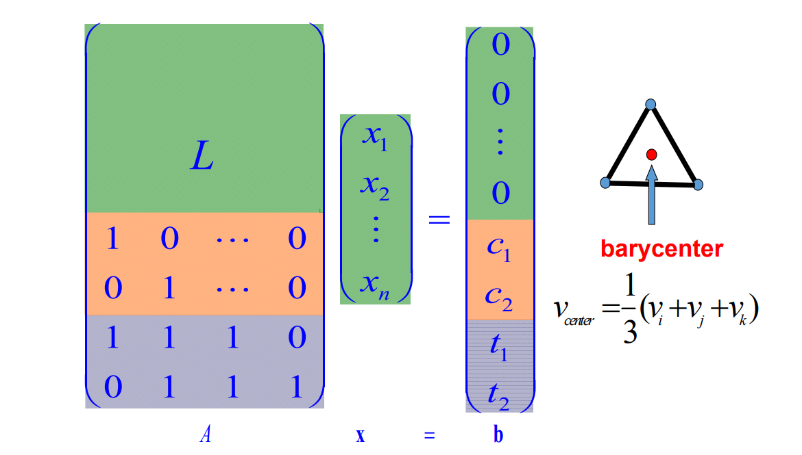
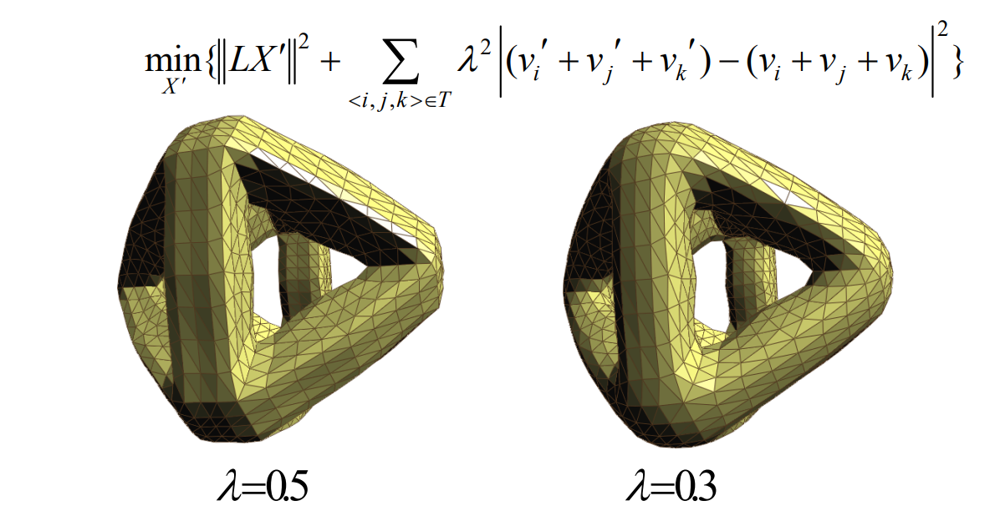
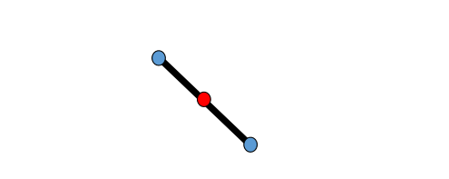
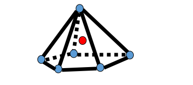
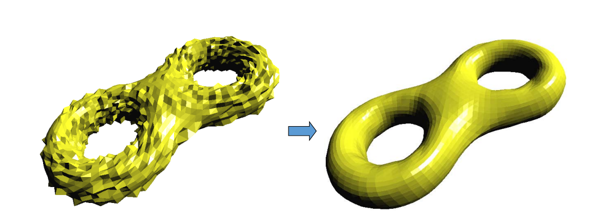

# Shrinkage问题    

Global Laplacian smoothing results in shrinkages    

    

解决方法：add constraints，例如顶点约束、面约束…    

    

# Soft Lapacian Smoothness    

不带约束的 Laplacian 会导致maesh收缩，因此要固定几个
点作为约束。     
hard 约束（Interpolation）：必须满足的约束，例如 \\(S.T.g(t)=0\\)    
Soft 约束（Approximation）: 尽量满足的约束，例如 \\(\min f(x)\\)   

硬约束会导致约束点变成一尖点，因此引入软约束

## Vertex Constraints     

Add position constraint for one vertex     

    

> hard 约束的问题是,fix点处会很突兀,因此通常使用软约束。   
每 fix 一个点，在矩阵下面增加三行。   
加入约束之后. L 的行数远多于列数。只能求近似解。    
\\(\min \left \|| Ax- b \right \||^2\\),相当于软约束优化问题。  

$$
\min _{{X}'} {||L{X}' ||^2+\mu ^2\sum _{i\in C}|{v }'_i -v_i|^2}
$$

> 第一项： Laplace 尽量小，第二项：固定点尽量不动    

    

## Face Constraints    

    

> 除了固定顶点位置的约束，还可以对面加约束，例如：固定面片重心的位置。关键是要线性约束。    

    

## Other Constraints    

• Edge constraints   

    

• 1‐ring barycenter constraints    

    

• Other linear constraints    

# Results   

    

**‘8’-like mesh model    
3070 vertices, 6144 triangles**
