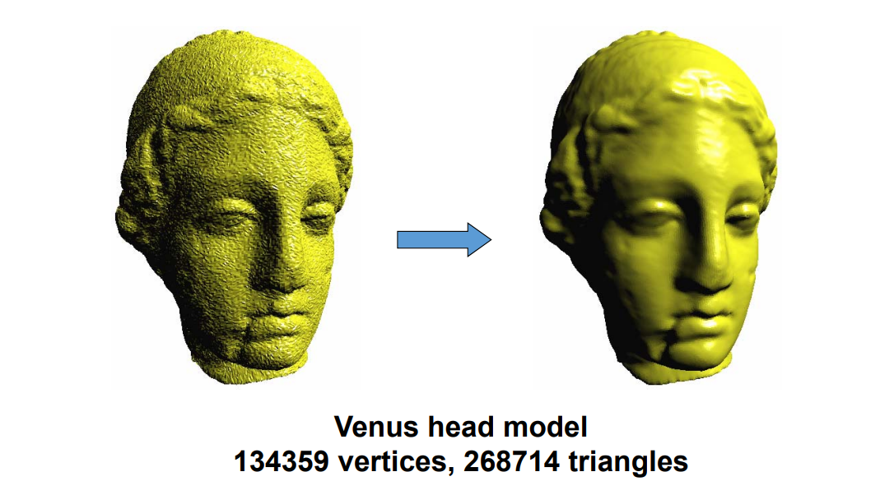
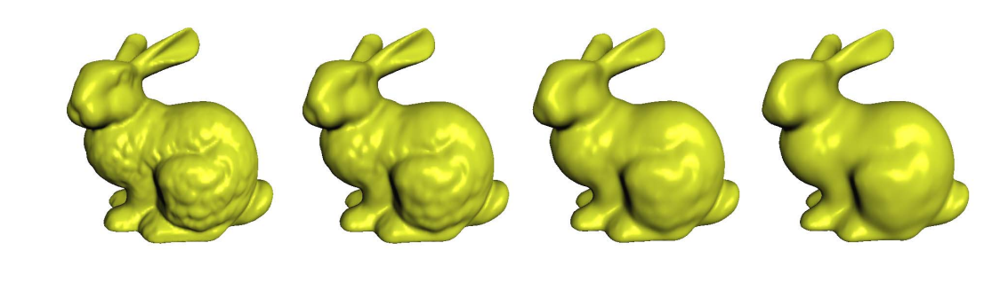

# Constrained (Feature‐Preserving)
# Global Laplacian Smoothing

# Shrinkage    

• Global Laplacian smoothing results in shrinkages    

    

# Ideas: add constraints    

* 如何处理各种约束条件？    
• 顶点约束、面约束…    

    

# Soft Lapacian Smoothness    

 - Interpolation (hard constraints) \\(\to\\) Approximation (soft constraints)    

    

$$
L(\nu_i)=\nu_i-\sum _ {j\in N(i)}w_{ij}\nu_j = 0
$$

> 不带约束的 Laplacian 会导致maesh收缩，因此要固定几个
点作为约束。     
hard 约束：必须满足的约束，例如 \\(S.T.g(t)=0\\)    
Soft 约束: 尽量满足的约束，例如 \\(\min f(x)\\)   

# Laplacian of Mesh   

• Discrete Laplacians

    

# Laplacian of Mesh   

• Surface reconstruction    

    

$$
L(\nu_i)=\nu_i-\sum _ {j\in N(i)}w_{ij}\nu_j = 0
$$

# Properties of Laplacian    

    

$$
Rank(L) = n-k
$$

&#x2705; k is the number of connected components of the mesh    
&#x2705; Need to add some constraints     

# Vertex Constraints     

• Add position constraint for one vertex     

    

> hard 约束的问题是,fix点处会很突兀,因此通常使用软约束。   
每 fix 一个点，在矩阵下面增加三行。   

# Vertex Constraints    

• Add position constraints for more vertices    

    

# Adding Vertex Constraints    

\\(\min _{{X}'} \\){\\( ||L{X}' ||^2+\mu ^2\sum _{i\in C}|{\nu }'_i -\nu_i|^2\\)}

    

> 第一项： Laplace 尽量小，第二项：固定点尽量不动    

# Face Constraints    

    

> 除了固定顶点位置的约束，还可以对面加约束，例如：固定面片重心的位置。关键是要线性约束。    
加入约束之后. A 的行数远多于列数。只能求近似解。    
\\(\min \left \|| Ax- b \right \||^2\\),相当于软约束优化问题。  

# Adding Face Constraints    

    

# Other Constraints    

• Edge constraints   

    

• 1‐ring barycenter constraints    

    

• Other linear constraints    

# Minimizing Energy    

    

# Least Square Solution    

• An over‐determined system:   

$$
AX = b
$$

• Normal equation:   

$$
A^TAX = A^Tb
$$

$$
X = (A^TA)^{-1}A^Tb
$$

> 求逆比较麻烦，如果 A 不变，可对 \\(A^\tau A\\) 做Cholesky 分解。    

# One Channel Solution    

• Very efficient solution by Cholesky factorization of \\(A^TA\\):

$$
A^TA = R^TR
$$
R is upper‐triangular and sparse     
Once R is computed, solving for x, y, z by back‐
substitution:    

$$
R^Tξ = A^Tb
$$

$$
RX = ξ
$$

# Results   

    

**‘8’-like mesh model    
3070 vertices, 6144 triangles**

# Results   

    

# LoD Smoothing    

    

Applying our algorithm to the bunny model with different parameters.    
