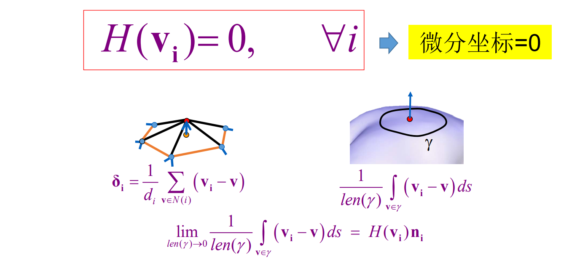
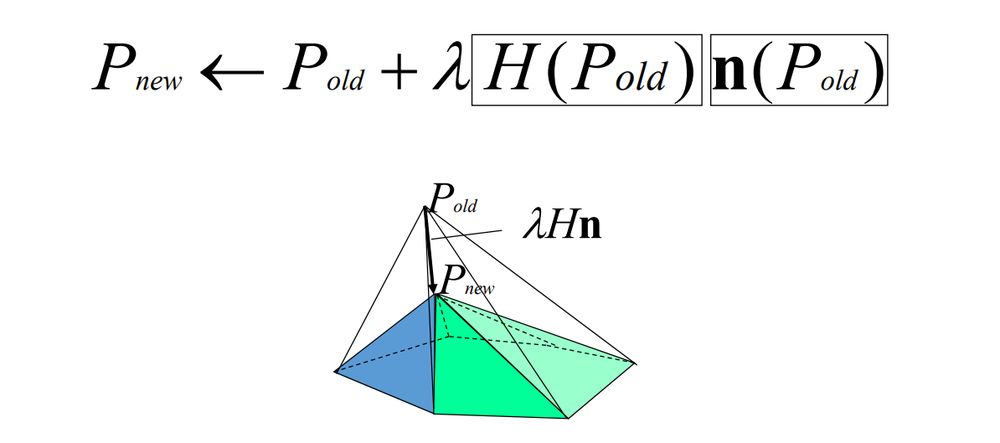
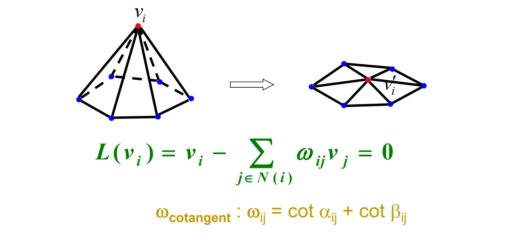
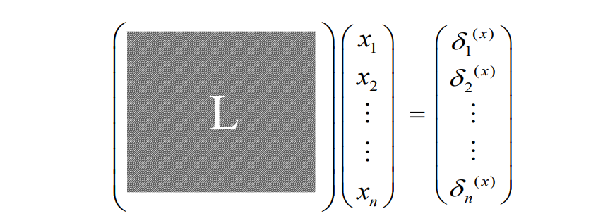
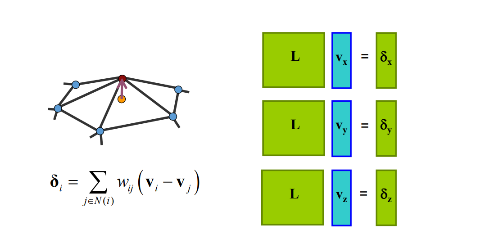
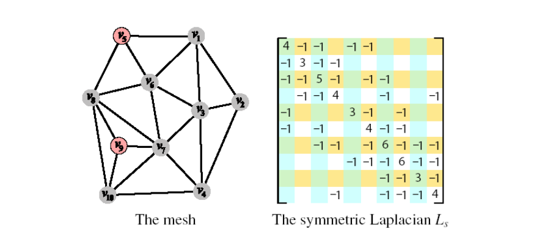
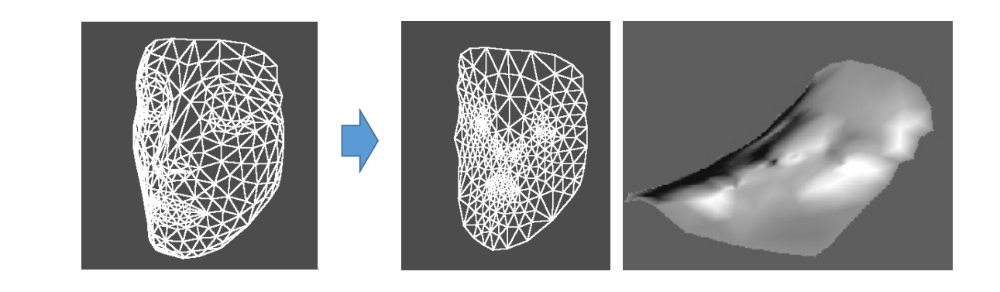

# Global Laplacian Smoothing    

> Local 方法存在的问题：  
> 1. 不同位置收敛速度不同    
2. 自交    

# 极小曲面(minimal surface)    

• 平均曲率处处为0   

    

# 局部迭代光顺方法的问题？   

• 注：通过作业6中已发现    

    

# 微分坐标一致为0    

    

 - 所有顶点的方程联立，得到网格曲面的整体
Laplacian方程：
$$
Ax = 0
$$

> 
$$
\alpha=(V_1,V_2,\dots ,V_n)^\tau 
$$
\\(A 的第 i 行为 L(V_i)的系数，即 V_i 的系数为1，V_j的系数为 — w_{ij}\\),其余为0.整体上非常稀疏。     
增加将边界点固定的约束。

# Laplacian Matrix   

• The transition between the \\(\delta and xyz\\)  is linear:     

    

$$
A_{ij}=\begin{cases}
 1 ,     i\in N(j)\\\\
  \\\\
0, otherwise
\end{cases}
$$

$$
D_{ij}=\begin{cases}
 d_i,     i=j\\\\
  \\\\
0, otherwise
\end{cases}
$$

$$
L=I-D^{-1}A
$$

# Laplacian matrix    
• The transition between the \\(\delta \\) and \\(xyz\\) is linear:    

    

# Reconstruction    

• From relative coordinates to absolute coordinates.    
• Solving a sparse linear system     

$$
Lv=\delta
$$

    

> 如果用L表示邻接关系，\\(\delta\\)已知，就可以重建出0.   
不断减小\\(\delta\\)而更新V,得到极小曲面。    

# Basic properties    

• Rank(L) = n‐c (n‐1 for connected meshes)    
• We can reconstruct the \\(xyz\\) geometry from delta up 
to translation   
$$
LX=\delta
$$

> L 非满秩， C 为 mesh 的联通个数，至少为1.    
必须增加额外约束是L满秩。 

# 极小曲面生成的全局方法    

* 检测边界，固定边界    
* 构建稀疏方程组\\((\delta=0)\\)     
* 求解稀疏方程组     
• 【注：有高效的求解方法，且有成熟的数学库可使用】    
* 更新内部顶点坐标    

    

> 更正一下，不是慢慢减\\(\delta\\)迭代更新V,而是直接令\\(\delta=0\\)     
数学库： MLK, Eigen  
