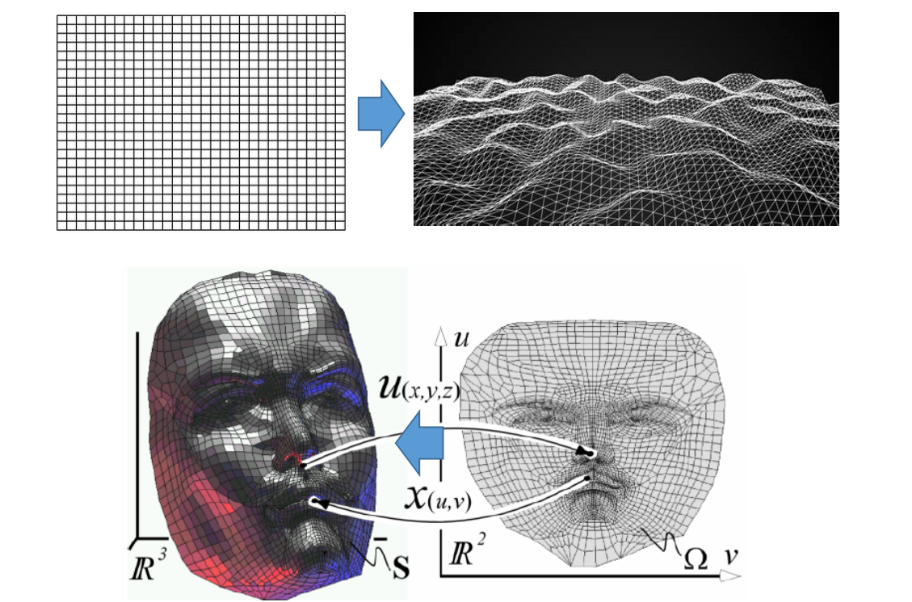
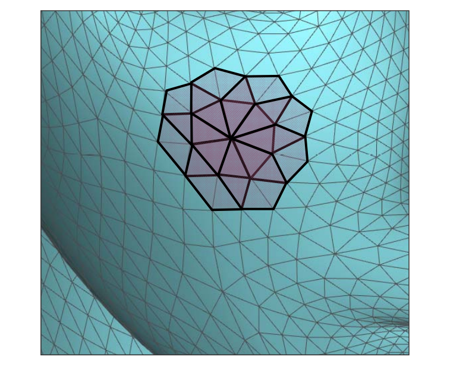
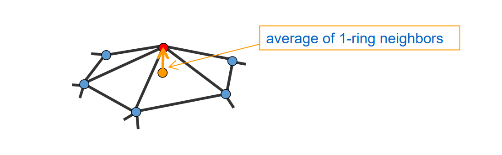
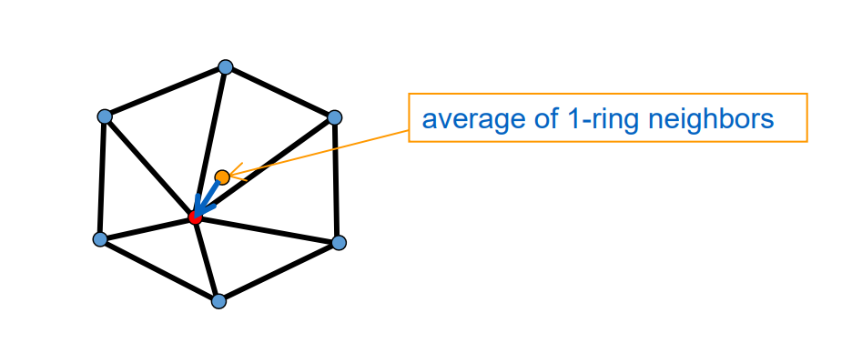
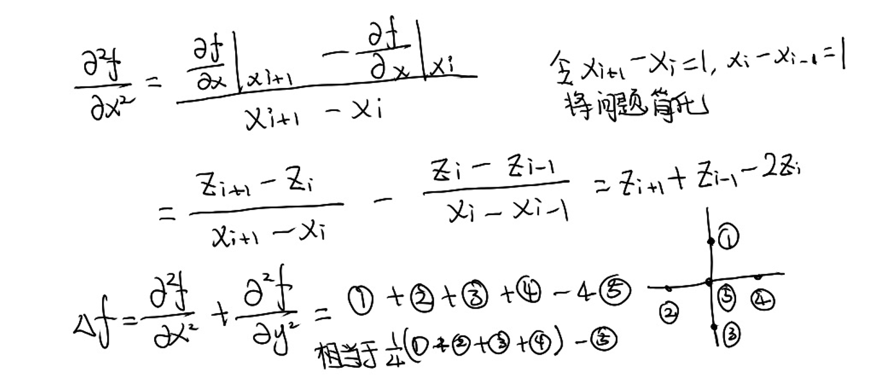
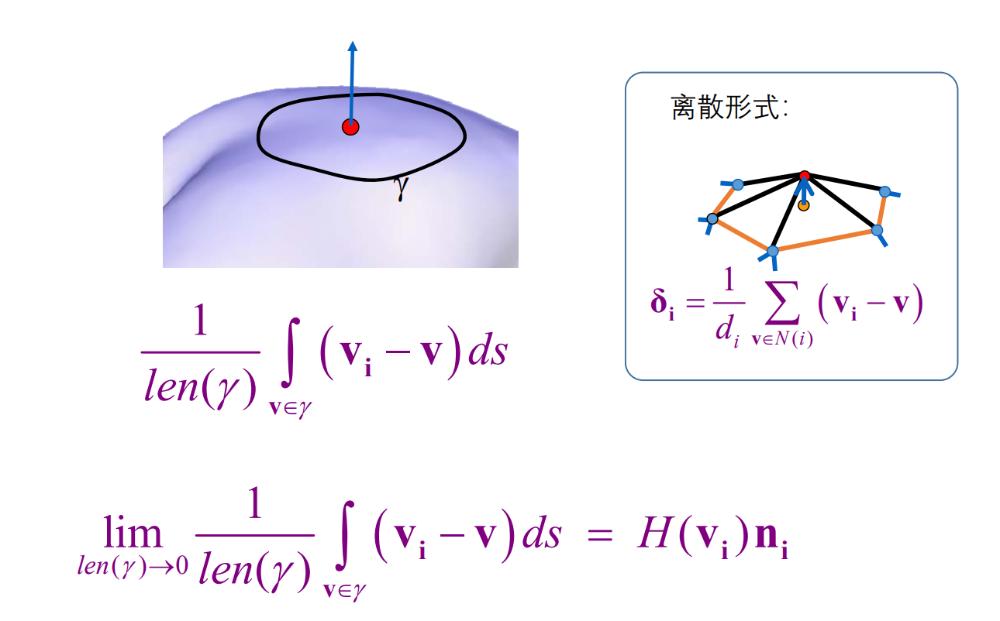
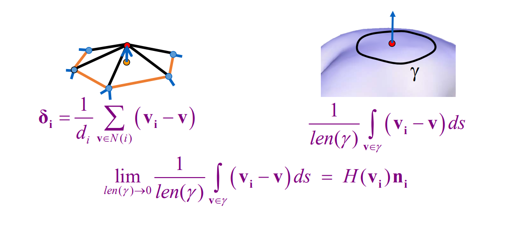

# 3D网格曲面

## 3D网格曲面是二维流形曲面的离散    

• 平面图在3D空间中的嵌入 \\(f:R^2\to R^3\\)    

   

# Local Structure   

 - Small‐sized Cells    
    - 1‐ring neighborhood （1‐邻域）    
    - 一般“流形”结构也是通过局部邻域来定义   

       

> 一个点的信息通常由它周围的顶点和面片来决定。     
对于离散几何来说，无穷小邻域性质就通过 l 邻域来分近似。   
­离散观点：直接取邻域点的特征来计算酯前点的特征     
连续观点：取邻域点拟合成曲面，然后分析曲面在该点处的特征。   

## 局部特征度量：1‐邻域   

 - Detail = surface – smooth (surface)     
 - Smoothing = averaging    
   

> 黄点、蓝点的加权平均，可以用各种加权方式。    
黄色向量：拉普拉斯算子，可以描述红点的尖锐承度。   

## Laplace算子(operator)    

• \\(n\\)维欧几里得空间的二阶微分算子（椭圆型算子）   
• 梯度 \\(\nabla f\\) 的散度 \\(\nabla \cdot f\\)   

$$
\Delta f=\nabla \cdot \nabla f=\nabla^{2} f
$$

• 在笛卡尔坐标系中，为所有非混合二阶偏导数：

$$
\Delta f=\sum_{i=1}^{n} \frac{\partial^{2} f}{\partial x_{i}^{2}}
$$

• 特别地，对二元实函数\\(f(x,y)\\)：    

$$
\Delta f=\frac{\partial^{2} f}{\partial x^{2}}+\frac{\partial^{2} f}{\partial y^{2}}
$$

> 梯度是一个向量，散度指向量各个分量之和。    
此页中是连续形式的 Laplace 算子。   

## Laplace‐Beltrami 算子    

• 推广：定义在黎曼流形上的椭圆型算子    

$$
\nabla ^2f=\nabla \cdot \nabla f
$$

$$
\Downarrow 
$$

$$
\nabla ^2f=\frac{1}{\sqrt{|g|} } \partial _i(\surd |g|g^{ij}\partial _jf).
$$

## Differential Coordinates （微分坐标）    

• 离散形式的 Laplacian 算子 (Umbrella Operator，
伞型算子):   

$$
\delta _i=\nu _i-\sum _{j\in N(i)}w_j\nu _j
$$

    

> 如何理解离散曲面的Laplace比算子？[23:40]    
2D场景： （图[24:39]）      
后向差分： 
$$
{f}' x=\frac{y_{i+1}-y_i}{x_{i+1}-x_i} 
$$
前向差分：
$$
{f}' x=\frac{y_i-y_{i-1}}{x_i-x_{i-1}} 
$$
3D的场景：
  
① ② ③ ④ 看作是⑤的 l 邻域。    
推广到一般形式可得：\\(\delta _i\\)     
\\(\delta _i\\)称为 Laplace 算子，也叫 Laplace 坐标、微分坐标。    

## 平均曲率流定理   

    

> \\(\gamma \\)代表红点的邻域外围封闭曲线。    
\\(V_i 是红点， V是\gamma \\)手上的点。    
\\( len(\gamma) \\)代表曲线长度。    
\\(H(V_i)为 V_i\\) 的平均曲率。     
将此定理公式写成离散形式，与\\(\delta _i\\)公式相通。    
\\(\delta _i\\) 可以作为平均曲率的近似。    

# Geometric Meaning   

 - DCs represent the **local** detail / local shape description   
    - The direction approximates the normal    
    - The size approximates the mean curvature    

    

# Weighting Schemes     
(Barycentric coordinates)    

• Uniform weight (geometry oblivious)     

$$
w_i=1
$$

• Cotangent weight (geometry aware)     

$$
w_j=(\cot \alpha +\cot \beta )
$$

• Normalization    

$$
w_j=\frac{w_j}{\sum _jw_j} 
$$

    

$$
\delta _i=\frac{1}{d_i} \sum _{j\in N(i)}(\nu_i-\nu_j)
$$

> \\(l\\)邻域点加权平均的权有讲究,通常使用 cotangent.  

