# Laplacian Editing     
[Sorkine et al. SGP 2004]

# What’s are Details?    

• Detail = surface – smooth (surface)    
• Smoothing = averaging    

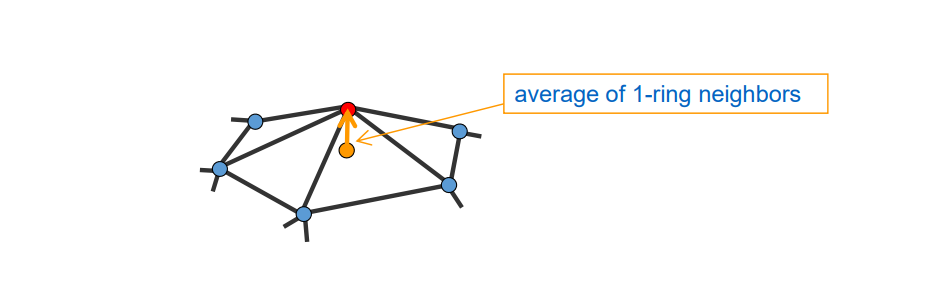    

# What’s the Difference?    

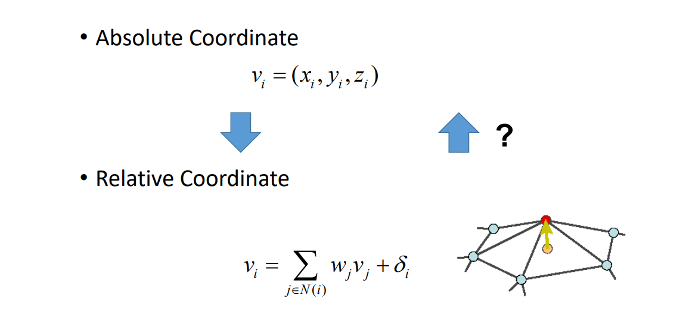    

# Laplacian Editing   

 - Local detail representation – enables **detail preservation** through various modeling tasks    
 - Representation with **sparse** matrices    
 - Efficient **linear** surface reconstruction    

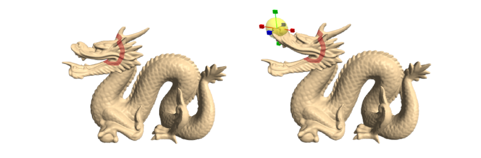    

# Editing framework     

 - The spatial constraints will serve as modeling constraints    
 - Reconstruct the surface every time the modeling constraints are changed   

Detail constraints: \\(LX=\delta \\)    
Modeling constraints: \\(x_j=c_j,j\in\\) {\\(j_1,j_2,\dots j_k\\)}    

> 用户对 mesh 的一个点进行编辑，算法更新其他的点，得到合理结果。     
本质：保持 mesh 的 Laplace 不变，因为 Laplace 描述了曲面的特征。    
准确说是 Laplace 长度不变，方向有可能旋转。     

# Direct Detail Preserving     

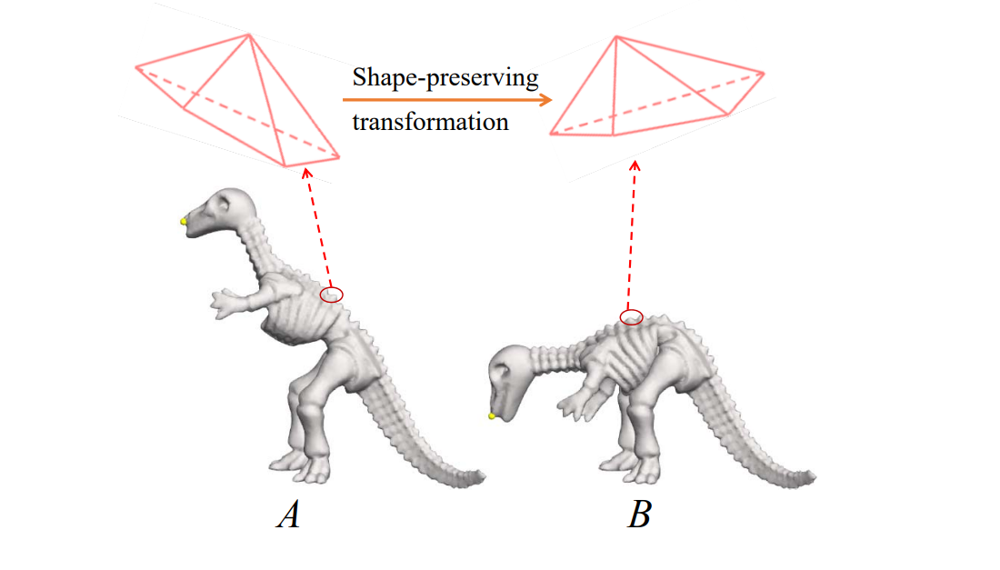    

# Rotation Transformation   

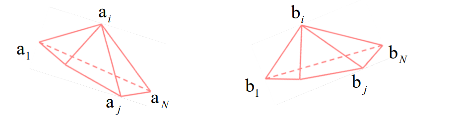    

$$
\begin{pmatrix}b_1-b_i
 \\\\\vdots 
 \\\\b_N-b_i
\end{pmatrix}=\begin{pmatrix}a_1-a_i
 \\\\\vdots 
 \\\\a_N-a_i
\end{pmatrix}R_i
$$

# Reconstruction    

• Soft constraints     

$$
L^TLv=L^T\delta 
$$

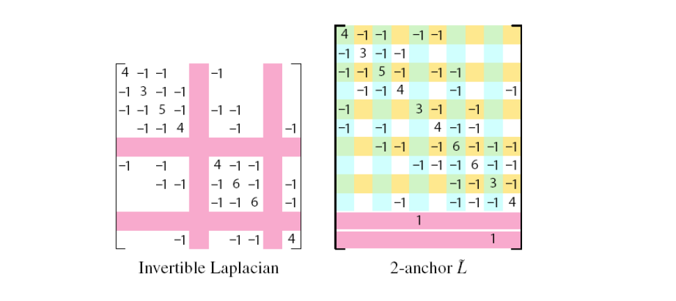    

# Variational Viewpoint    

• Laplacian Approximation    

$$
\tilde{X} =\underset{X}{argmin} (||LX-\delta ^{(x)}||^2+\sum _{j\in C}w^2||x_j-c_j||^2).
$$

• Gradient Approximation    

$$
\underset{\phi }{min} \iint _\Omega ||\nabla \phi -w||^2dA,
$$

# User Interfaces    

• ROI is bounded by a belt (static anchors)    
• Manipulation through handle(s)    

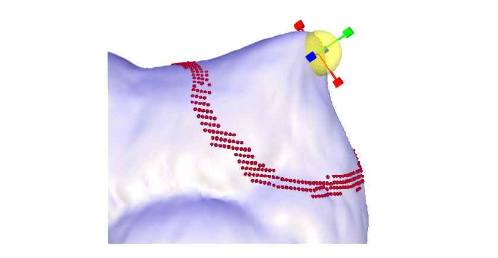    

# Results    

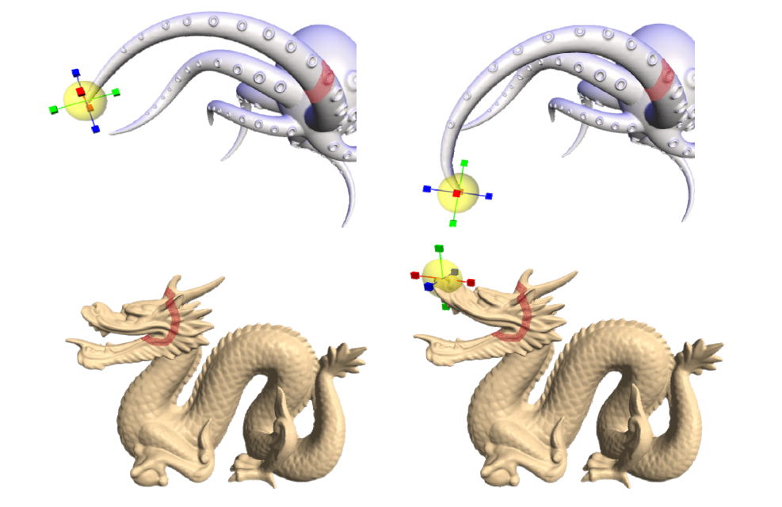    

# Detail transfer and mixing    
• “Peel“ the coating of one surface and transfer to 
another    

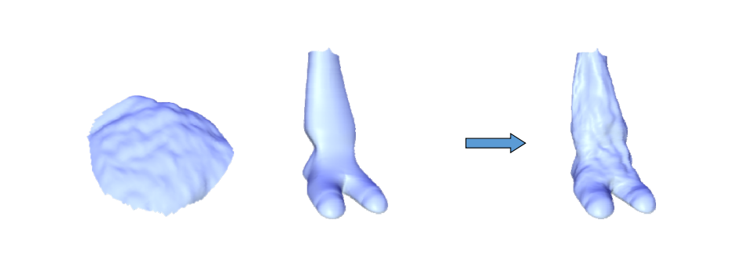    

   
第一步：Parameterization onto a common domain and elastic warp to align the features, if needed     

第二步：Detail peeling:    

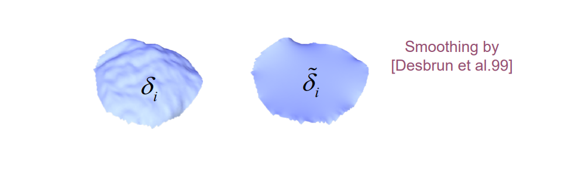    

$$
\xi _i=\delta _i-\tilde{\delta } _i
$$

第三步：Changing local frames:    

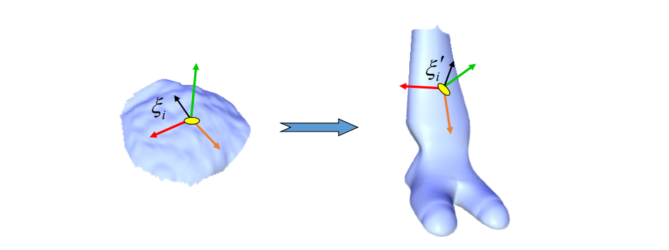    

第四步：Reconstruction of target surface from: \\(\delta _{target}\\)    

$$
\delta _{target} ={\delta}' _i+{\xi}' _i
$$
  

# Examples    

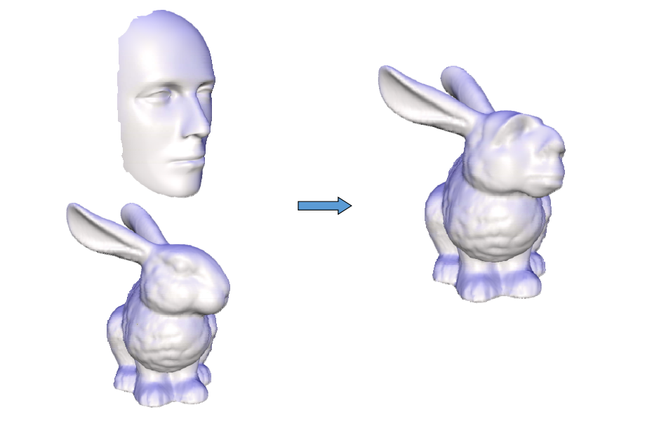    

# Mixing Laplacians    

• Taking weighted average of \\(\delta _i\\) and  \\(\delta ^‘_i\\)    

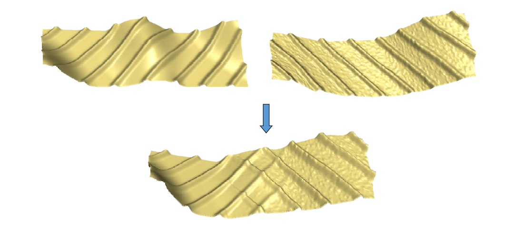    

# Mesh transplanting   

* The user defines    
• Part to transplant   
• Where to transplant   
• Spatial orientation and scale    
* Topological stitching    
* Geometrical stitching via Laplacian mixing    

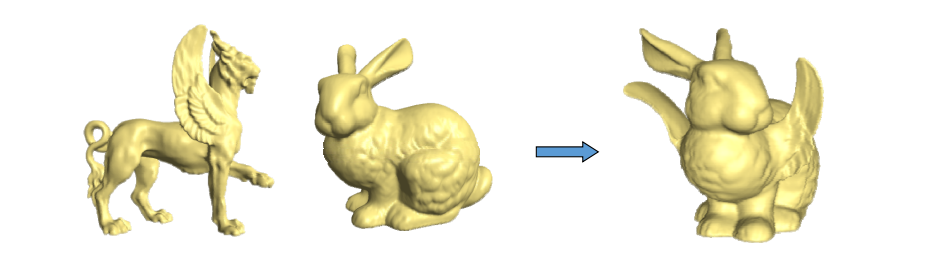    

• Details gradually change in the transition area    

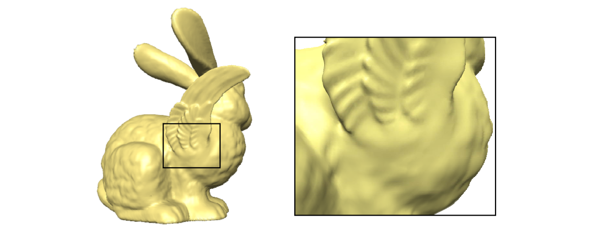    

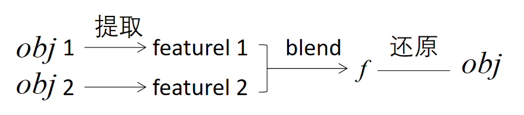    
提取与还原即 Encoder& Decoder.Laplace 是手工方法，E&D是AI方法。  

---  

> 本文出自CaterpillarStudyGroup，转载请注明出处。
https://caterpillarstudygroup.github.io/GAMES102_mdbook/
