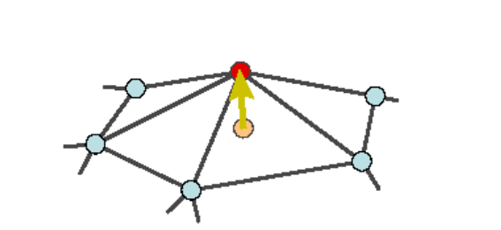
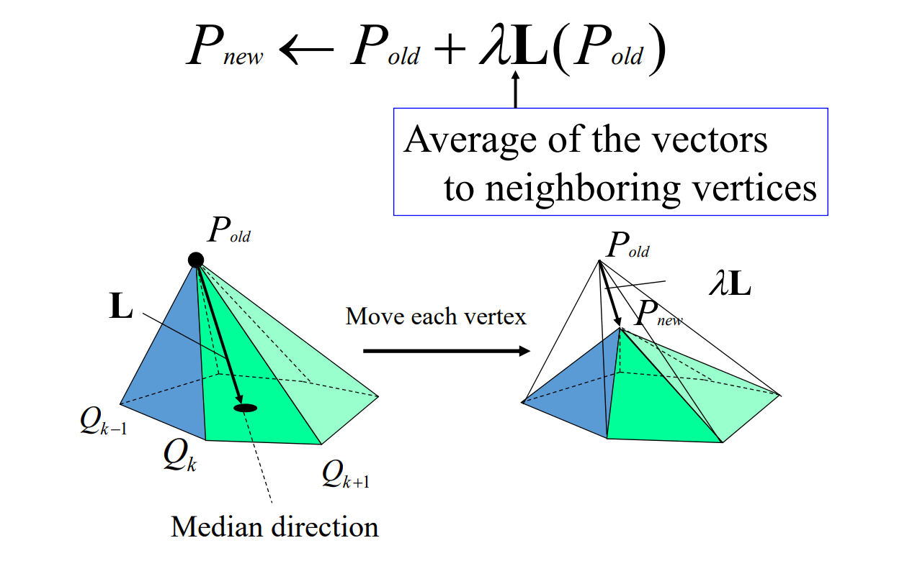
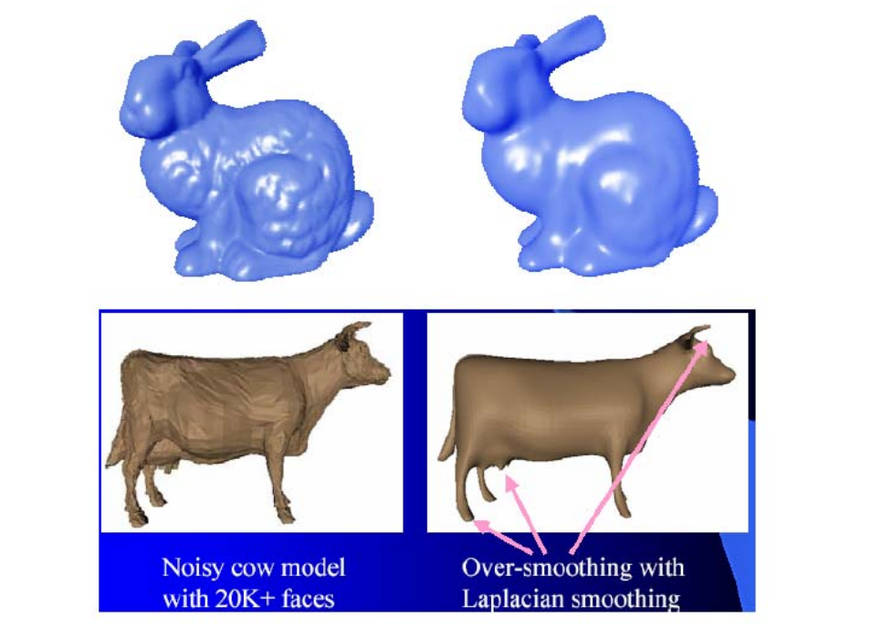
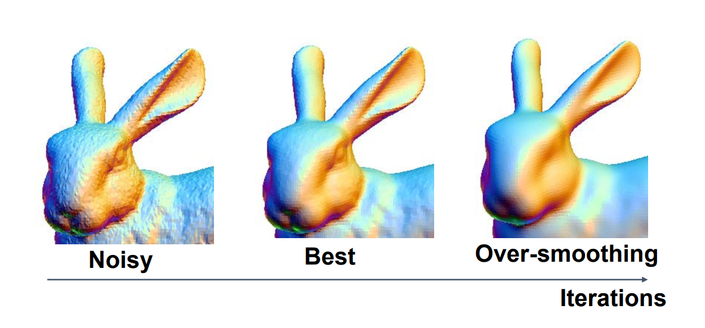
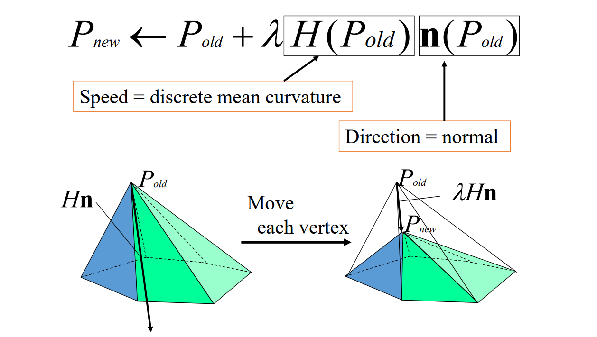
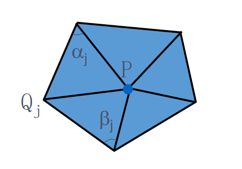
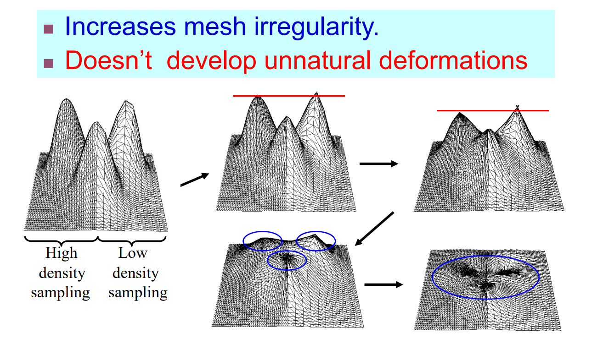

# Local Laplacian Smoothing    

## Differential Coordinates (Laplace Coordinates)    

 - Represent local detail at each surface point    
    - better describe the shape    
 - Linear transition from global to differential   
 - Useful for operations on surfaces where **surface details** are important   

    
$$
\delta _i=\frac{1}{d_i} \sum _{j\in N(i)}(\nu_i-\nu_j)
$$    

## Laplacian Smoothing Flow   

    

> 上节课的任意曲面到极小曲面的过程,是一种特殊的    
Local Lapluàn Smoothing.    
也可以看作是去噪、滤波。

## Laplacian Smoothing    

$$
P^{new}=P^{old}+\lambda L(P^{old})
$$

 - Equivalent to box filter in signal processing    
 - Apply to all vertices on mesh    
 - Typically repeat several times    
 - Can describe as energy minimization    
    - Energy = sum of squared edge lengths in mesh
    - Parameter \\(\lambda >0\\) controls convergence "speed"    

Example :

    

## Problem of Over‐smoothing   

How to find appropriate \\(\lambda\\) and number of iterations?   

    

# Mean Curvature Flow   

    

$$
\delta _i=\frac{1}{d_i} \sum _{\nu\in N(i)}(\nu_i-\nu)
$$

$$
\frac{1}{len(\gamma )} \int _{\nu\in \gamma }(\nu_i-\nu)ds
$$

$$
\lim_{len(\gamma ) \to 0} \frac{1}{len(\gamma )} \int _{\nu\in \gamma }(\nu_i-\nu)ds=H(\nu_i)n_i
$$

## Discrete Mean Curvature Flow   

    

 
## Discrete Mean Curvature   

$$
Hn=\frac{\nabla _PA}{2A} 
$$

$$
Hn=\frac{1}{4A} \sum _j(\cot \alpha _j+\cot \beta _j)(P-Q_j)
$$

    

## Properties of Mean Curvature Flow   

    

> Mean Curvature Flow 使用 cotangent 权，因此是Laplacian Smoothing 的特殊形式。     
对于 low densily mesh,\\(\delta _i\\) 比较长，如果使用普­通权，这种情况会收缩快。如果使用 cotangent 权，则不会。  
