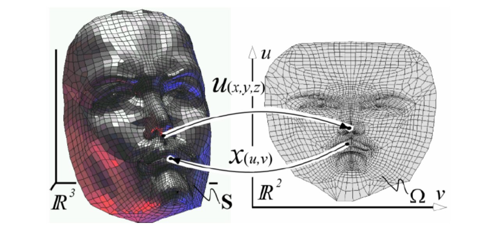
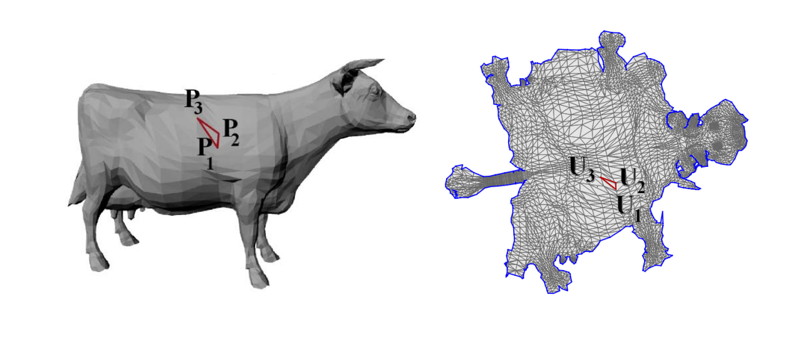
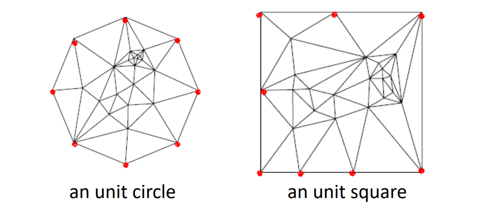
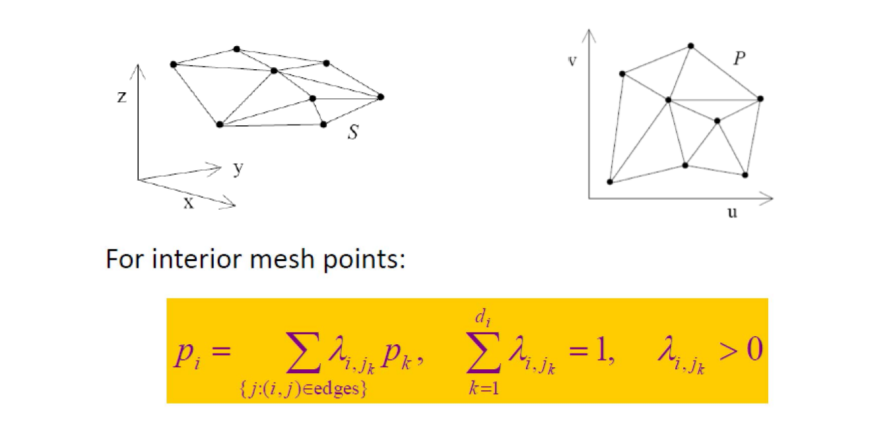
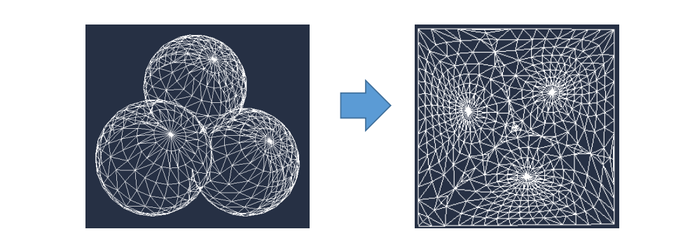
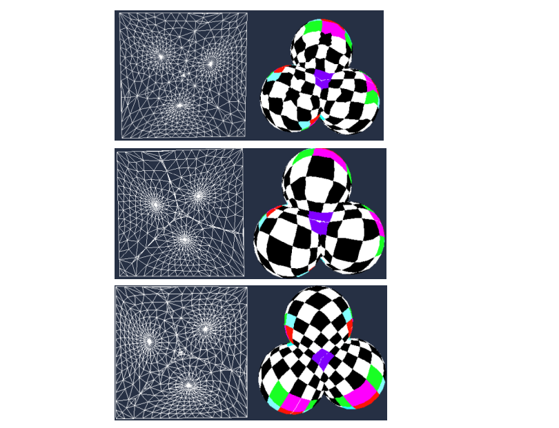
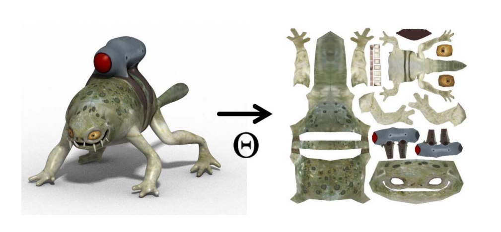

# Mesh Parameterization (Mesh Flattening)     

## 什么是曲面参数化

对于一个二维流形的三维曲面，把它拍成二维的过程称为参数化。     

    

* 每个3D顶点(\\(x,y,z\\))对应一个2D点(\\(u,v\\))    
• (\\(u,v\\)) 称为 (\\(x,y,z\\)) 的参数（2D流形曲面的本征维数）    

## 曲面参数化要解决的问题

    

非可展曲面展开后必须形变，因此希望展开后的平面形变尽量地少，具体衡量为：  
1. 三角形不能发生翻转。    
2. 三角形的扭曲能够保持。    
3. 边界不要自交。    

> 这节课为曲面参数化的基础课，不涉及这些内容，将在后面展开。  

## 参数化的应用

1. 提供了三维曲面每个点的一个二维参数，可用于**贴纹理**     
2. 在低维来处理高维问题，减少复杂度    
3. 三维曲面之间的相关问题可通过参数化空间来处理      

# 曲面参数化的方法：Tutte’s Method

## 第一步：将边界映射到平面的**凸**多边形上

*[Floater 97’]*

    

M. Floater. Parametrization and smooth approximation of surface triangulations. CAGD, 1997.    
<http://www.cs.jhu.edu/~misha/Fall09/Floater97.pdf>    

## 第二步：求解稀疏方程组   

    

Forming a sparse linear system    

> 还是之前 Global Laplacian Smoothing 求极小曲面的原理。   
边界点在同一平面上，得到的极小曲面也是在平面上的。   
但是要把边界点放右边呢？因为右边是固定点，要求的是内部点。  

## 性质   

    

- 优点：  
简单  
如果边界位于凸多边形上，则三角形一定不会发生翻转！   
- 缺点：  
扭曲大  
在密的地方容易发生数值上的精度问题
- 其它
第二步中使用不同的权值定义方向得到的结果不同，使用cot权的扭曲最小

    

> 使用这种格子作为纹理，方便观察扭曲情况，仍建议用 cotangent 权，扭曲较小。   
图1：均匀权， 图3：cotangent权     

## 操作步骤总结    

• 检测边界    
• **将边界映射到正方形边界或圆边界（凸边界）**   
• 构建稀疏方程组    
• 求解稀疏方程组    
• 更新顶点坐标    
• **连接纹理图像，更新显示**    

# 分块参数化    

    

复杂模型割成多块分别参数化，再 packing    
优点：1.减少扭曲。    2.具有语义。    
缺点：1.空间浪费。    

本文出自CaterpillarStudyGroup，转载请注明出处。
https://caterpillarstudygroup.github.io/GAMES102_mdbook/  
