# Mesh Parameterization (Mesh Flattening)     
曲面参数化   

# 2D Manifold Surfaces in \\(R^3\\)   

* A surface \\(S\\) in \\(R^3\\) has an **intrinsic dimension** of 2D   
•a patch \\(\Omega\\) in \\(R^2\\) is embedded into \\(R^3\\) (each point in \\(\Omega\\) is assigned a position in \\(R^3\\))    

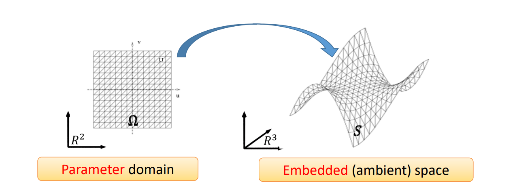    

# Parametric Surfaces    

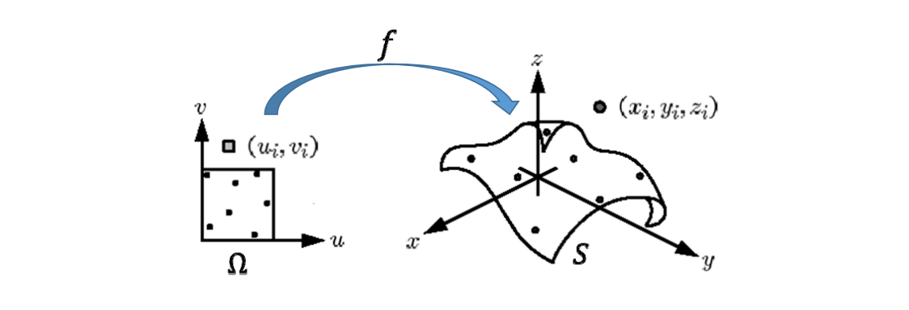    

$$
f:\Omega \to S
$$

$$
(u,v)\to \begin{cases}
 x= x(u,v),\\\\
 y= y(u,v),  \\\\
 z= z(u,v),
\end{cases}
$$

# 曲面展开（参数化）   

    

# 参数化：将曲面展开成平面    

* 每个3D顶点(\\(x,y,z\\))对应一个2D点(\\(u,v\\))    
• (\\(u,v\\)) 称为 (\\(x,y,z\\)) 的参数（2D流形曲面的本征维数）    

    

>   1. 三角形不能发生翻转。    
2. 三角形的扭曲能够保持。    
3. 边界不要自交。    
参数化的係用：1. 贴纹理     
  
# 但，球面是不可展的，必有形变    

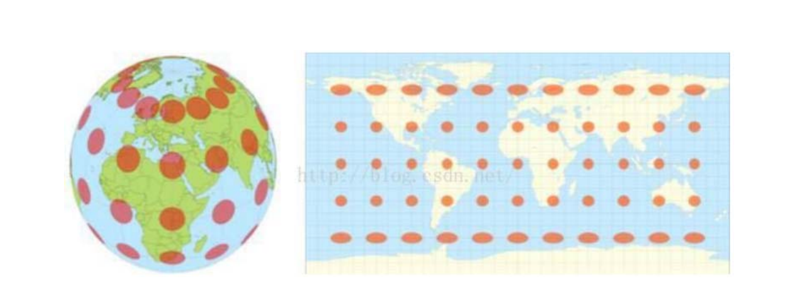    

> 思考：   
1.地图上的两点之间的距离是真实距离吗？哪些地方的距离可信度更高？    
2.地图上看，哪些区域的面积被放大了？    

# 传统横板地图    

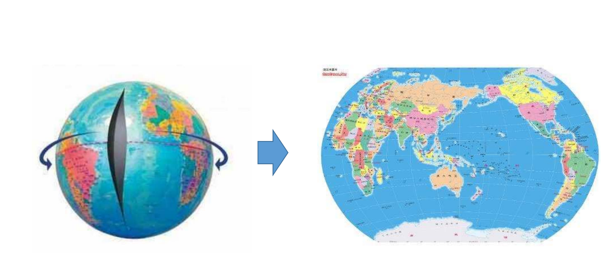    

沿经线切开    

# 新型竖板地图    

    
   

# 北京‐纽约的最短路径   

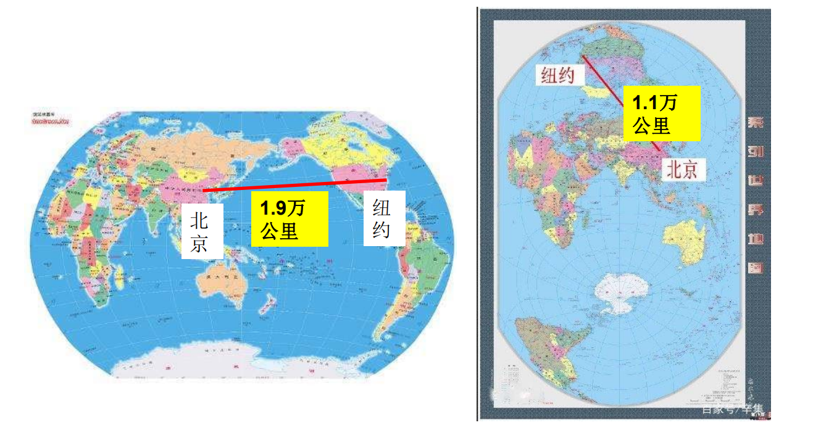    

# 参数化是几何处理中的基本问题    

* 提供了三维曲面每个点的一个二维参数     
• 本征维数参数      

* 在低维来处理高维问题，减少复杂度    
• 降维    

* 三维曲面之间的相关问题可通过参数化空间来处理      

# 给定边界的极小曲面    

• 如果边界刚好在一个平面上（共面）？    

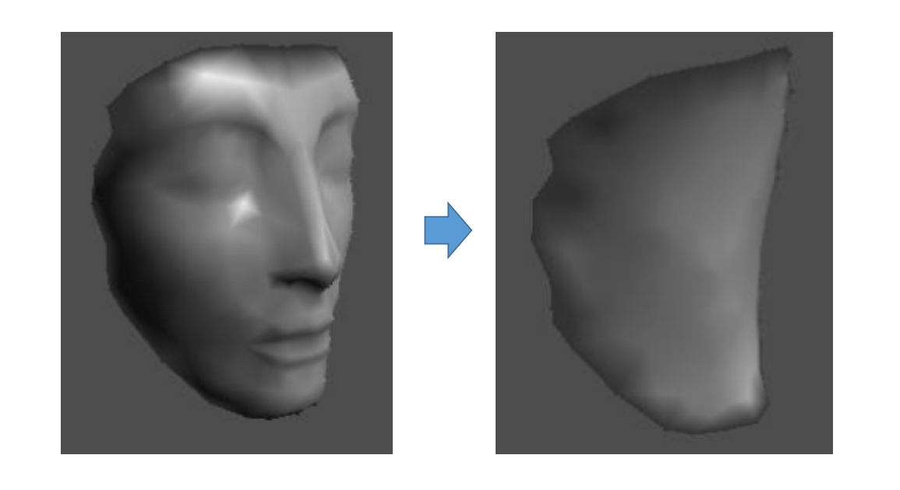    

# 将边界映射到平面的凸多边形上    [Floater 97’]

• Fixing the boundary of the mesh onto   

    

M. Floater. Parametrization and smooth approximation of surface triangulations. CAGD, 1997.    
<http://www.cs.jhu.edu/~misha/Fall09/Floater97.pdf>    

# 方法：求解稀疏方程组   

    

\\(\Rightarrow\\) Forming a sparse linear system    

> 还是之前 Global Laplacian Smoothing 求极小曲面的原理。    
但是为什么要把边界点放右边呢？右边还是\\(\delta\\)吗？    

# Tutte’s Method: Why it Works   

 - Theorem [**Tutte**,63], [Maxwel,1864] :     
    - If G=<V,E> is a 3‐connected planar graph (triangular mesh) then any barycentric embedding provides a **valid** parameterization    

    

> 如果边界位于凸多边形上，则三角形一定不会发生翻转！   
 

# 参数化：操作步骤    

• 检测边界    
• **将边界映射到正方形边界或圆边界（凸边界）**   
• 构建稀疏方程组    
• 求解稀疏方程组    
• 更新顶点坐标    
• **连接纹理图像，更新显示**    

# Floater参数化方法   [Floater 97’]

• Uniform parametrization    
• Weighted least squares parametrization    
• Shape‐preserving parametrization    

• 如何判断哪个参数化方法更好？    

M. Floater. Parametrization and smooth approximation of surface triangulations. CAGD, 1997.      
<http://www.cs.jhu.edu/~misha/Fall09/Floater97.pdf>   

# 曲面展开（参数化）   

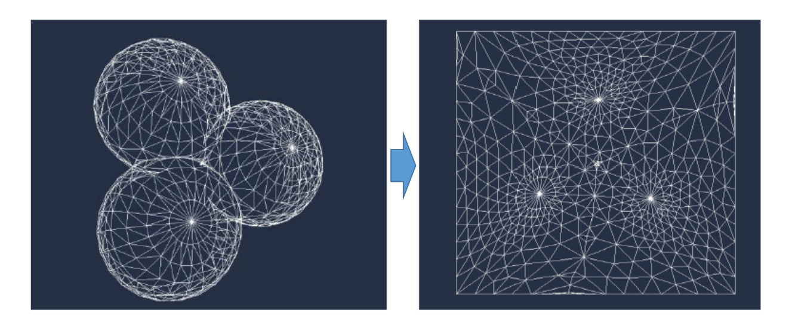    

# 纹理映射   

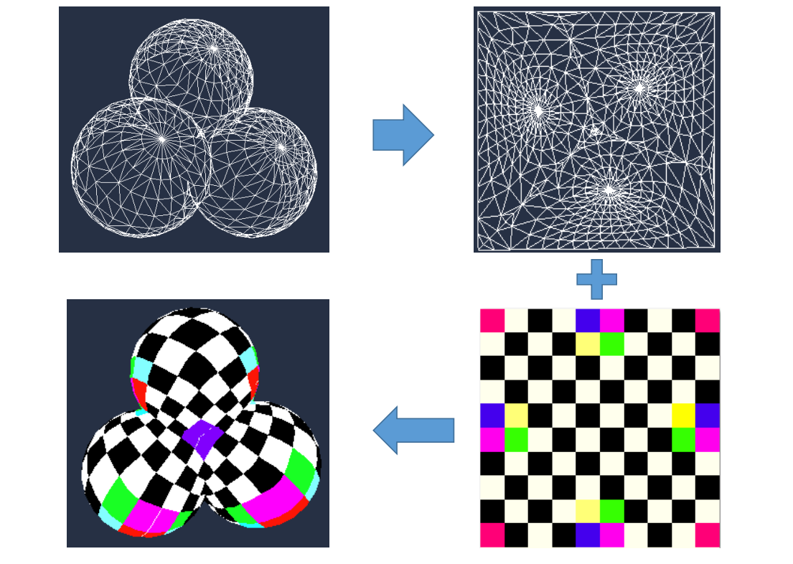    

    

> 使用这种格子作为纹理，方便观察扭曲情况，仍建议用 cotangent 权，扭曲较小。   
图1：均匀权， 图3：cotangent权     

# 例子   

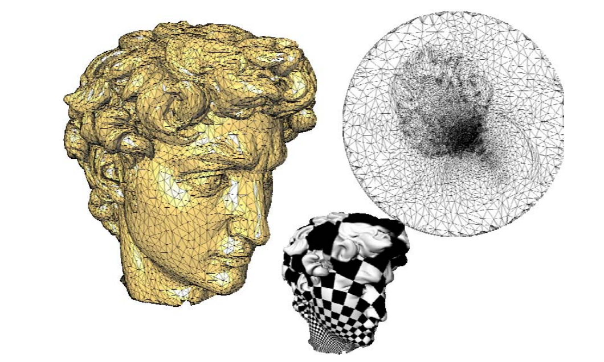    

> 例子中产生了较大的扭曲。且耳朵处容易发生数值精度问题。   
算法优点：简单、有效、无翻转。    

# Parameterization    

    

> 复杂模型割成多块分别参数化，再 packing    
优点：1.减少扭曲。    2.具有语义。    
缺点：1.空间浪费。    

# 曲面纹理的保存：2D图像   

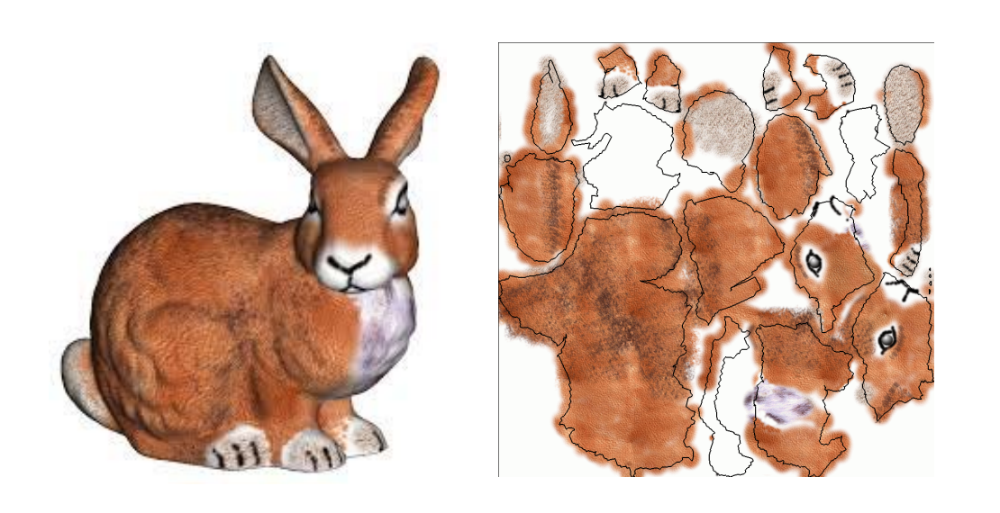    

# 参数化应用：纹理映射    

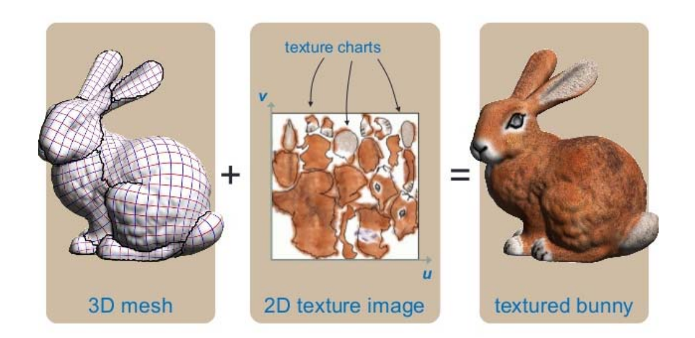    
