# 几何映射
 

# 回顾：曲面参数化   

• 问题：将空间曲面展开到二维平面    
• 本质：寻求一个映射\\(f:S\subset R^3\to\Omega \subset R^2\\)   

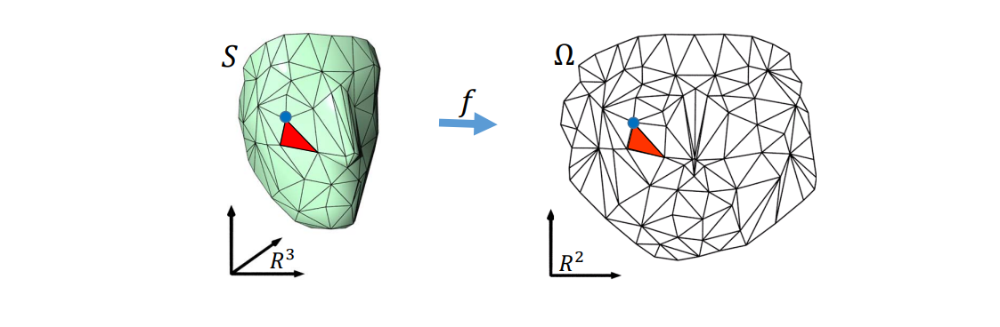  

# 映射（ Mapping / Map ）   

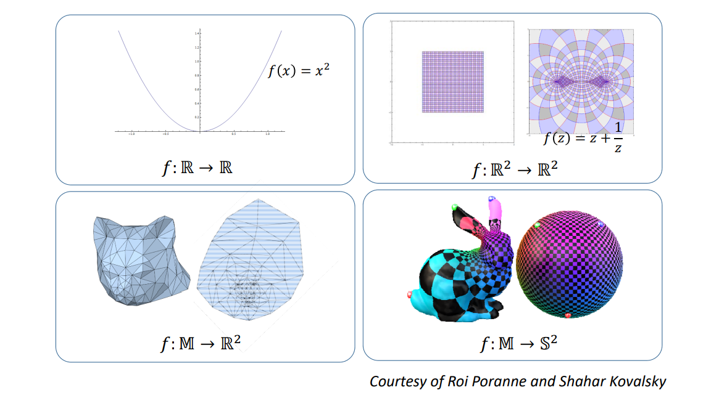  

# 映射（ Mapping / Map ）   

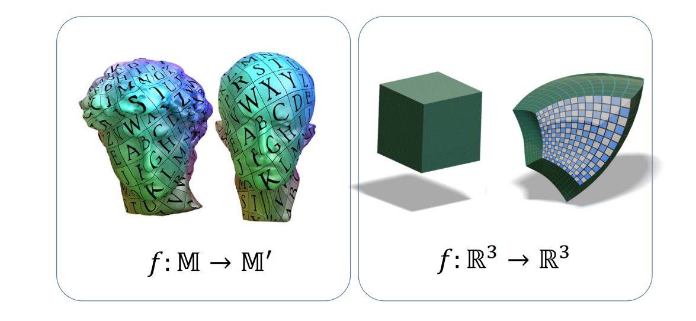  

# 本节课：平面几何映射   

• 映射表达：

$$
f:\mathbb{R} ^2\to\mathbb{R} ^2
$$

$$
f(X)=\begin{pmatrix}u(x)
 \\\\v(x)
\end{pmatrix}
$$

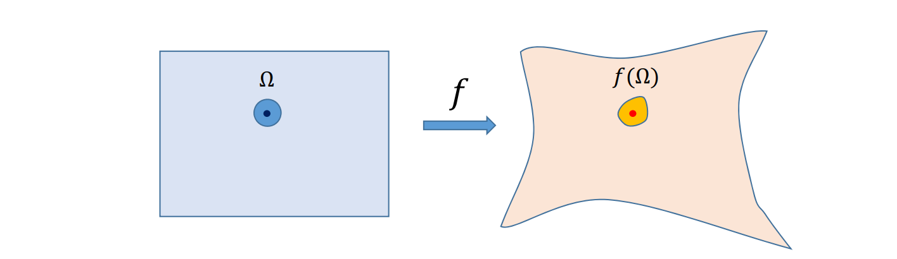  

# 映射的表达    

# 映射的表达：化繁为简   

* 映射表达为基本映射（基函数）的线性组合    
• 函数的分解   

* 映射表达为小区域（三角形区域）上映射的拼接   
• 区域的分解（映射的离散）   

# 映射：基函数的线性组合    

• 基函数(basis functions):   

$$
f_1,f_2,f_3,\cdots ,f_n
$$

• 基函数的线性组合：   

$$
f(X)=\begin{pmatrix}u(X)
 \\\\v(X)
\end{pmatrix}=\begin{pmatrix}\sum a_if_i(X)
 \\\\\sum b_if_i(X)
\end{pmatrix}
$$

  

  

  

# 映射的表达：化繁为简   

* 映射表达为基本映射（基函数）的线性组合    
• 函数的分解    

* **映射表达为小区域（三角形区域）上映射的拼接**    
• **区域的分解**（**映射的离散**）    

# 映射：简单区域上映射的连续组合   

• \\(f\\) is approximated by **piecewise linear maps** between pairs of triangles    

  

# 几何映射的例子    

# 例1：2D变形   

  

# 本质：插值问题   

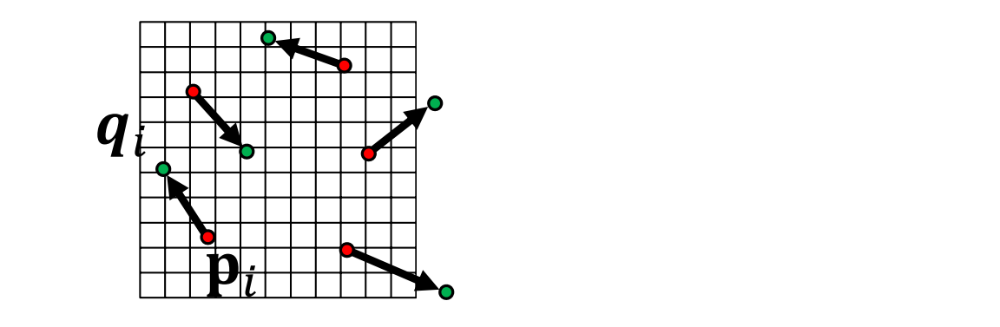  

$$
f(P_i)=\sum c_if_i(X)
$$

$$
c_i=?
$$

$$
f(P_i)=q_i,\forall i
$$

$$
\sum c_if_i(P_i)=q_i,\forall i
$$

# 求解    

• 插值法（比如，RBF插值）    

$$
f(p_i)=c_0+c_xx+c_yy+\sum c_i\phi (||X-P_i||)
$$

$$
\phi (r)=r^2\log r
$$

$$
f(P_i)=q_i,\forall i
$$

• 逼近法（能量极小法）    

$$
\min E_{TPS}(f)=\iint [(\frac{\partial ^2f}{\partial x^2} )^2+2(\frac{\partial ^2f}{\partial x\partial y} )^2+(\frac{\partial ^2f}{\partial y^2} )^2]
$$

Bending energy   

$$
s.t. f(P_i)=q_i,\forall i
$$

# 更多约束   

• Hermite插值：插值梯度    

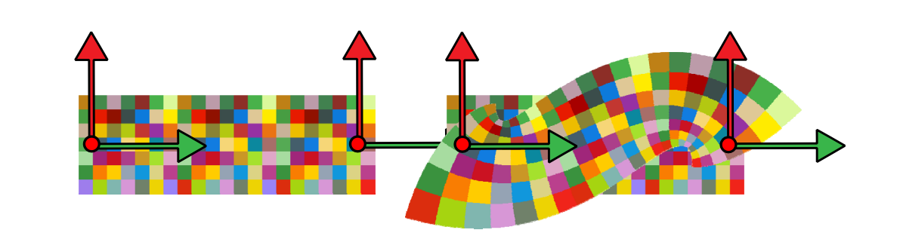  

$$
f(P_i)=q_i            
$$

$$
Df(P_i)=D_i            
$$

# 例2: Barycentric Coordinates   

Stages:    
• Source shape    
• Polygonal cage    
• Coordinates   

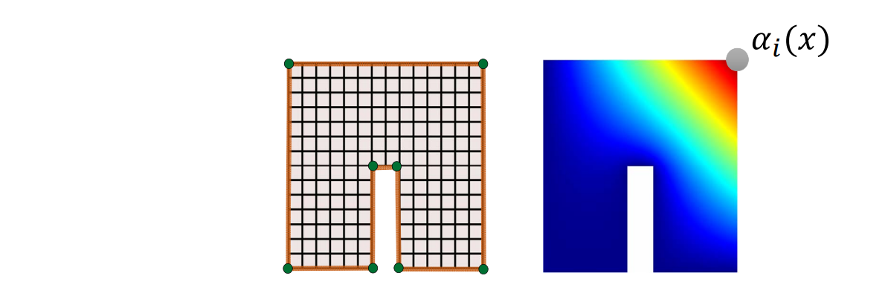  

$$
f(X)=\sum_{i=1}^{n} \alpha _i(X)q_i
$$

# 例2: Barycentric Coordinates    

Stages:    
• Source shape    
• Polygonal cage    
• Coordinates    

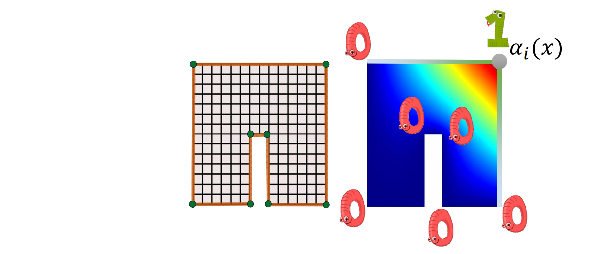  

$$
f(X)=\sum_{i=1}^{n} \alpha _i(X)q_i
$$

# 例2: Barycentric Coordinates   

Stages:   
• Source shape    
• Polygonal cage    
• Coordinates    
• Manipulate cage    
• Apply deformation    

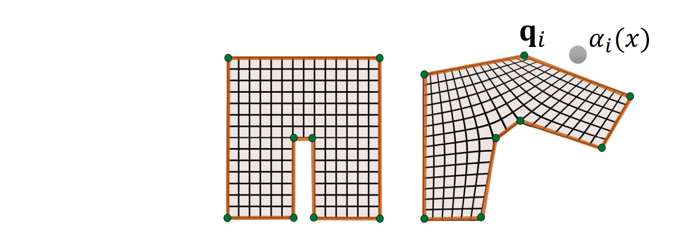  

$$
f(X)=\sum_{i=1}^{n} \alpha _i(X)q_i
$$

# 映射的性质   

# What are good maps?   

  

# Flip (foldover) triangles in mapping    

  

# Locally injective mappings    

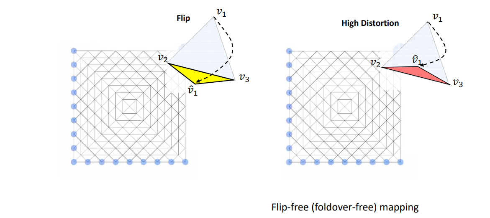  

# Globally Bijective VS. Locally Bijective   

  

# Globally Bijective VS. Locally Bijective   

    

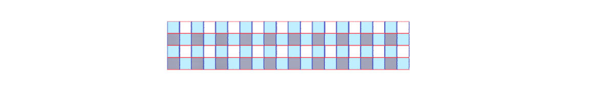  

  

# Globally Bijective VS. Locally Bijective   

 

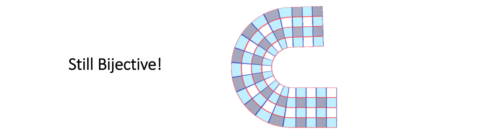  

# Globally Bijective VS. Locally Bijective   

 

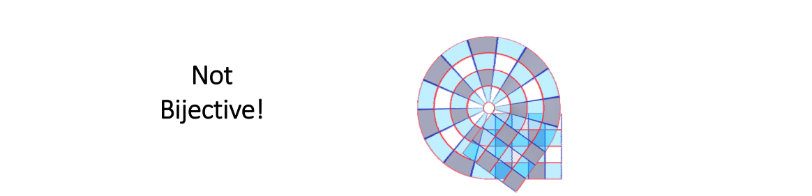  

# Globally Bijective VS. Locally Bijective    

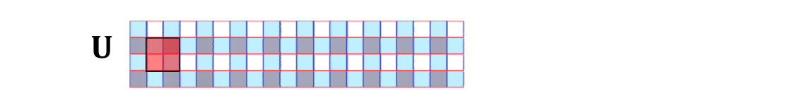  

Only Locally Bijective   

  

# Locally Bijection – Non‐example   

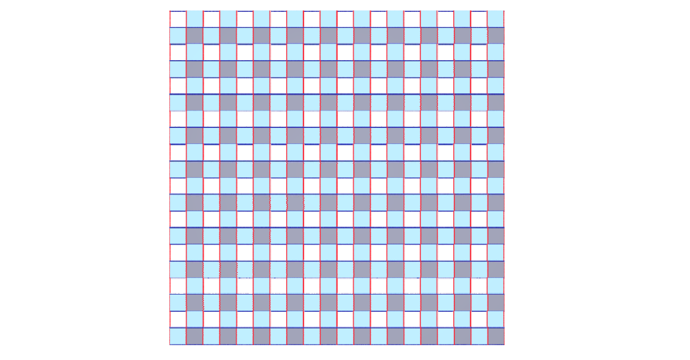  

# Locally Bijection – Non‐example    

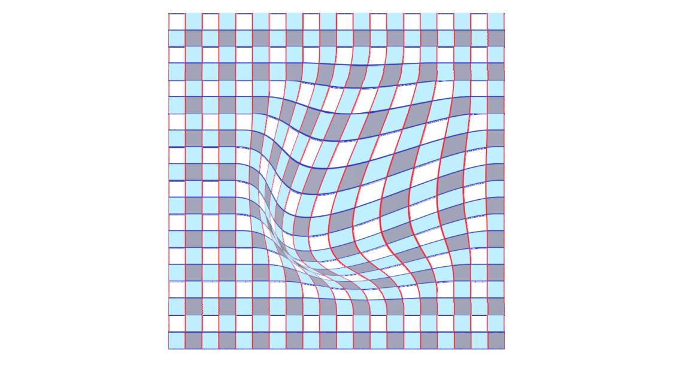  

# Locally Bijection – Non‐example    

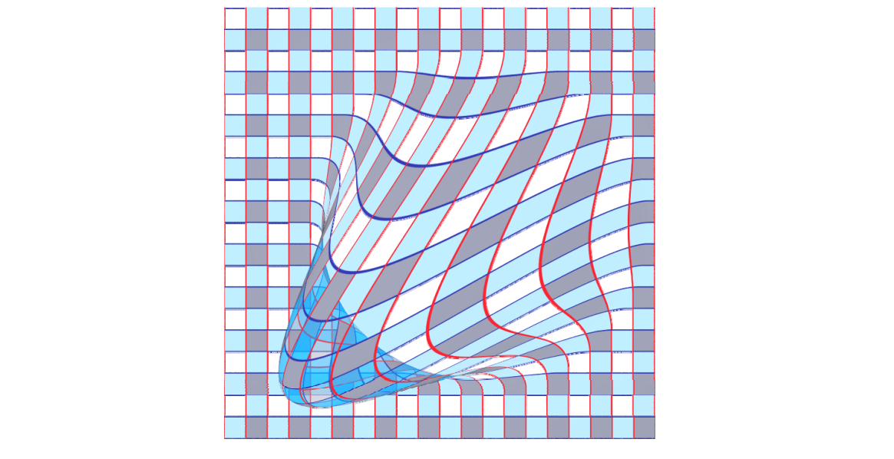   

# Locally Bijection – Non‐example    

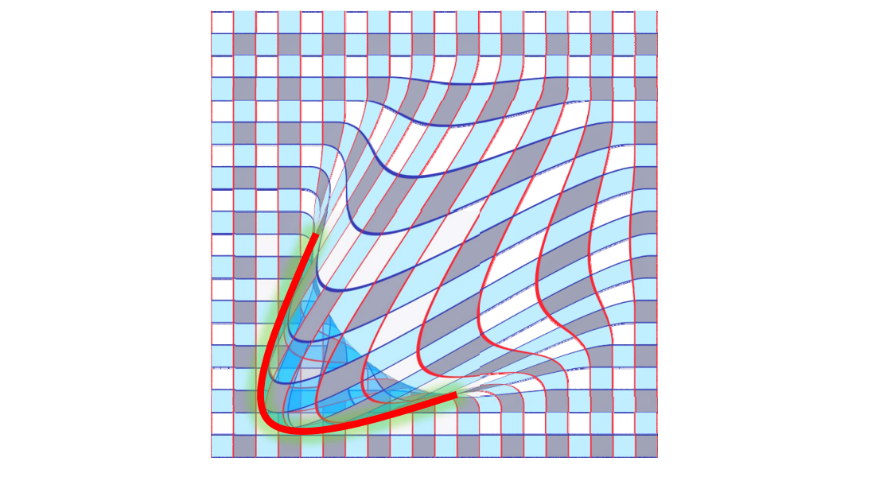  

# Locally Bijection – Sufficient condition  

  

# Globally Bijective VS. Locally Bijective   

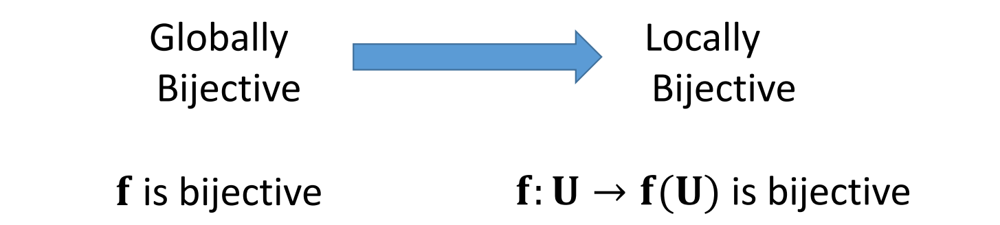  

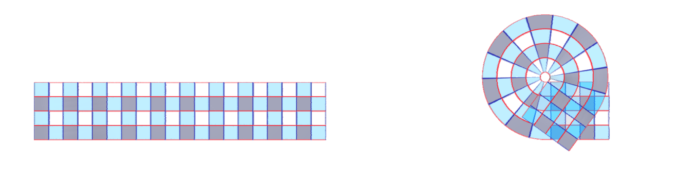  

Google: “Global inversion theorems”    

# What are good maps?   

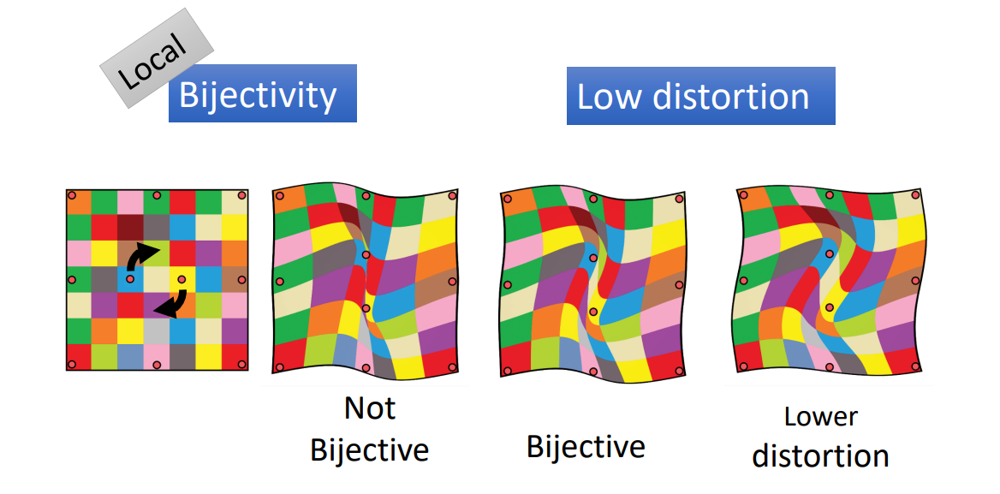  

# Jacobian的几何意义   

• 函数在某点的Jacobian度量了其局部的形变量    

  

# Distortion Measure    

$$
L=U\begin{pmatrix}
\sigma _1  & 0\\\\
0  &\sigma _2 
\end{pmatrix}V^*
$$

$$
\sigma _2\ge \sigma _1
$$

  

• angle‐preserving (conformal) \\(\sigma _1= \sigma _2\\)    

• area‐preserving (authalic) \\(\sigma _1\sigma _2=1\\)    

• length‐preserving (isometric) \\(\sigma _1=\sigma _2=1\\)   

# Distortion Metric   

  

# 映射的优化模型    

# Recap: Formulation of Parameterization   

$$
\min_{V} E(V)=\sum _{t\in T}(\sigma _1^2+\frac{1}{\sigma _1^2} +\sigma _2^2+\frac{1}{\sigma _2^2}) 
$$

$$
s.t.\sigma _1\sigma _2>0,\forall t
$$

• The cost function is highly **nonlinear** and **nonconvex**    
• The constraints are **nonlinear**    
• The Heissian matrix is highly **non‐definite**    

> Computationally expensive for large scale meshes!   

# Computing maps   

• Imposing constraints    

  

• Finding maps that are most…   

  

# Constrained Optimization   

  

# Energy     

    

$$
E(\phi )=E(A_1,\cdots ,A_m)
$$

# Map optimization    

• In terms of differentials:     

argmin \\(E(A_1,\cdots ,A_m)\\)    

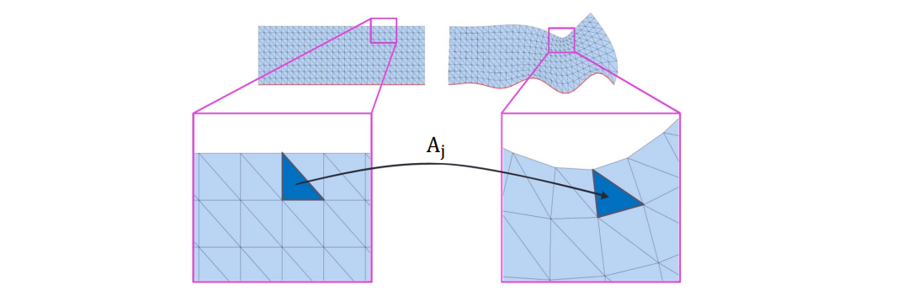    

# Map optimization    

• In terms of differentials:

argmin \\(\sum _jf(A_j)\\)    separable     

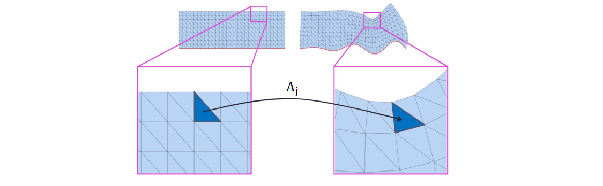    

# Map optimization    

argmin \\(\sum _jf(A_j)\\)

    

Must impose continuity!    

# Explicit continuity    

• Optimization variables: \\(A_1,A_2,\cdots ,A_m\\)     
• Adjacent \\(A_j\\)’s must agree     

    

# Explicit continuity    

• Optimization variables: \\(A_1,A_2,\cdots ,A_m\\)     
• Adjacent \\(A_j\\)’s must agree   

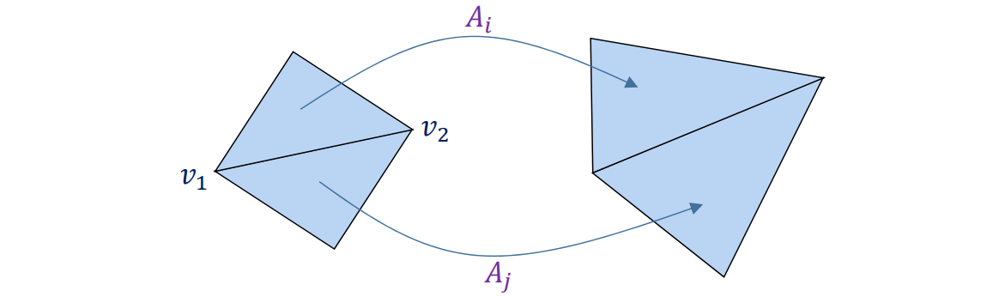    

$$
A_i\nu _1=A_j\nu _1
$$

$$
A_i\nu _2=A_j\nu _2
$$

# Implicit continuity    

    

$$
A_i\overline{\begin{bmatrix}
 \nu_1 & \nu_2 &\nu_3
\end{bmatrix}} =\overline{\begin{bmatrix}
 u_1 & u_2 &u_3
\end{bmatrix}}
$$

$$
A_i=\overline{\begin{bmatrix}
 u_1 & u_2 &u_3
\end{bmatrix}} \overline{\begin{bmatrix}
 \nu_1 & \nu_2 &\nu_3
\end{bmatrix}}
$$

$$
A_i=A_i(U)
$$

> Linearly express \\(A_i\\) ’s in terms of U   

• Optimization variables: \\(u_1,u_2,\cdots ,u_n(U)\\)    

$$
E(\Phi )=\sum _jf(A_j(U))
$$

# 几何优化的求解    

# Popular energies    

argmin\\(\sum _jf(A_j)\\)    

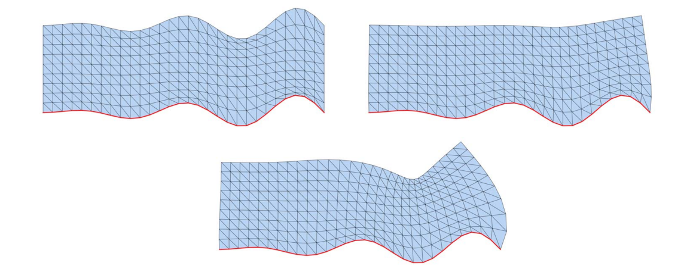    

# Dirichlet    

area / volume   \\(\Rightarrow E_D=\sum _jw_j||A_j||_F^2\\)   

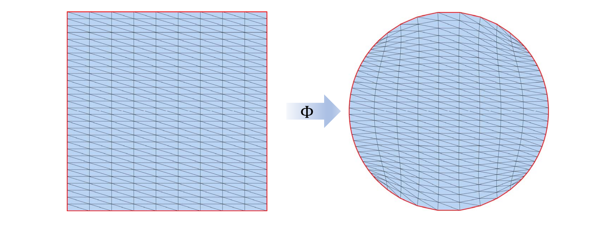   

# Dirichlet    

$$
E_D=\sum _jw_j||A_j||_F^2
$$

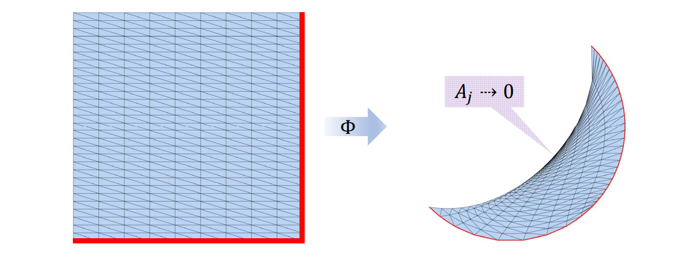   

# Orthogonal and Similarity    

• R is <u>orthogonal</u> if \\(R^T=R^{-1}\\)    
(rotation if det 𝑅 > 0)    

   

• S is a <u>similarity</u> if \\(S =\alpha R\\)   

   

# Closest  R and S    

• \\(\Re(A)=\\) closest orthogonal/rotation matrix to \\(A\\)    
• \\(\varsigma  (A)\\)= closest similarity matrix to  \\(A\\)    

• Computable using SVD/SSVD:    

\\(A=U\sum V^T\\);\\(\sum\\) =diag\\((\sigma _1,\cdots ,\sigma _n)\\)    

   

# As‐Similar‐As‐Possible (ASAP)   

$$
E_L=\sum _jw_j||A_j-\varsigma (A_j)||_F^2
$$

   

Solving sparse linear system!    

# As‐Rigid‐As‐Possible (ARAP)     

$$
E_R=\sum _jw_j||A_j-\Re (A_j)||_F^2
$$

   

# ARAP vs. ASAP    

   

# Singular values perspective    

   

# ARAP: Alternating Optimization     

$$
E_R=\sum _jw_j||A_j-\Re (A_j)||_F^2
$$

* Iteratively:     
• Compute and fix \\( R_j = \Re (A_j) \\)    Local step    

• Minimize

\\(\sum _jw_j||A_j-R_j||_F^2\\)   Global step    

[Liu et al. A Local/Global Approach to Mesh Parameterization. SGP 2008]    

   

   

   

   

   

   

   

   

# Alternating optimization    

• Very general    

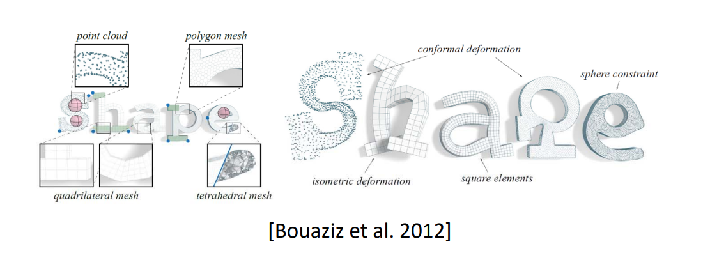   

• Related jargon:    
**gradient descent, global‐local, alternating projections**    

# Summary: Geometric Mapping    

• Discrete Mapping   

   

• Discrete formulation   

argmin \\(E(\phi )\\)  Separable    
s.t. \\(\phi \in K\\)    

> • Nonlinear and nonconvex     
• Computationally expensive for large scale meshes!    

# eshless mappings    

   

• Low distortion    
• Flip‐free    
• Bijective    

$$
f(x)=\sum_{i=1}^{m} c_iB_i(x)
$$

# Geometric Mapping    

* 其他区域间的映射求解    
• 离散形式    
• 约束条件    

   
