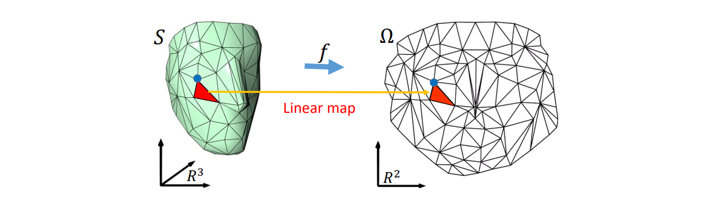

# 回顾

曲面参数化   
映射（ Mapping / Map ）   
平面几何映射   

# 映射的表达    

## 映射：基函数的线性组合    

映射表达为基本映射（基函数）的线性组合    

• 基函数(basis functions):   

$$
f_1,f_2,f_3,\cdots ,f_n
$$

• 基函数的线性组合：   

$$
f(X)=\begin{pmatrix}u(X)
 \\\\v(X)
\end{pmatrix}=\begin{pmatrix}\sum a_if_i(X)
 \\\\\sum b_if_i(X)
\end{pmatrix}
$$

  

  

  

## 映射：简单区域上映射的连续组合   

映射表达为小区域（三角形区域）上映射的拼接

\\(f\\) is approximated by **piecewise linear maps** between pairs of triangles    

  

# 几何映射的例子    

## 例1：2D变形   

  

> [06:51] 2D变形问题：构造一个函数\\(f\\)， 使得拖拽点\\(f(P)\\)满足到达目标点的约束。   
[10:06] 或\\(f(P)\\)满足\\(f'(P)\\)为目标值的约束，就是法线插值。    
[10:43] mesh 点是指定点（例如重心坐标）的组合。通过移动指定点控制mesh.    

本质：插值问题   

## 例2: Barycentric Coordinates   

重心坐标：[link](../DiscreteCurves/BarycentricCoordinate.md)

# 映射的性质   

问：What are good maps?

  

答：（1）满足双射，即Source 与 target 一一 对应。local 双射（单射)：一一对应，但有翻转发生      
（2）扭曲尽量少，否则有鬼影现象 [21:28下图]    
   
## 翻转 Flip (foldover) - 单射

### 现象

  

### 原理

  

f(x)是映射关系，求\\(f\\)的 Jacobian,

\\(J\\)是每个分量分别对\\(x\\)和构成偏导     
\\(\det|J| >0 \Rightarrow \\)未翻转。    

> [图23:35]有两个区域 \\(D_1, D_2\\),  
> \\(\Omega \\) 为\\(x_0\\)的无穷小邻域     
\\(\Omega\\)映射到\\(D_2\\)后成为\\(f(\Omega)\\)     
A: signed area.
$$
y=\underset{A(\Omega )} {lim}=\frac{A(f(\Omega ))}{A(\Omega )} =J(f)l_{x=x_0}
$$
|y|>1：膨胀     
|y|<1:收缩     
y<0：翻转   

[31:02] 3D空间则分解为\\(\sigma _1,\sigma _2,\sigma _3\\)     
[32:02图]  有一个矩形，希望把它边界变成红线形，求变形后的形状：      
期望：形变较小/夹角小\\(\dots\\) (看应用需求)   

## Globally Bijective - 双射

  

> 单射→双射：需要显式地判断是否发生碰撞      

  
> 这里的形变，虽然每个面片都没有发生翻转，但整体上发生了碰撞，不满足双射

## 扭曲

### Jacobian的几何意义   

函数在某点的Jacobian度量了其局部的形变量    

  

$$
L=U\begin{pmatrix}
\sigma _1  & 0\\\\
0  &\sigma _2 
\end{pmatrix}V^*
$$

$$
\sigma _2\ge \sigma _1
$$

  

• angle‐preserving (conformal) \\(\sigma _1= \sigma _2\\)    

• area‐preserving (authalic) \\(\sigma _1\sigma _2=1\\)    

• length‐preserving (isometric) \\(\sigma _1=\sigma _2=1\\)   

### 其它Distortion Metric   

  

# 映射的优化模型    

## Recap: Formulation of Parameterization   

$$
\min_{V} E(V)=\sum _{t\in T}(\sigma _1^2+\frac{1}{\sigma _1^2} +\sigma _2^2+\frac{1}{\sigma _2^2}) 
$$

$$
s.t.\sigma _1\sigma _2>0,\forall t
$$

• The cost function is highly **nonlinear** and **nonconvex**    
• The constraints are **nonlinear**    
• The Heissian matrix is highly **non‐definite**    

> Computationally expensive for large scale meshes!   

## 要解决的问题   

输入：      
  
可能的输出：  
  
希望找到形变较少的度量，不同的度量会得到不同的结果  

## 优化的能量   

基于不同的度量，生成对应能量函数，进行优化  
  

能量由每个三角形的变形能量相加得到：
    

$$
E(\phi )=E(A_1,\cdots ,A_m) = \sum _jf(A_j)
$$

## Map optimization    

同时要考虑三角形能够拼到一起。

    

### Explicit continuity    

优化参数: \\(A_1,A_2,\cdots ,A_m\\)     
相邻三角形的A应满足约束：  

    

$$
A_iv_1=A_jv_1
$$

$$
A_iv_2=A_jv_2
$$

### Implicit continuity    

    

$$
A_i\overline{\begin{bmatrix}
 \nu_1 & \nu_2 &\nu_3
\end{bmatrix}} =\overline{\begin{bmatrix}
 u_1 & u_2 &u_3
\end{bmatrix}}
$$

$$
A_i=\overline{\begin{bmatrix}
 u_1 & u_2 &u_3
\end{bmatrix}} \overline{\begin{bmatrix}
 \nu_1 & \nu_2 &\nu_3
\end{bmatrix}}
$$

$$
A_i=A_i(U)
$$

> 变量不是A，而是u，A是由u决定的

Optimization variables: \\(u_1,u_2,\cdots ,u_n(U)\\)    

$$
E(\Phi )=\sum _jf(A_j(U))
$$

> 这种方法更常用

# 几何优化的求解    

优化能量，关键是怎么定义能量

## 各种能量
### Dirichlet能量    

area / volume   \\(\Rightarrow E_D=\sum _jw_j||A_j||_F^2\\)   

> 公式没有几何意义，纯粹是一种度量。  
> 会造成比较大的扭曲，现在很少用了

### Orthogonal and Similarity    

• R is **orthogonal** if \\(R^T=R^{-1}\\)    
(rotation if det 𝑅 > 0)    

   

• S is a **similarity** if \\(S =\alpha R\\)   

   

• \\(\Re(A)=\\) closest orthogonal/rotation matrix to \\(A\\)    
• \\(\varsigma  (A)\\)= closest similarity matrix to  \\(A\\)    

对A做SVD/SSVD分解:    

\\(A=U\sum V^T\\);\\(\sum\\) =diag\\((\sigma _1,\cdots ,\sigma _n)\\)    

   

### As‐Similar‐As‐Possible (ASAP)   

$$
E_L=\sum _jw_j||A_j-\varsigma (A_j)||_F^2
$$

   

Solving sparse linear system!    

### As‐Rigid‐As‐Possible (ARAP)     

$$
E_R=\sum _jw_j||A_j-\Re (A_j)||_F^2
$$

   

**Alternating Optimization**     

* Iteratively:     
• Compute and fix \\( R_j = \Re (A_j) \\)    Local step    

• Minimize

\\(\sum _jw_j||A_j-R_j||_F^2\\)   Global step    

[Liu et al. A Local/Global Approach to Mesh Parameterization. SGP 2008]    

> [42:11] locd: 分裂     global:缝合       
交替迭代优化方法     

|||||
|---|---|---|---|
|||||
|||| |

> 交替优先的方法非常常用

## 各种方法的比较
### ARAP vs. ASAP    

   

### Singular values perspective    

   

# Summary

## Geometric Mapping    

• Discrete Mapping   

   

• Discrete formulation   

argmin \\(E(\phi )\\)  Separable    
s.t. \\(\phi \in K\\)    

• Nonlinear and nonconvex     
• Computationally expensive for large scale meshes!    

## Meshless mappings    

$$
f(x)=\sum_{i=1}^{m} c_iB_i(x)
$$

> [46:28] f有些独特的性质。例如在边界上满足一定的性质，就能保证内部一定满足某些性质。    
对整个对象做映射，因此是meshless.     

   

• Low distortion    
• Flip‐free    
• Bijective    

## 其他区域间的映射求解    
• 离散形式    
• 约束条件    

   
