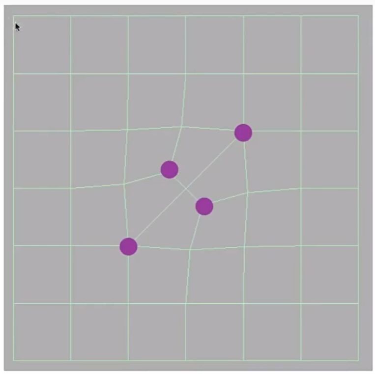
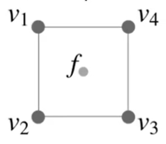

## Catmull-Clark 细分

loop 细分只能用于三角形面片，而此算法则更通用

### 定义

Quad face：四边形面片

Non-quad face：非四边形面片

奇异点： degree不为4的点，degree 表示与点相邻的边数

### 第一步：取所有边上的中点与面上的中点

把边中点与面中总用一条线连起来  

  

操作后，**增加的**奇异点个数与 操作前的non-quad face 数相同，且所有的面都变为 quad face

   

### 第二步： 更新面中心的新增点，

更新公式为：

\\[
f = \frac{v_1 + v_2 + v_3 + v_4}{4}
\\]

> &#x2753; 如果是在一个三角形面片的中心呢？
 
### 第三步： 更新边中心的新增点

更新公式为：

\\[
e = \frac{v_1 + v_2 + f_1 + f_2}{4}
\\]

### 更新 old 顶点

更新公式为：

\\[
p' = \frac{f_1 + f_2 + f_3 + f_4 + 2(e_1 + e_2 + e_3 + e_4) + 4p}{16}
\\]

> &#x1F4A1; 以上这些方法都是基于经验估计。  
> new point的位置不是该是由邻居点使用固定加权值得到，这个权值应该是不固定的，与old point和neighbour的距离有关。  
> 这些都是local细分方法，要想细分后与原mesh形状接近，应该使用global方法。  
> 同时，mesh细分是对丢失信息的补全，要想猜丢失的信息，还需要从其它mesh的统计规律、物理意义、人为知识中得到先验信息。  
