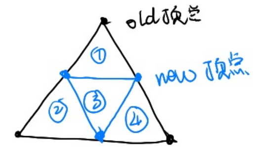
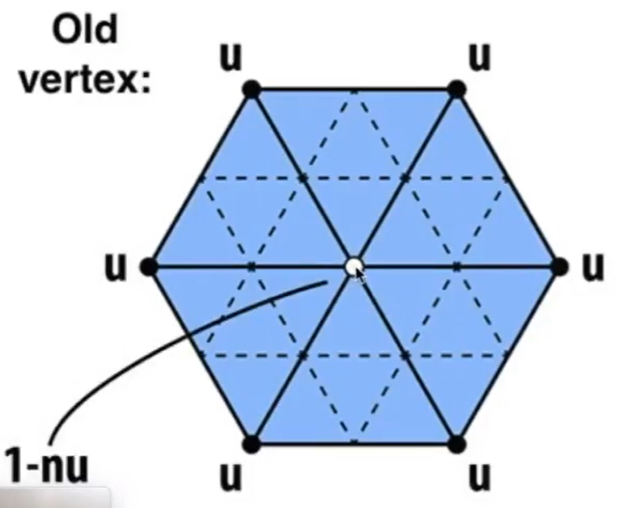

## Loop 细分算法

[11:30] (*loop 是人名，不代表循环*）

### 第一步： 划分三角形

### 第二步：更新new顶点的位置

new顶点被两个old三角形共享，更新公式为：

\\[
p = \frac{3}{8}(A+B) + \frac{1}{8}(C+D)
\\]

### 第三步：更新old顶点的位置

old 顶贞被多个 old 三角形共享

更新公式为：  

\\[
p = (1 - n * u) * pos + n * neighbor
\\]

n:与old顶点连接的边数

u:一个经验值

pos: old顶点更新前的位置

neighbor: old顶点的所有邻居的位置之和
