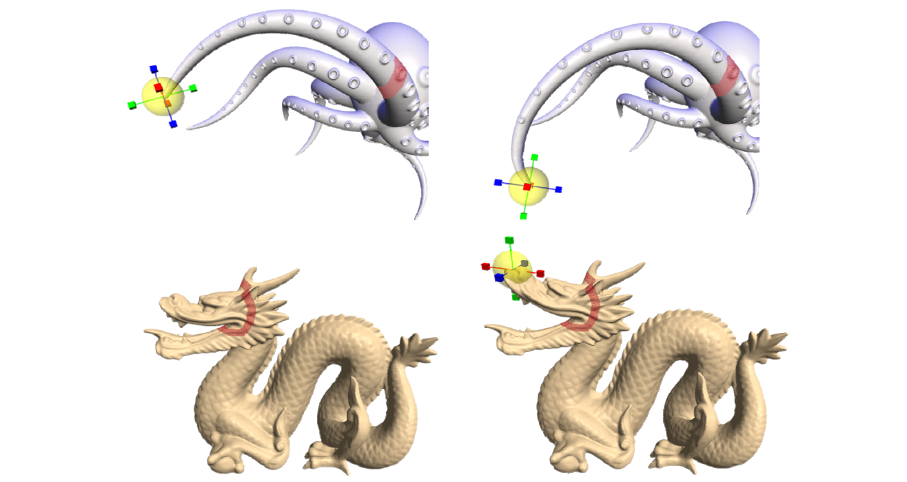
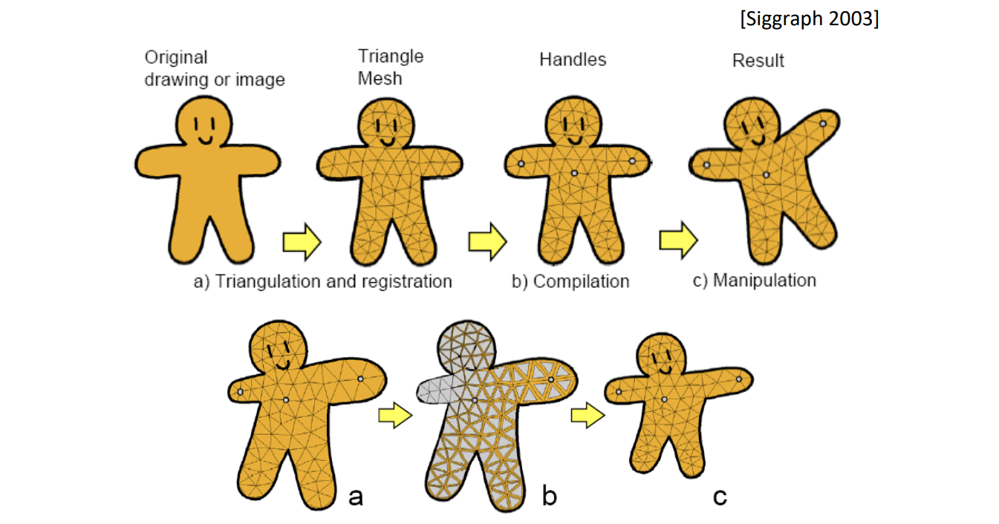
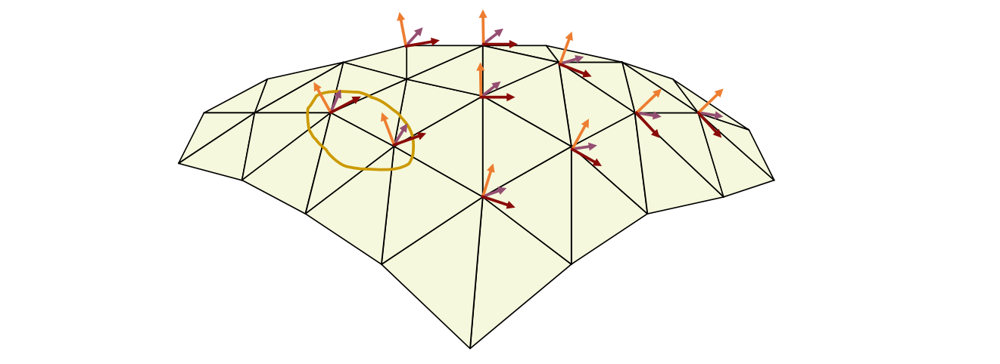
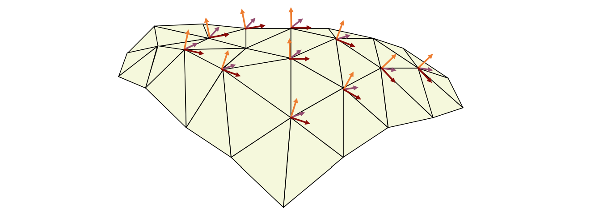

# Point based editing要解决的问题    

     

Fix 红圈上的点，Drag one or more vertices，更新红圈内的点

本质数学问题：数据插值问题，同时让f满足光滑、性质保持等约束。

$$
\begin{array}{l} 
 \min E (f) \\\\ 
  s.t. &f(x_i)=y_i,i=1,2,\dots , n \\\\ 
\end{array} 
$$

# （1） RBF‐based Editing       

# （2） Moving Least Squares Method

 [Siggraph 2006]   

# （3） Vector Field Based Deformations

 [Siggraph 2006]    

## 原理

> 在空间定义了一个连续的场，物理在场里面流动产生新的变化

Basic model: Moving vertex along the deformation orbit – defined by the path lines of a vector field v.    

  

Given a time‐dependent vector field V(X,t), a *Path Line* X(t) in space is an integral.    

  

## Vector Field Selection：    

* Deformation Request:    
• No self‐intersection    
• Volume‐preserving    
• Details‐preserving    
• Smoothness of shape in deformation    
* Divergence‐free Vector Field: \\(V=(V_1, V_2, V_3)\\)    

$$
div V=\frac{\partial V_1}{\partial x} +\frac{\partial V_2}{\partial y}+\frac{\partial V_3}{\partial z}=0
$$

> [38:39]优点:物体不会产生自交

# （4） Laplacian Editing [Sorkine et al. SGP 2004]   

优点：  
• Laplacian能体现局部细节，因此Laplacian 尽量不变可保证局部细节  
• Representation with **sparse** matrices    
• Efficient **linear** surface reconstruction       

  

$$
\nu _i=\sum _{j\in N(i)}w_j\nu _j+\delta _i
$$

## 优化目标

- Laplacian Approximation    

$$
\tilde{X} =\underset{X}{argmin} \left ( ||LX-\delta ^{(x)}||^2+\sum _{j\in C}\omega ^2||x_j-c_j||^2 \right ) 
$$

> 第一项：局部细节不变，第二项：满足用户要求

- Gradient Approximation    

$$
\min_\phi \iint _\Omega ||\nabla \phi -W||^2dA,
$$

  

## 求解线性方程组

$$
LX=\delta\\\\
x_j=c_j,  \quad j\in\\left \\{ j_1,j_2,\dots,j_k \right \\}
$$

## Results     

  

## Detail transfer and mixing    

这是基于Laplace的point based的一个应用

[40:45] 把一个 mesh 的 Laplacian 细节迁移到另一个 mesh上

    

> 要求网格一一对应

方法：Mixing Laplacians，即Taking weighted average of \\(\delta _i\\) and \\(\delta '_i\\)    

## Mesh transplanting    

这是基于Laplace的point based的一个应用  
[41:29] 把一个模型拼接到另一个模型上

    

可能用[0,1]控制Laplace的混合比例，造成渐变效果。  

## Invariance – solutions   

- Explicit transformation of the differential coordinates prior to surface reconstruction    
  - Lipman, Sorkine, Cohen‐Or, Levin, Rössl and Seidel [SMI 04], “Differential Coordinates for Interactive Mesh Editing”,    
    - Estimation of rotations from naive reconstruction    
- Yu, Zhou, Xu, Shi, Bao, Guo and Shum [SIGGRAPH 04], “Mesh Editing With Poisson‐Based Gradient Field Manipulation”,     
  - Propagation of handle transformation to the rest of the ROI using geodesic distances    
- Zayer, Rössl, Karni and Seidel [EG 05], “Harmonic Guidance for Surface Deformation”,     
  - Propagation of handle transformation to the rest of the ROI using harmonic functions     

# （5） Poisson Mesh Editing    

Yu et al. Mesh Editing With Poisson-Based Gradient Field Manipulation. Siggraph 2004.   

> 这个方法起源于一种图片算法，把图像一部分融合到另外一个图像.让边界无缝融合，用目标的颜色结合源的梯度。  
把这个方法用到3D图形上，源的梯度就演变为源的Laplace。  

• **The representation**: the **gradients** of the functions **X, Y, Z** on each triangle of the mesh   
• **Deformation**: propagate the transformation of the handle onto the ROI using **geodesic distances**    

    

• Inspiration: **Poisson Image Editing** [Pérez et al. 03]    

    

• Reconstruct a function from its gradients via the Poisson equation:     

$$
\underset{f}{\arg \min } \underset{\Omega}{\int}\||\nabla f-\mathbf{w}\||^{2}, \quad  s.t. \quad  f\left |_{\partial \Omega }= f^* \right | _{\partial \Omega}
$$ 
  

$$
\Downarrow 
$$

$$
 \Delta f=\operatorname{div} \mathbf{w} \quad  with  \left.\quad f \right|_{\partial \Omega}=\left.f^{*}\right| _{\partial \Omega} 
$$

# （6）（7） As‐rigid‐as‐possible Deformation     
 
方法起源于一种2D图形算法：  

    

> 把三角形当作刚体来形变。然后再缝合。

后引申到3D：  

[Sorkine and Alexa, As‐Rigid‐As‐Possible Surface Modeling. SGP 2007]     

Ask all star edges to transform rigidly by some rotation R, then the shape of the cell is preserved    

    

$$
\min_{\mathbf{v}^{\prime}}\sum_{i=1}^{n} \sum _{j\in N(i)}||({\mathbf{v}}^{\prime}_i-{\mathbf{v}}^{\prime}_j)-R_i({\mathbf{v}}_i-{\mathbf{v}}_j)||^2
$$

$$
s.t.\mathbf{v}^{\prime}_j=\mathbf{c} _j,j\in C
$$

效果：  
   

> deformation 时保持 Laplacian 旋转    
优点：中间会膨胀

# （8） Linear Rotation‐invariant Coordinates

[Lipman et al. Siggraph 05]      

> 保持曲面的第一形和第二形.
> 没听懂  

• Keep a local frame at each vertex    
• Prescribe changes to some selected frames    

   

Local frame:    
{\\(\mathbf{a}_i, \mathbf{b}_i, \mathbf{n}_i\\)}

• Encode the differences between adjacent frames     
• Solve for the new frames in least‐squares sense    

$$
\begin{array}{l}
{\mathbf{a}_i}-{\mathbf{a}_j}=\alpha_1 {\mathbf{a}_i}+\alpha_2 {\mathbf{b}_i}+\alpha_3 {\mathbf{n}_i}\\\\
{\mathbf{b}_i}-{\mathbf{b}_j}=\beta _1 {\mathbf{a}_i}+\beta _2 {\mathbf{b}_i}+\beta _3 {\mathbf{n}_i} \\\\
{\mathbf{n}_i}-{\mathbf{n}_j}=\gamma  _1 {\mathbf{a}_i}+\gamma _2 {\mathbf{b}_i}+\gamma _3 {\mathbf{n}_i}
\end{array}\\\\
\cdots \cdots \\\\
constraints
$$

   

* Reconstruction:    
• After having the frames, solve for positions Frame‐based deformations    

   

   

## Results    

   

本文出自CaterpillarStudyGroup，转载请注明出处。
https://caterpillarstudygroup.github.io/GAMES102_mdbook/  
