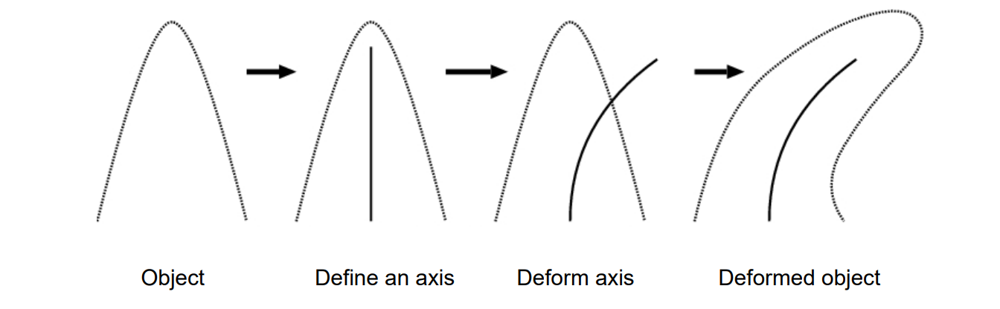
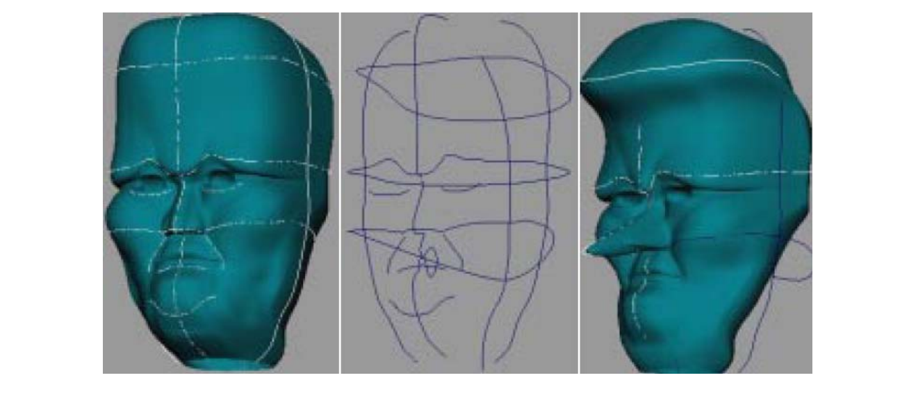
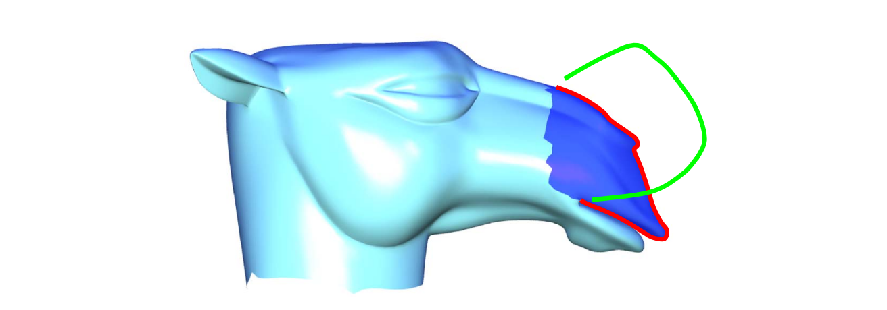
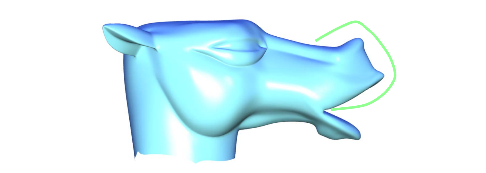
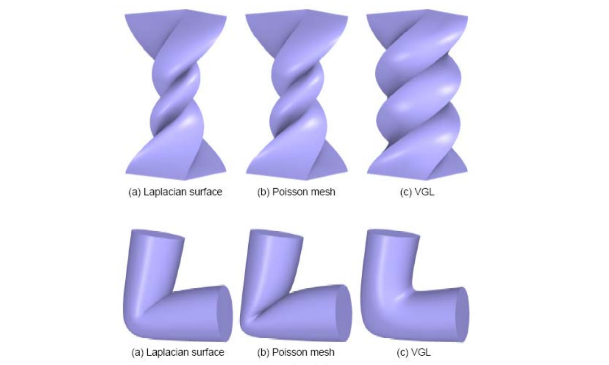
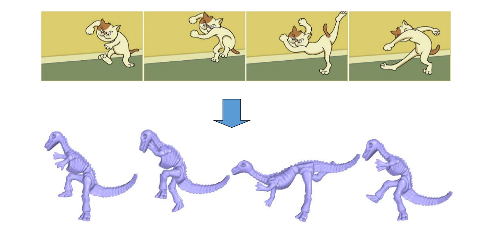

# 2. Curve Proxy    

Curve Proxy要解决的问题  
   

# 2.1 Skeleton based    

Axial Deformation [1994]

   

> 取曲面中轴或人为标注的骨架  
> 并建立骨架上的点与边界上的点的关联  

   

# 2.2 Skeleton‐based Deformation     

   

# 2.3 Wires based    

[Siggraph 1999]    

   

> 在曲面外围定义轮廓线

# 2.4 Silhouette sketching based    

[Nealen et al. Siggraph 05]    

> Silhouette （轮廓线）

Approximate sketching: Balance weighting between detail and positional constraints    

   

   

> 实现的思想类似于Laplace，只是交互的方式变成了Stretch。  

# 2.5 Volumetric Graph Laplacian    
    
   

> [55:32] 保证体里面的Laplace，相当于2D Laplacian 推广到3D。  
> 能保证体不收缩，即局部保体积。    

## Animation Modeling from 2D Cartoons    

   

# Short Summary: curve proxy    

• Curve features    
• Skeletons    
• Silhouette    
• Free‐form sketches    
• Wires    
• 2D image contours   
• …    

本文出自CaterpillarStudyGroup，转载请注明出处。
https://caterpillarstudygroup.github.io/GAMES102_mdbook/  
