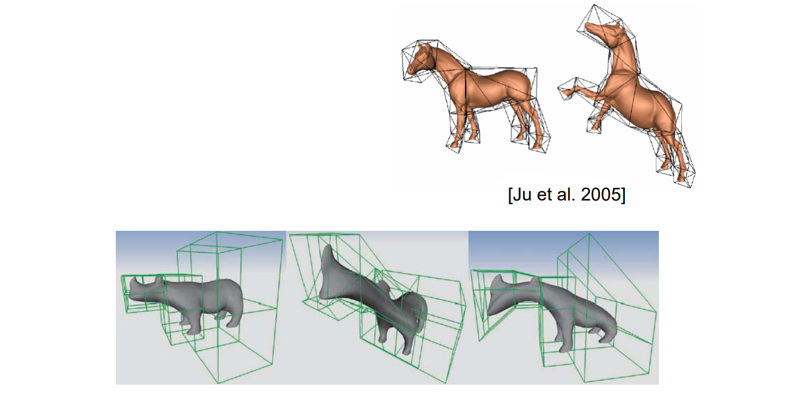
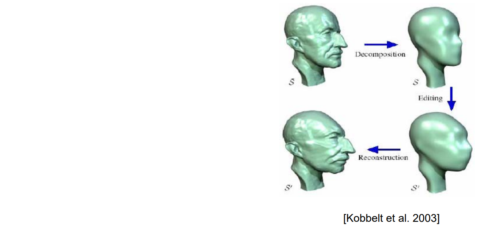
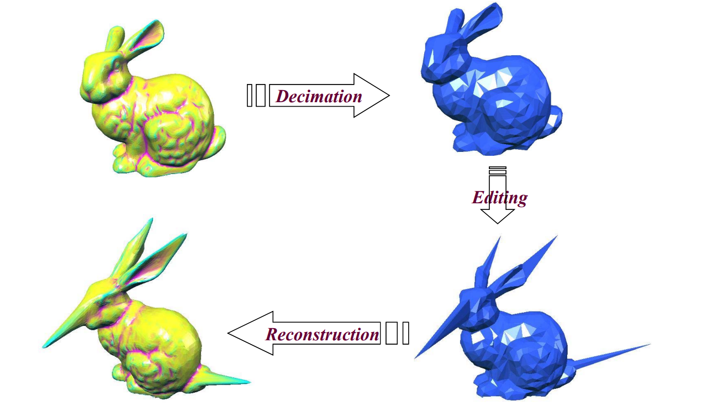

# 3. Mesh Proxy   

**方法**：      

* Define a mesh proxy for the shape: generally a simpler, coarse mesh which encloses the shape    

   

> The shape is embedded into the mesh proxy    

* Deform the mesh proxy using point/line base methods    

**Advantages**:     
• You can deform arbitrary objects    
• Independent of object representation    

# 3.1 Free‐form Deformation (FFD)    

[Sederberg et al. 86]   

* Proxy: a **lattice** mesh     
* more easily parametrized than the object     
* Deformation defined by the tensor Bezier solid     

   

# 3.2 Cage‐based deformation   

* Proxy: cage    
* Barycentric coordinates     

   

> 怎么找 Cage?

# 3.3 Multiresolution Editing    

* Proxy: simplified shape    

> 对曲面进行光顺 (简化)，再还原细节    

* Pros    
• Preserving details, scalable    
* Cons    
• Instable reconstruction for large deformation    
• Resampling problem     
* Invariant variables    
• Detail information    

   

   

# Short Summary: mesh proxy   

• Lattice    
• Cage    
• Simplified shape    
• …     

本文出自CaterpillarStudyGroup，转载请注明出处。
https://caterpillarstudygroup.github.io/GAMES102_mdbook/  
