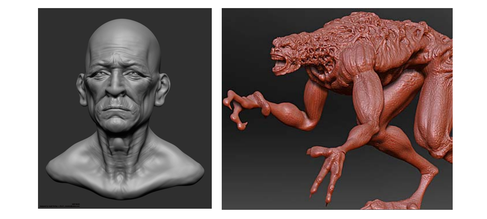
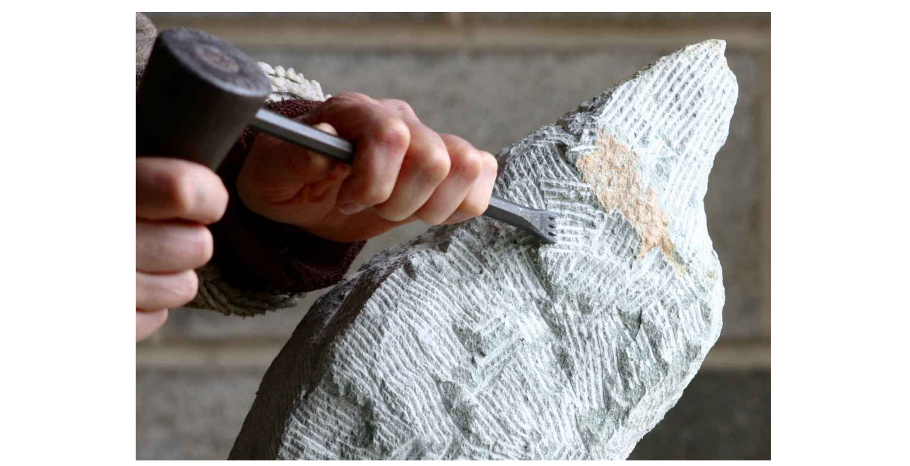
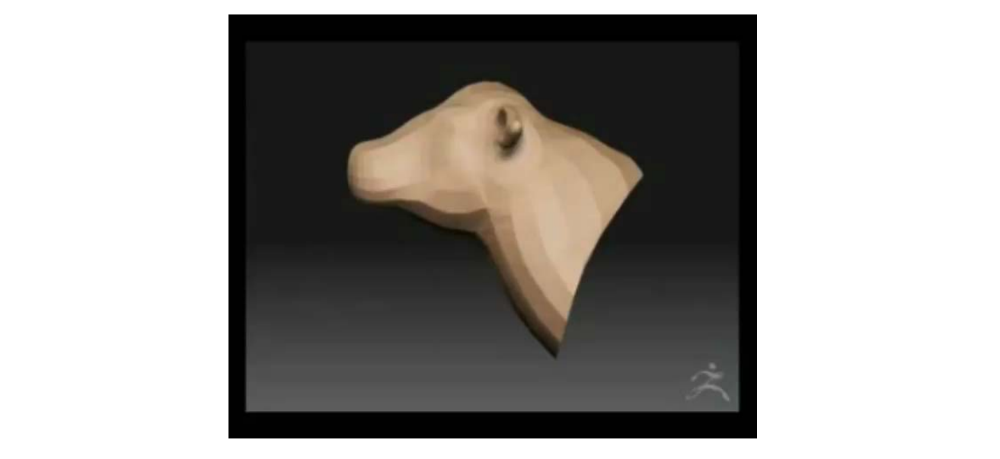
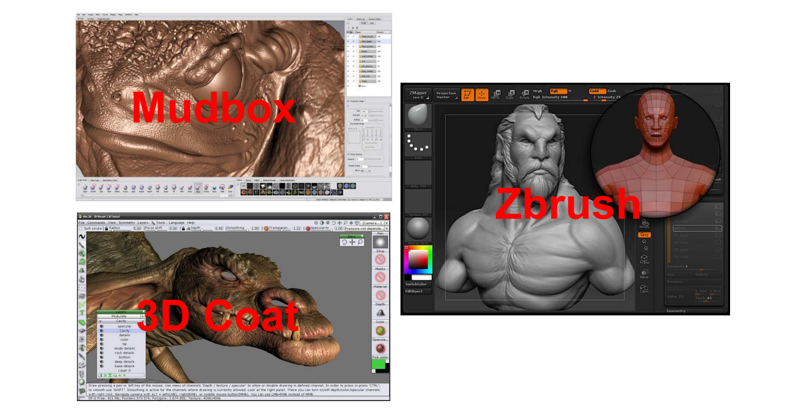
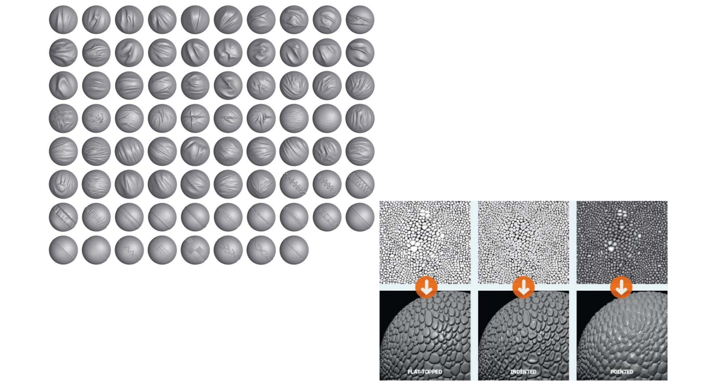
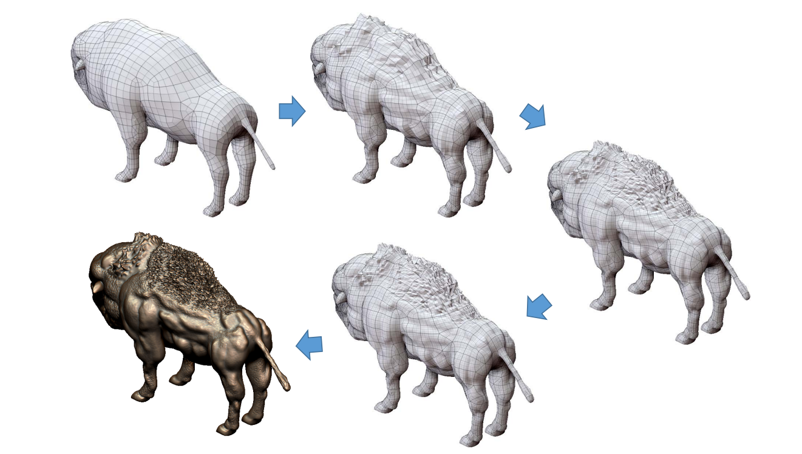

# 6. Sculpturing Modeling    

# Highly Detailed Meshes    

   

# Motivation: Sculpturing    

   

# Sculpturing Modeling    

• A series of sculpting/brush operators    

   

# Sculpting Modeling Tools    

   

# 3D Brushes
    

   

# Sculpting Modeling    

   

# Summary: Shape Editing   

* Points    
• Points, vertices, …    
* Lines/Curves    
• Sketches, skeletons, silhouettes, wires, …    
* Meshes    
• Bezier nets, lattices, cages, …    
* Other shapes   
• Deformation transfer: learning deformation from other shapes    
* **Physically‐based shape deformation** (*)    
• **Material‐based, FEM, simulation**    

本文出自CaterpillarStudyGroup，转载请注明出处。
https://caterpillarstudygroup.github.io/GAMES102_mdbook/  
