> [1:11:23] # Modeling   
公式中的 a,b,c都是2D的向量。    

[1:12:38] # Modeling    
把三个系数 a,b,c 看作是曲线的控制顶点，发现顶点的位置与曲线没有关系,不直观,不利于设计。     
把幂基换成 Berstein 基，控制点与曲线的关系变得直观。 

# 回顾：曲面重建   

     

# 建模(modeling)：设计与重建    

 - **曲面设计**(**Design**)    
    - 不存在的物体：通过人工交互凭空设计出新的物体    
      - CAGD (NURBS)、mesh modeling    
     - 存在的物体：通过人工交互编辑修改构建出新的物体    
      - Editing, deformation    
 - 曲面重建(Reconstruction)    
    - 存在的物体：对其采集并进行数字化构建    
    - 也称为：逆向工程、扫描重建    
      - Reverse engineering, scanning    

# Surface Editing

# Design Modeling    

* Design from zero    
• Create a shape by a set of 3D design operators such as extrusion or revolution etc.    

* **Design from a given shape** (**Mesh editing**)    
• Select a base shape    
• Select editing elements and editing operators     
• Deform the shape to obtain a new shape    

# Mesh Surface Editing    

     

# Interactive shape modeling    

* Modeling is an interactive, iterative process    
• Tools need to be intuitive (interface and outcome)    
• Allow quick experimentation     
• Preserve shape properties     

     

# User Interaction (UI)    

* User specifications: Intuitive, easy‐to‐use    
• Dragging handles ‐‐ vertices, features, ROI, …    
* Deformed shape: adapt to user intents    

**Challenges**:    
• Operations    
• Preservation of properties    
• Semantics    

     

# Methodology   

 - Set a proxy P for the input shape S    
    - P is simpler/easier/more semantic than S     
    - Find a map between P and S: S=g(P)    
      - g is also called an **embedded space**    
 - User interacts and deforms the proxy P to P’    
    - Find a deformation map: P’=h(P)    
 - Compute a new shape S’ from P’: S’=g(P’)    

> Key Problem:    
• find a good map *g*   

# Proxy Shapes (handles)    

* Points    
• Points, vertices, …    
* Lines/Curves    
• Sketches, skeletons, silhouettes, wires, …    
* Meshes    
• Bezier nets, lattices, cages, …    
* Other shapes    
• Deformation transfer: learning deformation from other shapes    

# 1. Point Proxy    

# Point based editing    

• Fix some vertices    
• Drag one or more vertices    

     

# User Interfaces    

• ROI is bounded by a belt (static anchors)    
• Manipulation through handle(s)    

     

> 本质数学问题：数据插值问题    

# Interpolation Problem    

$$
\begin{array}{l} 
 \min E (f) \\\\ 
  s.t. &f(x_i)=y_i,i=1,2,\dots , n \\\\ 
\end{array} 
$$

  

# 1.1 RBF‐based Editing       

  

# 1.2 Moving Least Squares Method    
[Siggraph 2006]   

  

# 1.3 Vector Field Based Deformations    
[Siggraph 2006]    

• Basic model: Moving vertex along the deformation orbit – defined by the path lines of a vector field v.    

  

• Given a time‐dependent vector field V(X,t), a *Path Line* X(t) in space is an integral.    

  

# Vector Field Selection    

* Deformation Request:    
• No self‐intersection    
• Volume‐preserving    
• Details‐preserving    
• Smoothness of shape in deformation    
* Divergence‐free Vector Field: \\(V=(V_1, V_2, V_3)\\)    

$$
div V=\frac{\partial V_1}{\partial x} +\frac{\partial V_2}{\partial y}+\frac{\partial V_3}{\partial z}=0
$$

# Piecewise Field for Deformation    

  

# Examples    

  

# 1.4 Laplacian Editing    
[Sorkine et al. SGP 2004]   

• Preserve local detail – Laplacian coordinates    
• Representation with **sparse** matrices    
• Efficient **linear** surface reconstruction       

  

$$
\nu _i=\sum _{j\in N(i)}w_j\nu _j+\delta _i
$$

# Variational Viewpoint    

• Laplacian Approximation    

$$
\tilde{X} =\underset{X}{argmin} \left ( ||LX-\delta ^{(x)}||^2+\sum _{j\in C}\omega ^2||x_j-c_j||^2 \right ) 
$$

• Gradient Approximation    

$$
\min_\phi \iint _\Omega ||\nabla \phi -W||^2dA,
$$

  

# Editing framework    

• The spatial constraints will serve as modeling constraints    
• Reconstruct the surface every time the modeling constraints are changed    

Detail constraints:       \\( \quad LX=\delta \\)     
Modeling constraints: \\(\quad x_j=c_j,  \quad j\in\\left \\{ j_1,j_2,\dots,j_k \right \\}\\)    

# Results     

  

# Detail transfer and mixing    

• “Peel” the coating of one surface and transfer to another   

    

# Mixing Laplacians     

• Taking weighted average of \\(\delta _i\\) and \\(\delta '_i\\)    

# Mesh transplanting    

* The user defines    
• Part to transplant    
• Where to transplant    
• Spatial orientation and scale    
* Topological stitching    
* Geometrical stitching via Laplacian mixing    

    

# Mesh transplanting   

• Details gradually change in the transition area    

# Mesh transplanting   

• Details gradually change in the transition area    

    

# Invariance – solutions   

 - Explicit transformation of the differential coordinates prior to surface reconstruction    
    - Lipman, Sorkine, Cohen‐Or, Levin, Rössl and Seidel [SMI 04], “Differential Coordinates for Interactive Mesh Editing”,    
      - Estimation of rotations from naive reconstruction    
 - Yu, Zhou, Xu, Shi, Bao, Guo and Shum [SIGGRAPH 04], “Mesh Editing With Poisson‐Based Gradient Field Manipulation”,     
    - Propagation of handle transformation to the rest of the ROI using geodesic distances    
 - Zayer, Rössl, Karni and Seidel [EG 05], “Harmonic Guidance for Surface Deformation”,     
    - Propagation of handle transformation to the rest of the ROI using harmonic functions     

# 1.5 Poisson Mesh Editing    
Yu et al. Mesh Editing With Poisson-Based Gradient Field Manipulation. Siggraph 2004.   

• **The representation**: the **gradients** of the functions **X, Y, Z** on each triangle of the mesh   
• **Deformation**: propagate the transformation of the handle onto the ROI using **geodesic distances**    

    

# Poisson editing – images   

• Inspiration: **Poisson Image Editing** [Pérez et al. 03]    

    

• Reconstruct a function from its gradients via the Poisson equation:     

$$
\underset{f}{\arg \min } \underset{\Omega}{\int}\||\nabla f-\mathbf{w}\||^{2}, \quad  s.t. \quad  f\left |_{\partial \Omega }= f^* \right | _{\partial \Omega}
$$ 
  

$$
\Downarrow 
$$

$$
 \Delta f=\operatorname{div} \mathbf{w} \quad  with  \left.\quad f \right|_{\partial \Omega}=\left.f^{*}\right| _{\partial \Omega} 
$$

# 1.6 As‐rigid‐as‐possible Deformation     
 

    

# 1.7 ARAP Modeling    
[Sorkine and Alexa, As‐Rigid‐As‐Possible Surface Modeling. SGP 2007]     

• Ask all star edges to transform rigidly by some 
rotation R, then the shape of the cell is preserved    

    

$$
\min_{\mathbf{v}^{\prime}}\sum_{i=1}^{n} \sum _{j\in N(i)}||({\mathbf{v}}^{\prime}_i-{\mathbf{v}}^{\prime}_j)-R_i({\mathbf{v}}_i-{\mathbf{v}}_j)||^2
$$

$$
s.t.\mathbf{v}^{\prime}_j=\mathbf{c} _j,j\in C
$$

# ARAP Modeling    

   

# 1.8 Linear Rotation‐invariant Coordinates      
[Lipman et al. Siggraph 05]      

• Keep a local frame at each vertex    
• Prescribe changes to some selected frames    

   

Local frame:    
{\\(\mathbf{a}_i, \mathbf{b}_i, \mathbf{n}_i\\)}

# Frame‐based deformations    

• Encode the differences between adjacent frames     
• Solve for the new frames in least‐squares sense    

$$
\begin{array}{l}
{\mathbf{a}_i}-{\mathbf{a}_j}=\alpha_1 {\mathbf{a}_i}+\alpha_2 {\mathbf{b}_i}+\alpha_3 {\mathbf{n}_i}\\\\
{\mathbf{b}_i}-{\mathbf{b}_j}=\beta _1 {\mathbf{a}_i}+\beta _2 {\mathbf{b}_i}+\beta _3 {\mathbf{n}_i} \\\\
{\mathbf{n}_i}-{\mathbf{n}_j}=\gamma  _1 {\mathbf{a}_i}+\gamma _2 {\mathbf{b}_i}+\gamma _3 {\mathbf{n}_i}
\end{array}\\\\
\cdots \cdots \\\\
constraints
$$

   

# Frame‐based deformations    

* Reconstruction:    
• After having the frames, solve for positions Frame‐based deformations    

   

# Frame‐based deformations    

* Reconstruction:    
• After having the frames, solve for positions Results     

   

# Results    

   

# 2. Curve Proxy    

# User Specifications    

• Line or curve features    

   

# 2.1 Skeleton based    

• Axial Deformation [1994]

   

# Axial Deformation    

   

# 2.2 Sketching Deformations        

   

# Sketching Deformation    

   

# Skeleton‐based Deformation     
   

   

# 2.3 Wires based    
[Siggraph 1999]    

   

# 2.4 Silhouette sketching based    
[Nealen et al. Siggraph 05    

   

# Silhouette Sketching    

* Approximate sketching     
• Balance weighting between detail and positional constraints    

   

   

# 2.5 Volumetric Graph Laplacian    
    

   

   

# Animation Modeling from 2D Cartoons    

   

# Short Summary: curve proxy    

• Curve features    
• Skeletons    
• Silhouette    
• Free‐form sketches    
• Wires    
• 2D image contours   
• …    

# 3. Mesh Proxy   

# User Specifications    

* Define a mesh proxy for the shape: generally a simpler, coarse mesh which encloses the shape    
• The shape is embedded into the mesh proxy    
* Deform the mesh proxy using point/line base methods    
* Advantages:     
• You can deform arbitrary objects    
• Independent of object representation    

   

# 3.1 Free‐form Deformation (FFD)    
[Sederberg et al. 86]   

* Proxy: a **lattice** mesh     
• more easily parametrized than the object     
• Deformation defined by the tensor Bezier solid     

   

# 3.2 Cage‐based deformation   

* Proxy: cage    
• Barycentric coordinates    
• Many works…    

   

# 3.3 Multiresolution Editing    

* Proxy: simplified shape    

* Pros    
• Preserving details, scalable    
* Cons    
• Instable reconstruction for large deformation    
• Resampling problem     
* Invariant variables    
• Detail information    

   

   

# Short Summary: mesh proxy   

• Lattice    
• Cage    
• Simplified shape    
• …     

# 4. Deformation Transfer    

# Deformation Transfer    
Siggraph 2004    

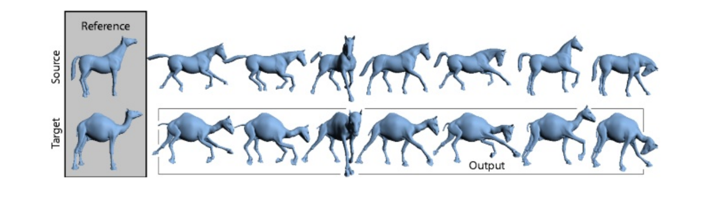   

# Editing Arbitrary Deforming Surface Animations    
Siggraph 2006    

   

# 5. Sketch‐based Modeling     
# （基于草图的建模）   

   

# An Example    

   

# B‐Mesh    
[Ji et al. 2010]   

   

# Sketch‐based Modeling Systems    

   

# More…   

   

# 6. Sculpturing Modeling    

# Highly Detailed Meshes    

   

# Motivation: Sculpturing    

   

# Sculpturing Modeling    

• A series of sculpting/brush operators    

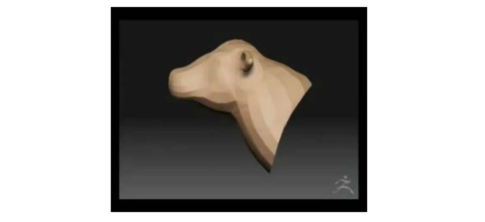   

# Sculpting Modeling Tools    

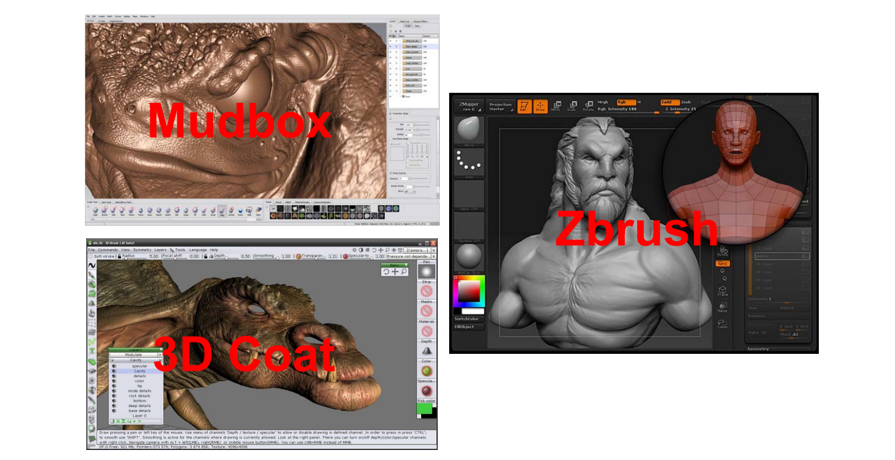   

# 3D Brushes
    

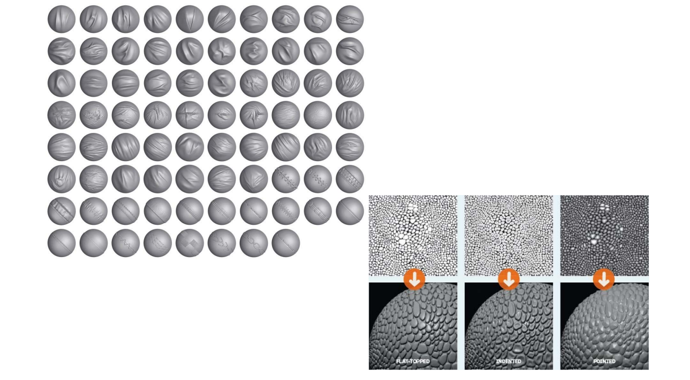   

# Sculpting Modeling    

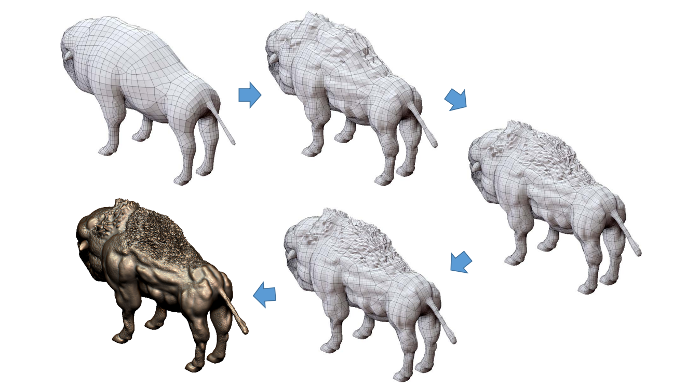   

# Summary: Shape Editing   

* Points    
• Points, vertices, …    
* Lines/Curves    
• Sketches, skeletons, silhouettes, wires, …    
* Meshes    
• Bezier nets, lattices, cages, …    
* Other shapes   
• Deformation transfer: learning deformation from other shapes    
* **Physically‐based shape deformation** (*)    
• **Material‐based, FEM, simulation**    

# Data‐Driven Modeling   

# 三维几何模型数据库     

   

# 1. Modeling by Examples    
[Funkhouser et al. Siggraph 2004]   
 
1. Segment into parts    
2. Search 3D database for parts    
3. Compose parts into a model    

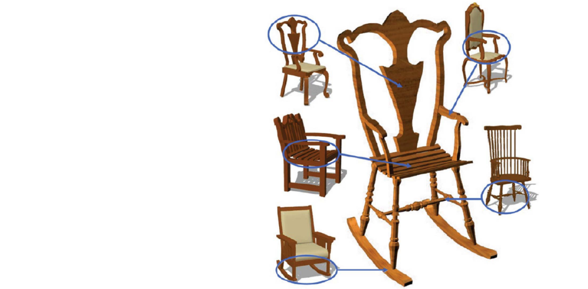    

# Modeling by Examples    
[Funkhouser et al. Siggraph 2004]   

1. Segment into parts   
2. Search 3D database for parts    
3. Compose parts into a model    

    

# 2. Probabilistic Reasoning    
[Chaudhuri et al. Siggraph 2011]    

• Design space    

    

$$
\mathbf{P(X)} =\prod_i\mathbf{P}\left ( x_i|\pi (x_i) \right )
$$

# 2. Probabilistic Reasoning     
[Chaudhuri et al. Siggraph 2011]   

• Exploring the design space    

  

# 3. ShapeSynth:     
# Exploration as Design Tool      
[Averkiou et al. Siggraph 2014]    

 

# 4. Photo‐inspired Modeling     
    

    

# Examples    

    

 

# 5. Primitive‐based Modeling    
     

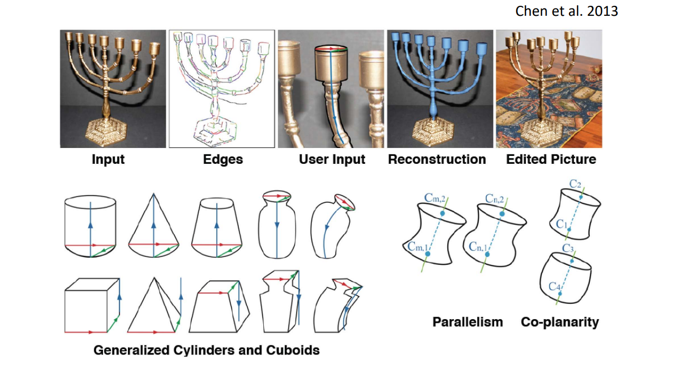    

# 6. Shadow Guidance    
Fan et al. 2013    

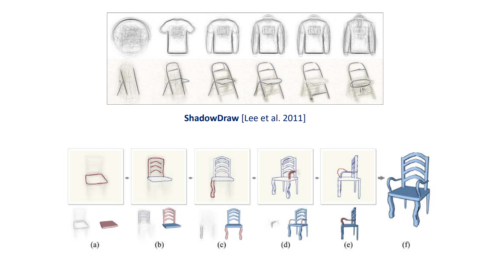    

# 6. Shadow Guidance    
Fan et al. 2013     

    

# 7. Learning Generative Models of 3D Shapes (3D‐GAN)    

• Emergence of various 3D‐GANs for shape generation    

    

Chinagraph 2020 Key note talk by Hao Zhang:    
<https://www.bilibili.com/video/BV1Pa4y1x7au?p=3>    
Chaudhuri, et al. Learning Generative Models of 3D Structures. Computer Graphics Forum (Eurographics STAR), 2020.     
  

# Shape Morphing    

 - Given two objects produce sequence of intermediate objects that gradually evolve from one object to the other    
    - Interpolate object shapes    
    - Interpolate object attributes    
      - Color, texture, normal, etc.    

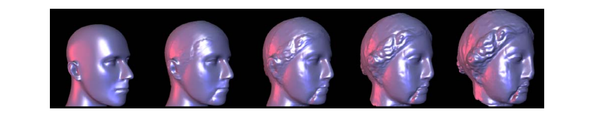    

# Applications    

    

# Shape Transformations    

* Warping: Unary Op    
• Given **Object A** and **F(t)**, find **Object B**    

    

* Morphing: Binary Op    
• Given **Object A** and **Object B**, find **F(t)**    

    

# Terminologies   

• Morphing    
• Metamorphosis    
• Shape blending    
• Shape averaging    
• Shape interpolation    
• Shape transition    

# Rules for Good Morphing    

 - Natural    
    - Keep as much as possible of the two shapes during the transformation    
      - Volume, curvature, area, etc...    
    - Subjective aesthetic criteria    
 - User control    
    - intuitive    
    - not too heavy   
    - can be adapted to user's knowledge    

# Morphing   

* Input: two meshes source & target    
• Frames at \\(t_0\\) and \\(t_n\\)    
* Output: sequence of intermediate meshes    
• Frames \\(t_1\\) to \\(t_{n‐1}\\)    
* Intermediate mesh:    
• For each point on source/target model specify location 
at time \\(t_i\\) consistent with source & target    

# Morphing: Two Sub‐Problems    

 - Correspondence problem   
    - Compatible meshes    
    - For each point on source/target meshes find corresponding point on second mesh = Parameterization     

   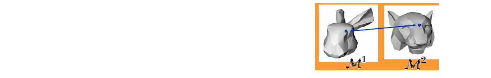    

 - Path problem    
    - Inbetween shapes    
    - Specify trajectory in time for each point    
      - For mesh – specify vertex trajectory       

# 1. Vertex Correspondence    

* Compatible meshes (consistent meshes, inter‐map)    
• Each vertex on source mesh mapped to vertex on target (and vice versa)    
• Have common connectivity    

    

# Challenges    

    

# Correspondence: Parameterization     

 - To compute map between source mesh S and  target mesh T parameterize both on common  domain D:     

$$
F_s:S \to D\\\\
F_t:S \to D\\\\
F_{st}:F_t^{-1} F_s
$$

 - Common domain options
    - 2D patch(es) – works for genus 0 + boundary
      - Use convex boundary (why?)
    - Sphere
    - Base mesh    

# 1.1 Parameterization: Planar domain    

    

# 1.1 Parameterization: Planar domain    

    

# 1.1 Parameterization: Planar domain    

    

# 1.2 Parameterization: Sphere domain    

    

# 1.3 Parameterization: Base mesh     
Lee et al. 1999    

• MAPS    

    

# 1.3 Parameterization: Base mesh    

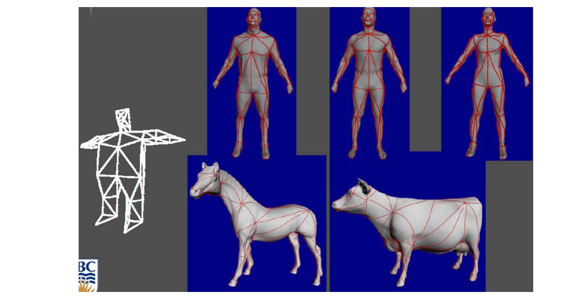    

# 1.3 Parameterization: Base mesh    

    

# 1.4 Decomposition Based    
[Shlafman et al. 2002]   

    

# 1.5 Component Based    
   

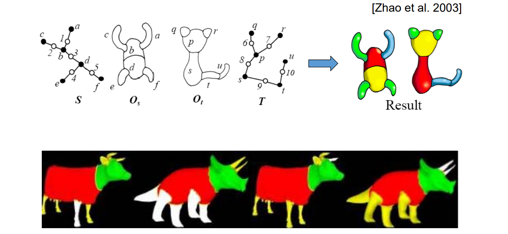    

# 1.6 Many Recent Works    

    

# 1.7 Error‐Bounded Compatible Remeshing    
Yang et al.  Error‐Bounded Compatible Remeshing. Siggraph 2020.    

• Optimization based method    

    

# 1.7 Error‐Bounded Compatible Remeshing   
Yang et al.  Error‐Bounded Compatible Remeshing. Siggraph 2020.    

    

# 1.8 Different Topologies    
[DeCarlo et al. 1996]     

    

# 1.8 Different Topologies    
    

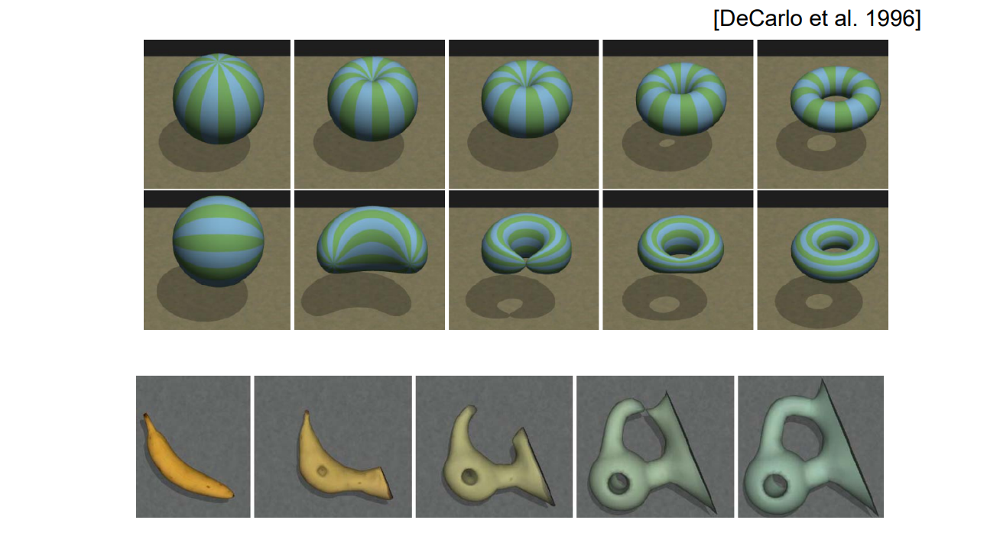    

# More: Correspondences between planar shapes – Matching     

• Physically Based Method  [Sederberg et al. 1992]    

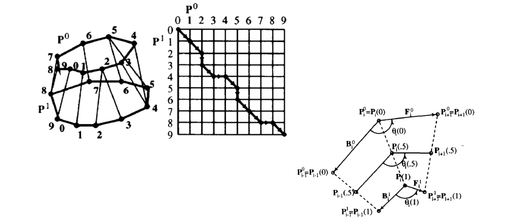    

# More: Correspondences between planar shapes – Matching     
• Curve Aligning [Sebastian et al. 2003]    

    

$$
\mu[g]=\int_{C}\left|\frac{\partial}{\partial s}(\bar{C}(\bar{s})-C(s))\right|^{2} d s+R \int_{C}(\kappa(s)-\bar{\kappa}(\bar{s}))^{2} d s
$$

# More: Correspondences between planar shapes – Matching    
• Perceptually Based Method [Liu et al. 2004]    

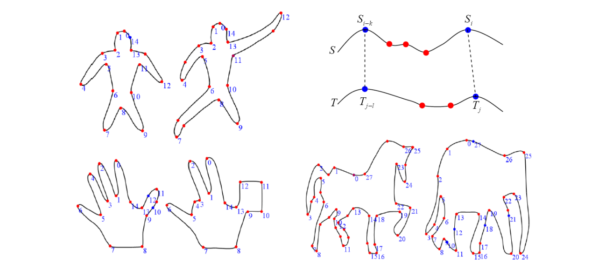    

# 2. Vertex Path (Trajectory)    

* Input:   
• All vertices on source & target have one‐to‐one correspondence with each other    
• Each vertex has two 3D coords vFc1 (source) and vFc2 (target)   

* Output: generate the intermediate shapes from two shapes    

    

# Simplest Method: Linear Interpolation   

* Linear interpolation between corresponding points    
* Work well for many cases    
• many drawbacks    

    

# Linear Interpolation    

* Simple and easy    
* Drawbacks   
• Shrinkage    

    

# Unnatural Results in Linear Interpolation    

    

# Intrinsic Approach    
Sederberg et al. 1993   

* Intrinsic variables    
• edge lengths    
• turning angles    

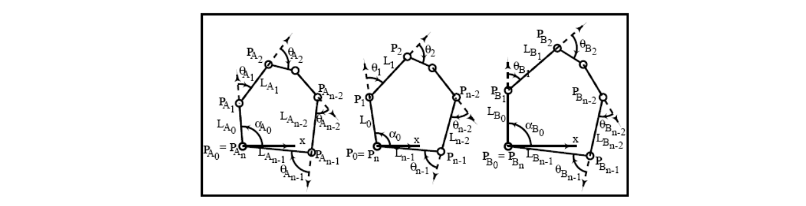    

# Fourier Approach   
   

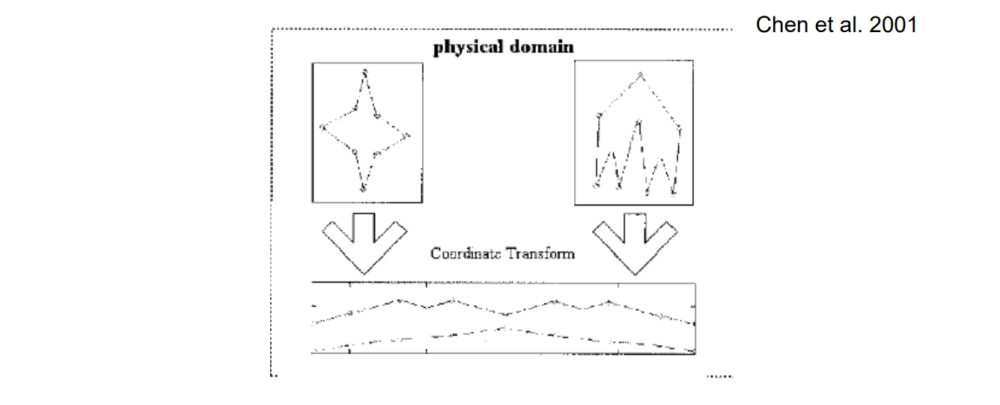    

$$
\begin{array}{l} 
  \begin{bmatrix}x(t)
 \\\y(t)
\end{bmatrix} \\\\ 
  =\begin{bmatrix}a_0
 \\\c_0
\end{bmatrix}+ {\textstyle \sum_{k=1}^{\infty }} \begin{bmatrix} a_k &b_k
  \\\\ c_k &d_k
\end{bmatrix}\begin{bmatrix}\cos(2\pi kt)
 \\\ \sin(2\pi kt)
\end{bmatrix} \\ 
\end{array} 
$$

# Wavelet Approach     
Zhang et al. 2000   

• Wavelet decomposition 

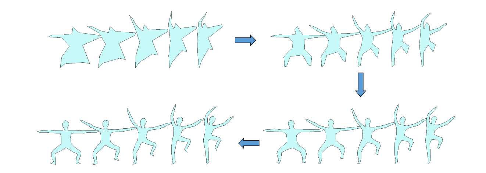    

# Star Skeleton Representation    
[Shapira et al. 1995]    

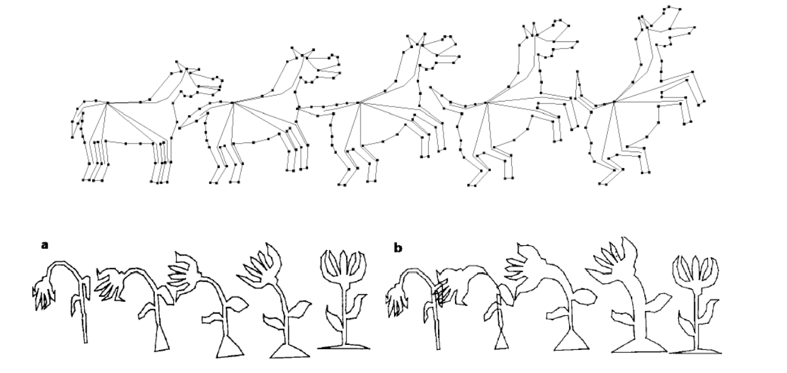    

# Interior Based Approach     

* Based on compatible triangulation    
• [Gotsman and Surazhsky, 1999‐2001]     
• As‐rigid‐as‐possible [Alexa et al. 2000]      

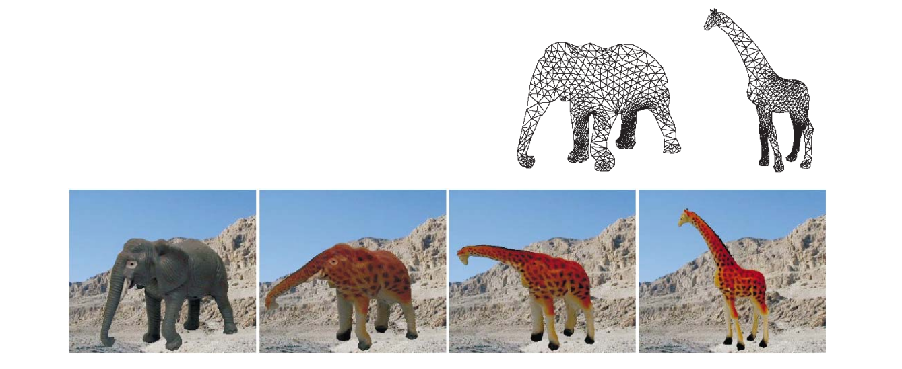    

# Morphing between Different Topologies    
Liu et al. 2005     

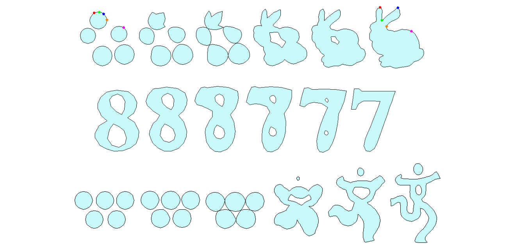    

# Implicit Approaches     

• Construct a 4D function which interpolates two shapes (with iso‐value 0 and 1 respectively)     

    

# Distance Field    
[Cohen-Or et al. 1998]   

• Distance field of a shape    

    

# Distance Field    

    

# Variational Implicit Function    

    

$$
f(X)=\sum_{j=1}^{n} d_j\phi (X-C_j)+P(X)
$$

# Examples     

    

# Polymorph:    
# Morphing between multiple shapes     

    

