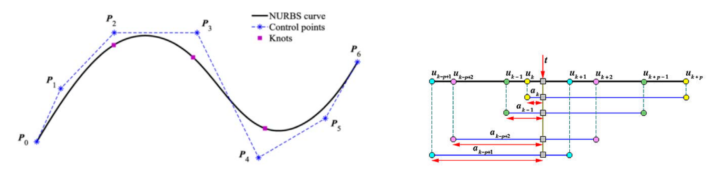

# NURBS

## 定义

NURBS = **Non‐Uniform** Rational B‐Spline = 非均匀有理B样条

(\\(𝑁^{(d)}_i\\) :B‐spline basis function 𝑖 of degree d)     

$$
f(t)=\frac{\sum_{i=1}^{n}N_i^{(d)}(t)w_ip_i }{ \sum_{i=1}^{n}N_i^{(d)}(t)w_i} 
$$

- Uniform：均匀参数化，结点向量均匀
- Non‐Uniform：非均匀参数化，结点向量非均匀

> 非均匀,使用了非均匀的参数化，参数间距不一致，甚至有可能重合。 

## De Boor algorithm

similar to rational de Casteljau alg.   
- option 1. – apply separately to numerator, denominator   
- option 2. – normalize weights in each intermediate result   

the second option is numerically more stable     

> 这一部分没讲

# 影响NURBS曲线建模的因素   

• 控制顶点：用户交互的手段   
• 节点向量：决定了B样条基函数   
• 权系数：也影响曲线的形状，生成圆锥曲线等    

   

# NURBS曲线的性质    

大部分与Bezier/B样条曲线类同：具有良好的几何直观性     

> [24:18] 变差缩减：曲线与直线相交，其交点数不多于控制顶点的凸包与直线的交点数。     
此性质用于曲线与直线求交。
   
---  

> 本文出自CaterpillarStudyGroup，转载请注明出处。
https://caterpillarstudygroup.github.io/GAMES102_mdbook/

