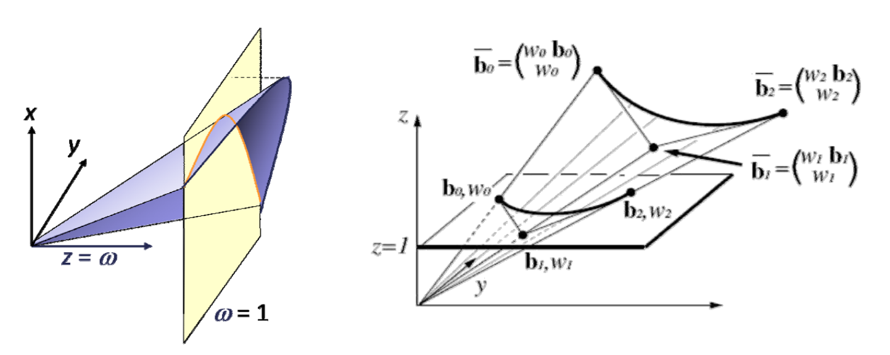
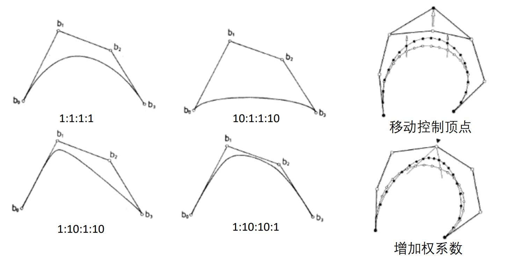
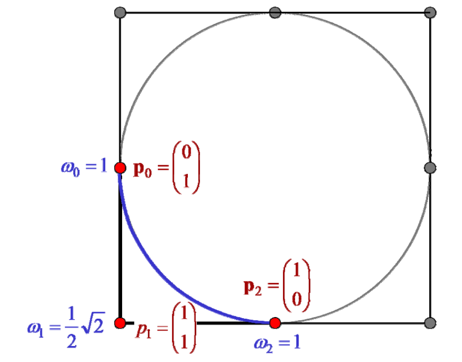

# 有理曲线   

# 问题：Bézier曲线无法表示圆弧！  

思考：如何证明？   
Approximation of Circle using Cubic Bezier    

  

Evaluation of \\((𝒙^𝟐+𝒚^𝟐)\\) for points on the Bezier curve    

  

# 投影几何  

 2D case:

$$
\binom{x}{y}  →\begin{pmatrix}wx
 \\\\wy 
 \\\\w
\end{pmatrix}
$$

 3D case:

$$
\begin{pmatrix}x
 \\\\y 
 \\\\z
\end{pmatrix} →\begin{pmatrix}wx
 \\\\wy 
 \\\\wz
 \\\\w
\end{pmatrix}
$$

• 齐次坐标：\\(x\longrightarrow \binom{wx}{w} \\)   

    

# 有理Bezier曲线

* Rational Bezier curves in \\(\mathbb{R} ^n\\) of degree \\(d\\):   
• Form a Bezier curve of degree 𝑑 in \\(𝑛+1\\) dimensional space    
• Interpret last coordinates as homogenous component    
• Euclidean coordinates are obtained by projection    

$$
𝒇^{(hom)}(t)=\sum_{i=0}^{n}B_i^{(d)}(t)P_i,P_i\in \mathbb{R} ^{n+1}
$$

$$
𝒇^{(hom)}(t)=\frac{\sum_{i=0}^{n}B_i^{(d)}(t)\begin{pmatrix}p_i^{(1)}
 \\\\\cdots 
 \\\\p_i^{(n)}
\end{pmatrix}}{\sum_{i=0}^{n}B_i^{(d)}(t)P_i^{(n+1)}}
$$

# 有理Bezier曲线

• 每个控制顶点上设置一个权系数    

$$
{f}^{(eucl)} (t)=\frac{\sum_{i=0}^{n}B_i^{(d)} (t)w_ip_i}{\sum_{i=0}^{n}B_i^{(d)} (t)w_i } 
$$

$$
p_i=\begin{pmatrix}p_i^{(1)}
 \\\\\cdots 
 \\\\p_i^{(n)}
\end{pmatrix}
$$

• 另一种形式    

$$
{f}^{(eucl)} (t)=\sum_{i=0}^{n}p_i =\frac{B_i^{(d)} (t)w_i}{\sum_{i=0}^{n}B_i^{(d)} (t)w_i } =\sum_{i=0}^{n}q_i(t)p_i 
$$

with \\(\sum_{i=0}^{n} q_i(t)=1\\)

• 如权系数都相等，则退化为Bezier曲线   

# 有理Bezier曲线的几何解释    

• 高维的Bezier曲线的中心投影   

    

# 权系数对曲线形状的影响    

• 控制顶点的权系数越大，曲线就越靠近该点    

    

# 有理Bezier曲线的性质    

* 具有Bezier曲线的大部分性质(设\\(w_i>0,i=1\sim n\\)):    
• 端点插值   
• 端点切线   
• 凸包性   
• 导数递推性   
• de Casteljau作图算法   
• …     

# 2次有理Bezier曲线表示圆   

  