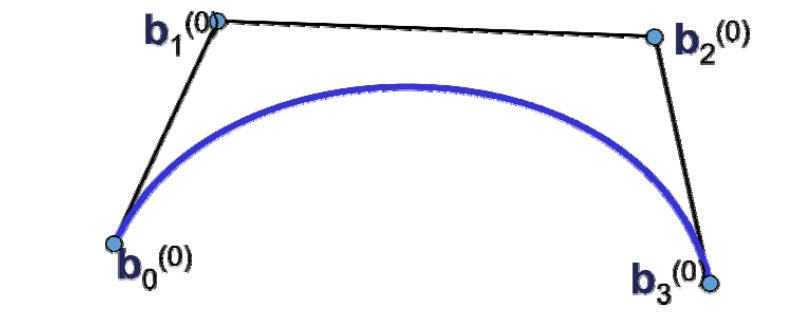
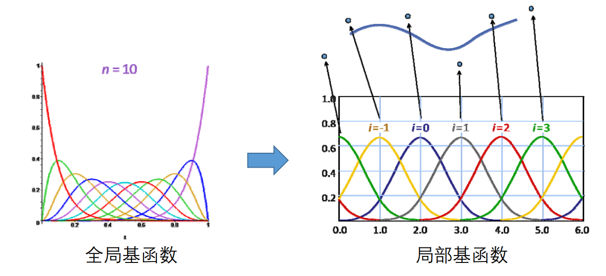

# Bézier曲线    

• 类似RBF函数：对每个控制点叠加权函数    
• 几何设计观点：给定控制顶点{\\(b_i,i=0\sim n\\)}，使用一组（随\\(t\\)变化的）权系数函数{\\(B_i^n(t),i=0\sim n\\)} 对它们进行线性组合，得到的点的集合    

$$
x(t)=\sum_{i=0}^{n} B^n_i(t)\cdot b_t
$$

  

> Bezier曲线的性质来源于Bernstein**基函数**的性质   

# B样条曲线   

• Bézier曲线、RBF函数：每个控制点上的权系数函数都是全局（定义在整个定义域）的   
• B样条曲线：每个控制点上的权系数函数是局部定义的（定义在其参数节点附近的支集）   

  