## 建模(modeling)：设计与重建    

 - 曲面重建(Reconstruction)    
   - 存在的物体：对其采集并进行数字化构建    
   - 也称为：逆向工程、扫描重建    
     - Reverse engineering, scanning    
     
     

## Outline   

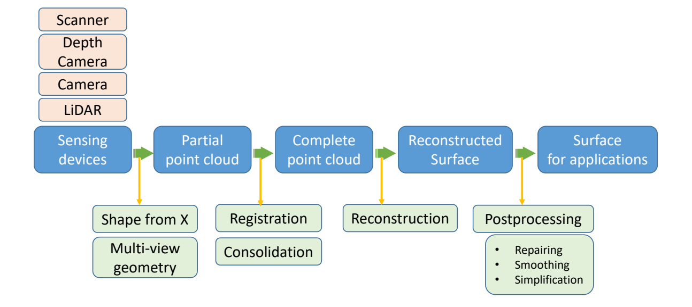

## 1. Acquisition     

## 1. Acquisition （数据采集）   

## Structure of Data

## 1.1 Volume Scanning     

 - Input: a sequence of slice images     
 - Output: 3D models of human organs     

## Reconstruction from 2D contours

 - Stack contours    
 - Triangulate “strips” between contours   

       

 - Note:contour topology can change   

## 1.2 Shape from shading (SFS)   

 - Input: a single image     
 - Output: a 3D model (with albedo, normal, etc.)    
 - Method: Inverse of rendering     
    - Solving from rendering equation [Horn 1980]     

      

## Shape from shading (SFS)     

 - Solving from the Phong shading equation    
 - Reflectance models: Lambertian models    

      

## Shape from shading    

 - From multiple images     
      

Jiang et al. 3D Face Reconstruction with Geometry Details from a Single Image. IEEE Transactions on Image Processing, 2018.      
Xu et al. Shading-based Surface Detail Recovery under General Unknown Illumination. IEEE Transactions on Pattern Analysis and Machine Intelligence, 2018.      

Wu et al. Unsupervised learning of probably symmetric deformable 3D objects fro images in the wild. CVPR 2020. (Best paper award)    

## Shape from a single image – Learning based method

      

Two confidence-adjusted reconstruction losses are minimized at the same time with asymmetric weights.     

Wu et al. Unsupervised learning of probably symmetric deformable 3D objects fro images in the wild. CVPR 2020. (Best paper award)      

## 1.3 Image based modeling (IBM)     

 - Input: multiple photos from different views     
 - Output: 3D models    

    

    

## Mathematics: projective imaging    

 - A 3D point corresponds different pixels in different images      
 - Key: Finding pixel correspondence between images     

## Theory: Multi‐view geometry    

    

##  1.4 Structured light （结构光/白光）

    

## 1.5 SfM & SLAM    

 - SfM: Structure from Motion     
 - SLAM: Simultaneous Localization and Mapping     

|  SfM   |  SLAM  |
|  ----  | ----  |
| Vision  | Robotics |
| Structure  | Mapping |
| Camera poses  | Location |
| 3D reconstruction  |   Localization   |
| Feature tracking  | Prediction |   

 
 
## SLAM的主要流程    

    

## 1.6 Laser Radar （激光雷达测距）    

 - Light Detection And Ranging, LiDAR    
 - 原理：主动向目标发射探测信号（激光束）,然 后将接收到的从目标反射回来的信号（目标回波）与发射信号进行比较（三角测距）

    

## 1.7 Depth Images    

 - Microsoft Kinect     
 - Apple Primesense     
 - Intel RealSense     
 - Google Project Tango     
 - Asus Xtion     
 - iPhone XI/XII    

## Depth Data: Grid Points   

 - 2.5D image     

    

## 深度相机原理 (Time of flight, TOF)     

    

## 深度相机原理 (Kinect)    

 - 当激光穿透毛玻璃后形成随机衍射斑点，这些散斑（laser speckle）具有高度的随机性，而且会随着距离的不同变换图案。空间中任意两处散斑图案都不同     
 - Light coding打出了一个具有三维纵深的“体编码”，只要看物体表面的散斑图案，就可以知道这个物体在什么位置      

    

## 1.8 Shape from Silhouette/Contours     

    

## 2. Registration     

## 2. Registration    

    

## Goal: Reconstruction from scans    

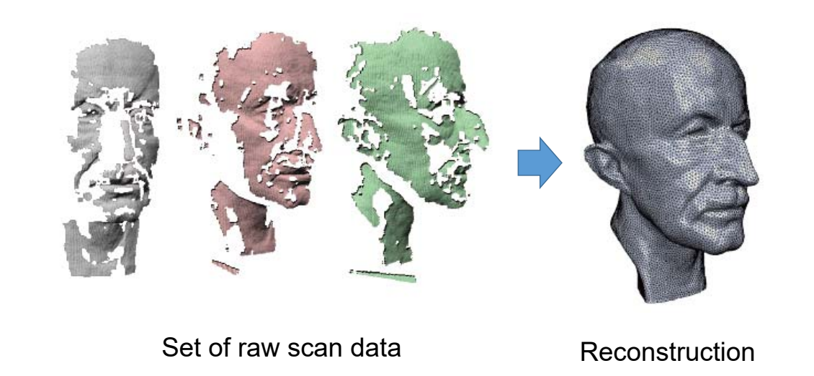    

## 多个视点的扫描    

 - 每个视点得到分片3D数据     
 - **问题**：如何将这些分片数据合并成一个整体数据？       

## Pairwise Registration    

 - Align a source model \\(\chi\\) onto　a target model \\(y\\)   
    - find a transformation  T \\(\chi\\) that brings \\(\chi\\) into alignment with \\(y\\)      
 - Two main questions:     
    - How do we measure the quality of the alignment?     
    - What transformations are acceptable?    

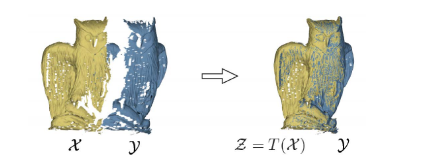    

## Registration as energy minimization-    

    

    

## Alignment Error    

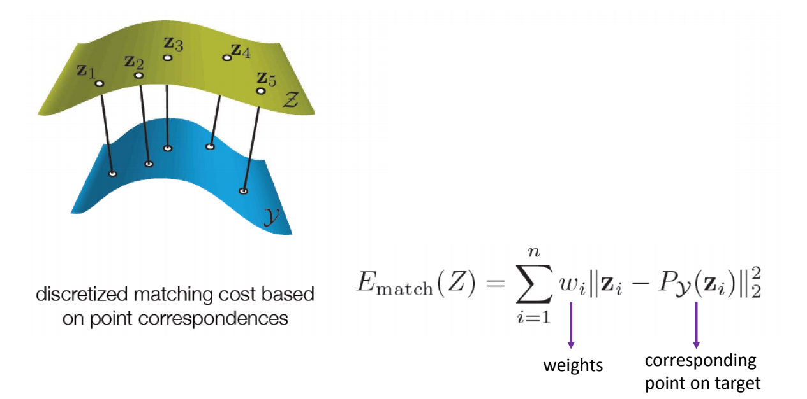    

## Prior Error – 1 (Rigid objects)   

    

$$
E_{prior}(\mathbf{Z,R,t})=\sum_{i=1}^{n} ||\mathbf{Z}_i-(\mathbf{RX}_i+\mathbf{t})||^2_2
$$

## Prior Error – 2 (Elastic objects)

    

$$
E_{prior}(\mathbf{Z},(R_i))=\sum_{i=1}^{n} \sum_{j\in \mathcal{N}_{i}}||(\mathbf{Z}_j-\mathbf{Z}_i)-R_i(\mathbf{X}_j-\mathbf{X}_i)||^2_2
$$

## Prior Error – 3 (Articulated objects)    

    

## Iterative Closest Point (ICP) Algorithm
[Besl+92]

    

## 3. Consolidation    

## 3. Consolidation     

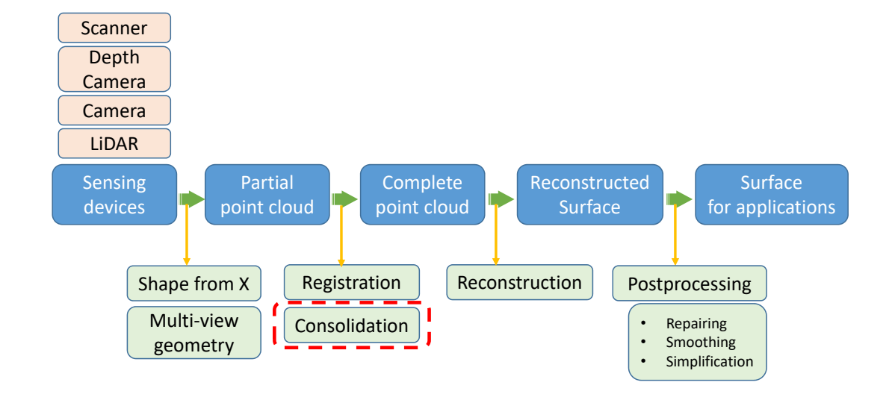    

## Imperfect Acquisition    

 - Outliers    
 - Noisy data    
 - Orientation    
 - Large missing parts    
 - Non‐uniform sampling     
 - Blurred features    
 - …       

## Consolidation     

 - Goal: obtain a surface/point‐cloud with good quality (noise‐free, orient‐consistent, complete, continuous…)      

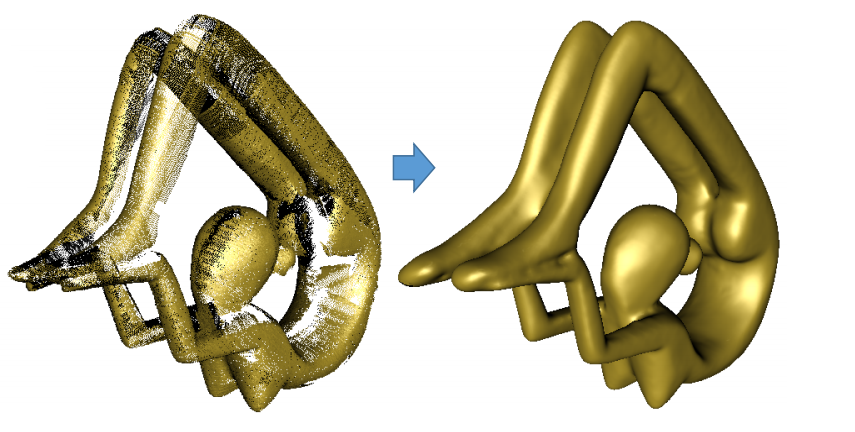  

## Point Cloud Consolidation    

> **Output**      
>**Consolidated**      
Clean     
Thin    
Outlier‐free     
Uniform    
Oriented     

## Challenges    

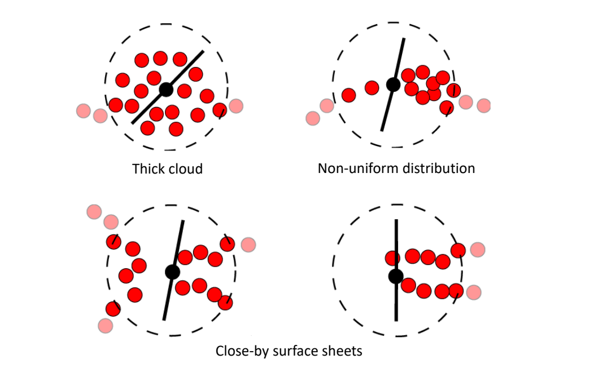  

## Normal (Oriented) Consistency    

 - Based on angles between unsigned normals    
 - May produce errors on close‐by surface sheets      

  

Zhang et al. Multi‐Normal Estimation via Pair Consistency Voting. IEEE TVCG, 2019.     
Liu et al. Quality Point Cloud Normal Estimation by Guided Least Squares Representation. SMI 2015.    
Huang et al. Consolidation of Unorganized Point Clouds for Surface Reconstruction. Siggraph Asia 2009.    

## Normal Propagation     

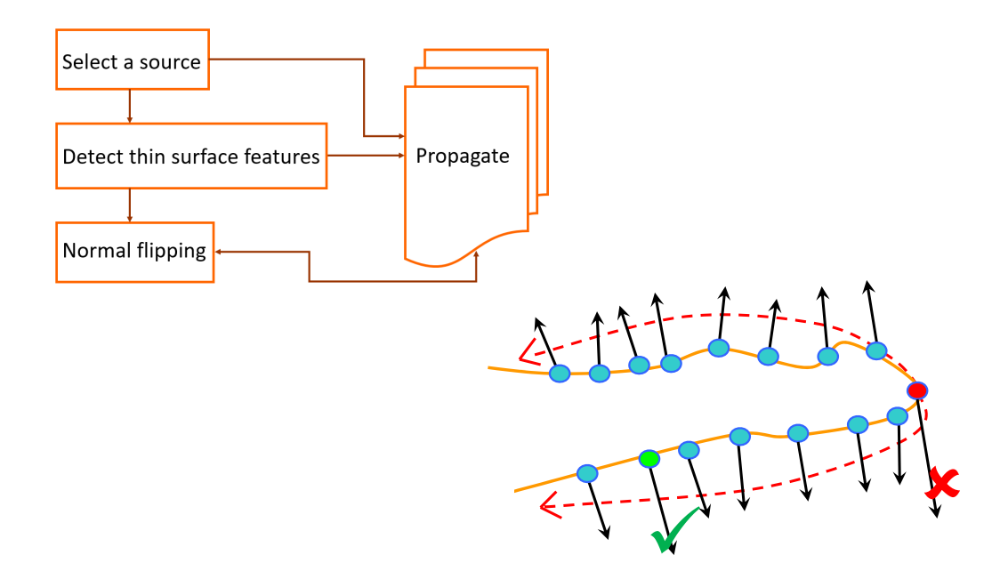  

Huang et al. Consolidation of Unorganized Point Clouds- for Surface Reconstruction. Siggraph Asia 2009.    

## Resampling     

 - More locally regular point distribution    
    - Locally Optimal Projection (LOP) and WLOP    

  

Huang et al. Consolidation of- Unorganized Point Clouds for Surface Reconstruction. Siggraph Asia 2009.      

## Edge‐Aware Resampling (2D)     

  

Huang et al. Edge‐Aware Point Set Resampling. ACM TOG 2013.      

## Edge‐Aware Resampling (3D)    

  

Huang et al. Edge‐Aware Point Set Resampling. ACM TOG 2013.     

## 4. Reconstruction

## 4. Reconstruction   

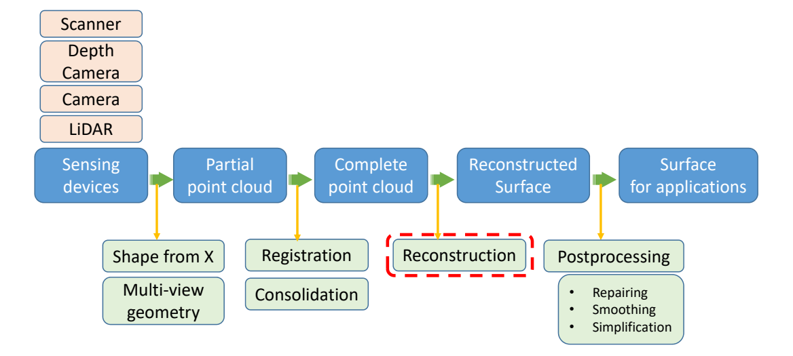  

## Surface Reconstruction    

 - Input     
    - A set of points in 3D that sampled from a model surface     
 - Output     
    - A 2D manifold mesh surface that closely approximates the surface of the original model    
    
      

## Desirable Properties    

 - No restriction on topological type     

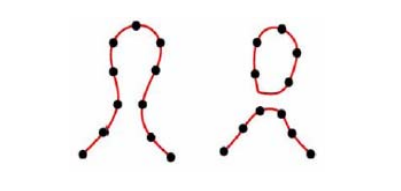  

 - Representation of range uncertainty     
 - Utilization of all range data     
 - Incremental and order independent updating    
 - Time and space efficiency    
 - Robustness    
 - Ability to fill holes in the reconstruction     

## Solutions    

 - **Approximation methods: Constructing continuous functions (Scattered data interpolation schemes)**     
    - NURBS surfaces    
    - Signed distances [Hoppe et al. 1992]    
    - Radial basis function reconstruction [Carr et al. 2001]     
    - Poisson reconstruction [Kazhdan et al. 2006]     
 - Discrete methods: Constructing triangle meshes directly    
    - [Amenta & Bern 1998]    
    - Power‐crust [Amenda et al. 2001]    
    - Cocone [Dey & Giesen 2001]    
    - [Cazals & Giesen 2006]    
    - …
    
    

## Implicit Approximation Methods (similar to GAMES 102‐9)     

 - Convert point cloud into a signed distance field   

 - Construct an implicit function whose iso‐surface with iso‐value 0 to approximate the field     

 - Extract the mesh surfaces from the implicit function     
    - Marching cube methods
    
    

## Signed Distance Fields    

 - For every point, add two *off‐surface* points, one inside and one outside the surface in the direction of the normal     
 - Add a point only if it is closest to its source     
 - N≈3n points    

     

## Complexity     

Straight‐forward method:     
 - Storage O(\\(N^2\\))      
 - Solving the \\(W_i O(N^3)\\)          
 - Evaluating f(x) O(N)       

Carr et al. Reconstruction and representation of 3D objects with Radial Basis Functions, SIGGRAPH 2001.    

## (2) MPU Implicits    

Multi‐level partition of unity implicits:    
 - Hierarchical implicit function approximation     
    - Given: data points with normal    
    - Computes: hierarchical approximation of the signed distance function    

  

Ohtake et al. Multi‐level Partition of Unity Implicits, SIGGRAPH 2003    

## (3) Possion reconstruction    

 - Idea: fitting an indicator function     

$$
\chi M(x)=\begin{cases}
1 & \text{  } x\in M \\\\
0 & \text{ } x\notin M
\end{cases}
$$

  

Kazhdan et al. Poisson surface reconstruction. SGP 2006.

## (4) Marching Cube   

 - Marching cubes: method for approximating surface defined by isovalue  \\(\alpha\\), given by grid data      
 - <u>Input</u>:    
    - Grid data (set of 2D images)    
    - Threshold value (isovalue)  \\(\alpha\\)     
 - <u>Output</u>:    
    - Triangulated surface that matches isovalue surface of  \\(\alpha\\)      

## Marching Cubes    

 - First pass    
    - Identify voxels which intersect isovalue    

 - Second pass    
    - Examine those voxels     
    - For each voxel produce set of triangles    
      - approximate surface inside voxel    

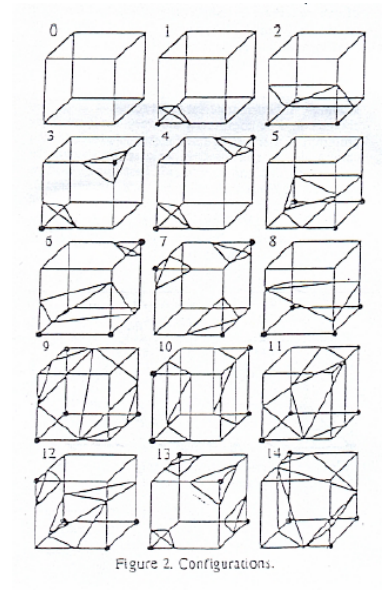  

## Solutions   

 - Approximation methods: Constructing continuous functions (Scattered data interpolation schemes)    
    - NURBS surfaces    
    - Signed distances [Hoppe et al. 1992]    
    - Radial basis function reconstruction [Carr et al. 2001]     
    - Poisson reconstruction [Kazhdan et al. 2006]     
 - Discrete methods: Constructing triangle meshes- directly     
    - [Amenta & Bern 1998]    
    - Power‐crust [Amenda et al. 2001]    
    - Cocone [Dey & Giesen 2001]    
    - [Cazals & Giesen 2006]    
    - …    
    
    
    
## Curve from Points ‐ Connect the Dots (1)    

 - Given unordered set of points P     
    - connect them by linear segments
 - Can be ambiguous     
 - Harder when topology not known
 
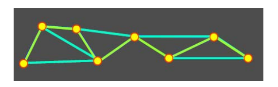  

   
 - Use Voronoi Diagram    
 - Construct Delaunay triangulation    
 - Which edges to choose?
 
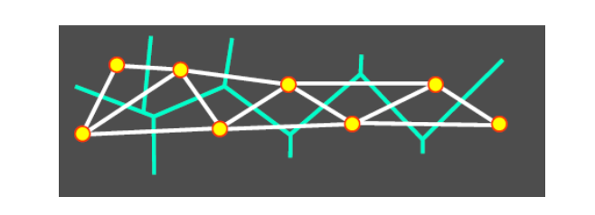  

## (2) 基于字典学习的曲面重建    

Xiong et al. Robust Surface Reconstruction via Dictionary Learning. Siggraph Asia 2014.    

     

**问题**   

 - 输入：三维点集（蓝色点）P    
 - 输出    
    - 采样点集（红色点）V    
    - V构成的三角网格M，使得M逼近P   

**误差度量**     

 - 如何度量点集P与网格M之间的误差？    

**某个点到三角形的距离**

$$
d(\mathbf{p}_i,f) =|| \mathbf{p}_i-\mathbf{p}_i^{\prime} || 
$$

$$
\begin{aligned}
=\min _{\substack{\alpha+\beta+\gamma=1 \\\\
\alpha, \beta, \gamma \geq 0}}||\mathbf{p}_i-(\alpha \mathbf{v}_r+\beta \mathbf{v}_s+\gamma \mathbf{v}_t)||
\end{aligned}
$$

> 
\\({P}' _i=\alpha ^{\ast}V_r+\beta ^{\ast}V_s+\gamma ^{\ast}V_t\\)

\\((\alpha ^{\ast},\beta ^{\ast},\gamma ^{\ast})\\):\\({P}' _i\\)相对与\\(f\\)的重心坐标     

> 

  

**某个点到三角形的距离**    

$$
d(\mathbf{p}_i,f) =|| \mathbf{p}_i-\mathbf{p}_i^{\prime} || 
$$

$$
\begin{aligned}
=\min _{\substack{\alpha+\beta+\gamma=1 \\\\
\alpha, \beta, \gamma \geq 0}}||\mathbf{p}_i-(\alpha \mathbf{v}_r+\beta \mathbf{v}_s+\gamma \mathbf{v}_t)||
\end{aligned}
$$

> 

\\(\mathbf{Ｖ}=[\mathbf{Ｖ}_1,\mathbf{Ｖ}_2,\cdots ,\mathbf{Ｖ}_m] \in  \mathbb{R }^{3\times m}\\)

Vertex matrix of **M**  
> 

  

## Iterative Refinement   

## Resistant to Noise   

## Feature Preserving

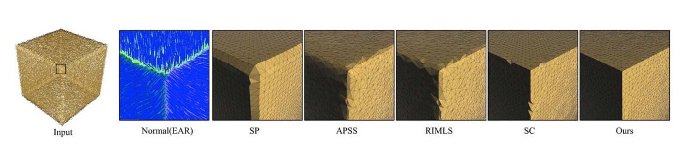

Implicit methods need normal information, while normal estimation is another challenging problem.     

## Conclusion   

 - Model the surface reconstruction problem via **dictionary learning**     
 - VS Implicit method    
    - Straightforward    
    - Approximation error is considered    
 - VS Existing Explicit method     
    - Denoising the input point cloud    
    - Global approximation error    

## Hybrid Methods

## (1) Competing Fronts     

 - Deformable model reconstruction
    - Implicit coarse guidance field or attraction field
    - Explicit deformable model (a mesh)
 - Property
    - Watertight guarantee
    - Topology control

   

Sharf et al. Competing Fronts for Coarse–to–Fine Surface Reconstruction. Eurographics 2006.

## (2) Cooperative Evolutions  

 - Two deformable models     
    - One from interior     
    - The other from exterior    
 - Alternative evolutions     

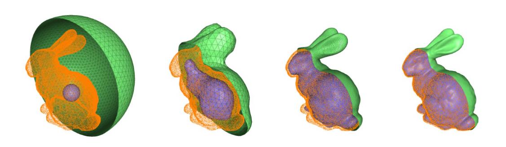

Lu and Liu. Surface Reconstruction via Cooperative Evolutions. CAGD 2020.    

## 5. Post‐processing    

## 5. Post‐processing    

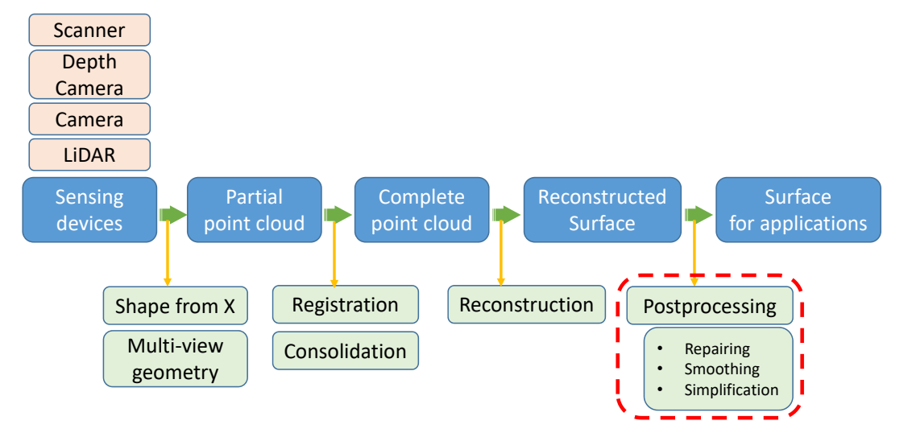

## Post‐processing   

 - Repairing, denoising, smoothing, simplification…    

Repairing (completion, hole‐filling, restoration)   

## (1) Filling Holes in Meshes      
[Liepa, SGP 2003]    

## Pipeline   

1. Hole identification     
2. Hole triangulation    
3. Mesh refinement     
4. Mesh fairing    

## Summary    

 - Easy to implement     
 - Focus algorithm on holes     
 - **Triangulation may self‐intersect**    
 - **Can’t fill holes with islands**     
 - **Fairing weaken original surface feature**    

## (2) Robust Repair of Polygonal Models [Ju, Siggraph 2004]

## Summary    

 - Employ a space‐efficient octree grid     
 - Produce closed, manifold surface for any input 
model     

## (3) Context‐based Surface Completion    
[Sharf et al., Siggraph 2004]

## Motivation     

Complete the missing region with patches that conform with its context     

## Method    

Import patches with matching context from the surface itself:     
 - Analyze surface characteristics.    
 - Find best matching patch.    
 - Fit imported patch to boundary.    

## Limitations: Semantics

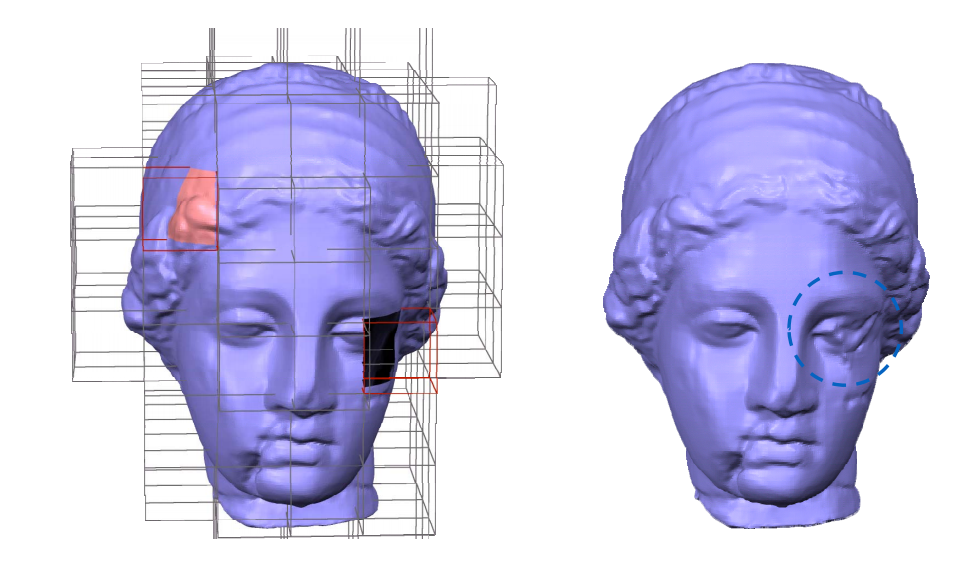   

## Summary   

 - A fully automatic method to complete a missing region in a surface from its context.      
    - Completed patches geometrically conform with neighborhood.    
    - Incremental scale‐space framework for finer approximation of the unknown region.    
    
    
    
## (4) Example‐based Surface Completion     
[Pauly et al., SGP 2005]

## Solution   

 - Use **3D model database** to provide geometric priors for shape completion      
 - Apply **non‐rigid transforms** on the models     
    - More deformation \\(\Rightarrow \\) less likely completion    
 - **Consistently** combine geometric information from multiple context models    
 - Final result comes with **confidence values**    
 
 
 
 
## (5) Atomic Volumes for Mesh Completion     
[ Podolak and Rusinkiewicz, SGP 2005]

## Atomic Volumes    

 - A volume is **atomic** if it doesn’t intersect
the polygons of the mesh.    

  

## Summary　　　

 - Avoid changing, approximating or re‐sampling the original mesh data     
 - Incorporate user constraints     
 - **Can’t process holes with islands**    

## (6) Geometry Completion by Texture Synthesis    
[Nguyen et al., PG 2005]

## (7) Others  

## More…    

 - Marco Attene, Marcel Campen, Leif Kobbelt. Polygon Mesh Repairing: An Application Perspective. ACM Computing Surveys, 2012.     

 - Learning based 3D data completion in recent years    
    - Han et al. High Resolution Shape Completion Using Deep Neural Networks for Global Structure and Local Geometry Inference. ICCV 2017.    
    - Han et al. Deep Reinforcement Learning of Volume‐guided Progressive View Inpainting for 3D Point Scene Completion from a Single Depth Image. CVPR 2019.   
    - Nie et al. Skeleton‐bridged Point Completion: From Global Inference to Local Adjustment. NeuIPS 2020.    

## 动态物体的3D重建    

## 3D动态重建的困难性    

 - 数据量大     
 -  数据采集困难    
    - Single‐Camera    
    - Multi‐Camera    
 - 数据结构复杂    
    - Geometry    
    - Color    
    - Topology    
 - 硬件需求高     
 
 
 
## General Pipeline    

 - 数据采集     
  

## General Pipeline   

 - 生成3D mesh/surface  

  

## 人体动态重建 （Human Performance Capturing）    

 - 离线高质量的动态重建方法    
 - 实时动态的人体重建方法    
 - 基于深度学习的人体重建方法     

## 离线高质量动态重建   

High-quality streamable free-viewpoint video (SIGGRAPH 2015)    

## 2.2 实时动态人体重建   

[Motion2Fusion 2017]

## 实时动态人体重建   

CVPR 2018 [Oral]    

**DoubleFusion**:*Real-time Capture of Human Performances with Inner Body Shapes from a Single Depth Sensor*     

## 2.3 基于深度学习的动态人体重建方法     

Volumetric performance capture from minimal camera viewpoints (ECCV 2018)    
