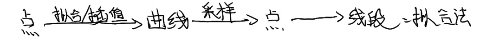

前三种是连续表达，第四种是线段表达。    
连续表达在数学上容易表达。但在应用上有局限。   

[51:42] # 几何迭代法    

要解决的问题：   
\\(Q_0\\) ~ \\(Q_4\\) 是用户给点，要求新的控制顶点P，使其生成
的曲线经过Q点。     
普通方法：构造方程反求控制顶点。    
本文方法：   
[>] 图(b)的P点标注得不对。     
用 Q 作为初始 P       
基于 P 画出曲线。    
计算曲线对应点与Q的距离，调整P的位置。    

12.2 曲线的离散    

[55:08] # 曲线的离散化    

黑色是光滑曲线，但无法用于计算。因此用虚线近似替代曲­线进行计算。只要能控制直线与曲线的误差。     

[56:52] # 为何要    

只有针对线段或特殊曲线（圆、椭圆）等的高效渲染算法。     
不会针对一般曲线专门设计，因此要把一般曲线离散成线段再渲染。     

[1:01:50] # 离散曲线     

  
   

差分法：一个点的导数是相邻点的差分，用前一点和后一点的弦的斜率来代替当前点的切线。       

[?] 不懂？    