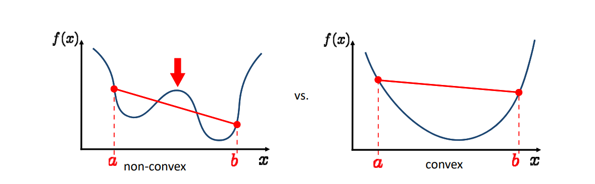
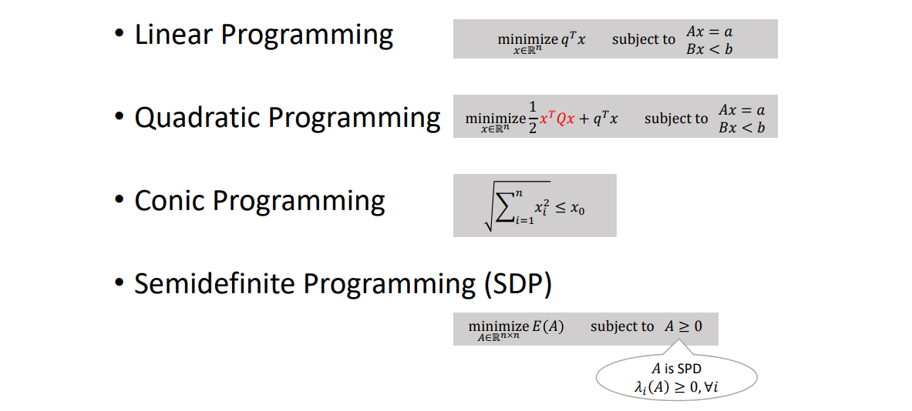

# 凸函数    

凸函数能保证找到全局最小值    

[1:2:04]凸函数有很好的性质。因此都希望把问题转化为凸问题。    

    

f convex if:  

$$
f((1-t)a+tb\le (1-t)f(a)+tf(b), \qquad t\in [0,1]
$$    

凸集：任何两点的连线都在集合内     
凸集最小点有非常好的性质      

# 凸优化问题   

凸优化问题：优化函数\\(f(x)\\) and all 约束条件\\(g_i(x)\\) are convex functions     

凸优化的主要类型    

    

---  

> 本文出自CaterpillarStudyGroup，转载请注明出处。
https://caterpillarstudygroup.github.io/GAMES102_mdbook/

