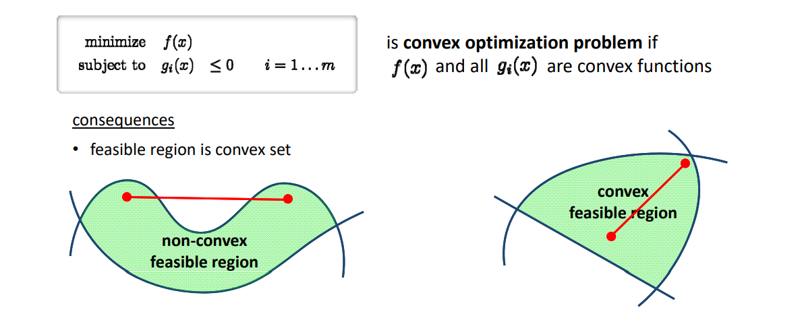
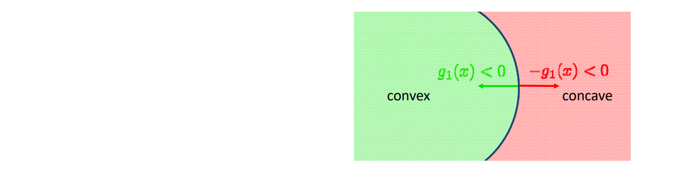

# Convex Optimization    

# 凸函数能保证找到全局最小值    

• Searching globally optimal solutions usually requires convexity!     
• f convex if:  
\\(f((1-t)a+tb\le (1-t)f(a)+tf(b)\\),    \\(t\in [0,1]\\)    

    

# 凸优化问题   

    

# 凸优化问题   

    

is convex optimization problem if \\(f(x)\\) and all \\(g_i(x)\\) are convex functions     

<u>consequences</u>   

• feasible region is convex set    
• equality constraints can only be affine, i.e. \\(g_i(x)=a^Tx+b\\) since    

$$
g_i(x)=0\Longleftrightarrow 
\begin{cases}
g_i(x) &\le 0\\\\
-g_i(x) &\le 0
\end{cases}
$$

  

# 凸优化的主要方法    

    

