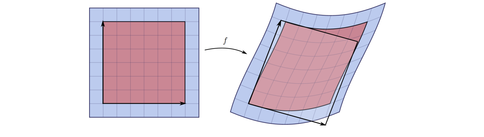
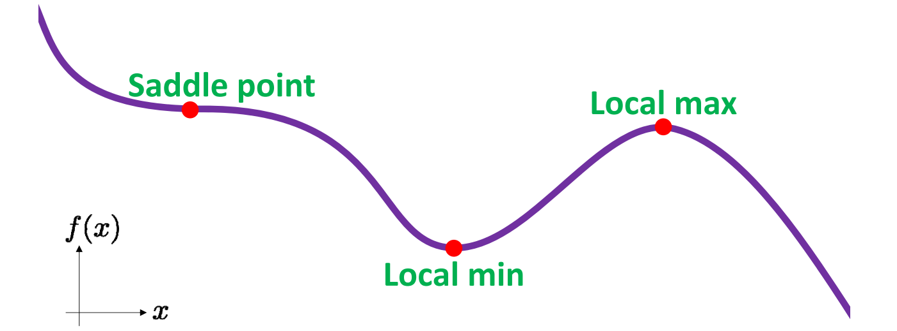
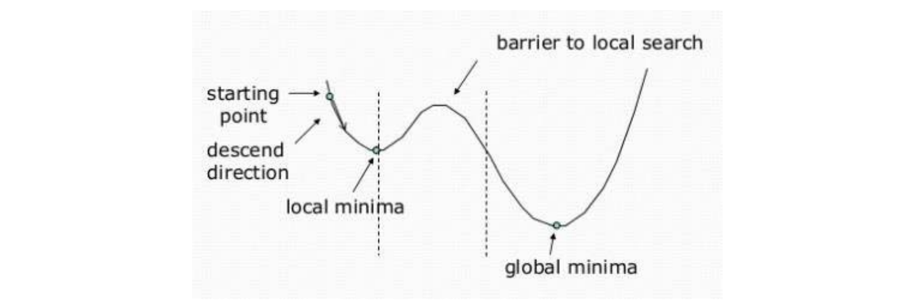
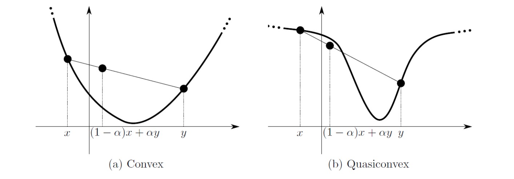

# 优化问题的一般形式   

> 优化问题的目标函数一般是实值函数，因为实数才能比大小    
不同的\\(g(x) 和 h(x)\\)，用不同的方法优化。    

高维实值函数：\\(f:\mathbb{R}^n\to \mathbb{R}\\)    

|||
|---|---|
|\\(\min_x\in \mathbb{R} ^nf(x)\\)|    目标函数 or 能量函数    |
|S.t.\\(g(x)=0\\)   | 等式约束|
|\\(h(x)\ge 0 \\)  | 不等式约束 |   

不同的优化**问题**须用不同的优化方法    
特定的优化问题需要**设计**特定的优化方法达到最佳性能    

# 概念

## 梯度 (Gradient)：一阶导数   

$$
f:\mathbb{R}^n\to \mathbb{R}
$$

$$
f=(\frac{\partial f}{\partial x_1} ,\frac{\partial f}{\partial x_2} ,\cdots ,\frac{\partial f}{\partial x_n})
$$

## Jacobian: 一阶“导数”矩阵    

$$
f:\mathbb{R}^n\to \mathbb{R}^m
$$

$$
(D_f)_{ij}=\frac{\partial f_i}{\partial x_j} 
$$

   

## Hessian ：二阶“导数”矩阵   

$$
f:\mathbb{R}^n\to \mathbb{R} \to H_{ij}=\frac{\partial^2 f}{\partial x_i\partial x_j} 
$$

   

$$
f(x)\approx f(x_0)+\nabla f(x_0)^\top (x-x_0)+(x-x_0)^\top Hf(x_0)(x-x_0)
$$

> [57:31] 每个分量对每个变量求导构成的矩阵     
H是函数的二阶项的度量     

# 驻点（Critical point）    

$$
\nabla f(x)=0
$$

   

Critical points may not be minima.    

## 一般非线性函数的最小值    

无法直接求解，可以从某初值开始，逐步找其附近的极小值    

   

## 凸函数的驻点就是最小值    

   

# 优化问题的类型   

• Constrained / Unconstrained    
• Linear / Nonlinear    
• Global / Local    
• Convex / Nonconvex    
• Continuous / Discrete    
> [1:03:25] Discrete:只在整数域上找最优解。   

• Stochastic / Deterministic    
• Single objective / Multiple objectives    

> 多目标常常是矛盾的，需要做权衡，找平衡点或通过权重结合成单目标问题。     

minimize \\((E_1(x),E_2(x),\cdots ,E_k(x))\\)        

\\(E=\lambda _1E_1+\lambda _2E_2+\cdots +\lambda _kE_k\\)    

---  

> 本文出自CaterpillarStudyGroup，转载请注明出处。
https://caterpillarstudygroup.github.io/GAMES102_mdbook/

