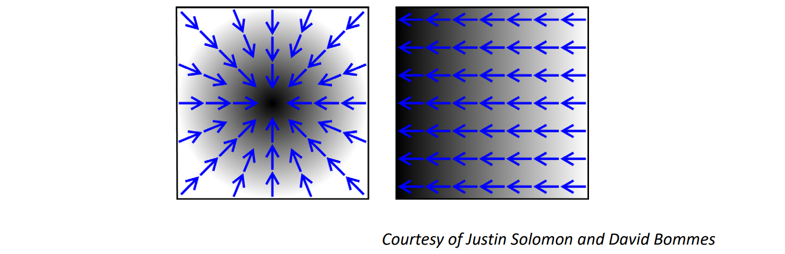

# Fundamentals   

# 优化问题的一般形式   

高维实值函数：\\(f:\mathbb{R}^n\to \mathbb{R}\\)    

\\(\min_x\in \mathbb{R} ^nf(x)\\)    目标函数 or 能量函数    

S.t.\\(g(x)=0\\)    等式约束

\\(h(x)\\)\ge 0    不等式约束    

 - Two roles    
    - Client: Which optimization tool is relevant?    
      - 不同的优化**问题**须用不同的优化方法    
    - Designer: Can I design an algorithm for this problem?    
      - 特定的优化问题需要**设计**特定的优化方法达到最佳性能    
 - Optimization is a huge field.    

## 梯度 (Gradient)：一阶导数   

$$
f:\mathbb{R}^n\to \mathbb{R}
$$

$$
\to \nabla f=(\frac{\partial f}{\partial x_1} ,\frac{\partial f}{\partial x_2} ,\cdots ,\frac{\partial f}{\partial x_n})
$$

   

## Jacobian: 一阶“导数”矩阵    

$$
f:\mathbb{R}^n\to \mathbb{R}^m
$$

$$
\to (Df)_{ij}=\frac{\partial f_i}{\partial x_j} 
$$

   

## Hessian ：二阶“导数”矩阵   

$$
f:\mathbb{R}^n\to \mathbb{R} \to H_{ij}=\frac{\partial^2 f}{\partial x_i\partial x_j} 
$$

   

$$
f(x)\approx f(x_0)+\nabla f(x_0)^\top (x-x_0)+(x-x_0)^\top Hf(x_0)(x-x_0)
$$

# 驻点（Critical point）    

$$
\nabla f(x)=0
$$

(unconstrained)    

   

Critical points may not be minima.    

## 一般非线性函数的最小值    

* 仍无法求解！    
* 数值求解    
• 从某初值开始，逐步找其附近的极小值    

   

## 凸函数的驻点就是最小值    

   

Numerical Algorithms, Solomon   

# 优化问题的类型   

• Constrained / Unconstrained    
• Linear / Nonlinear    
• Global / Local    
• Convex / Nonconvex    
• Continuous / Discrete    
• Stochastic / Deterministic    
• Single objective / Multiple objectives    

minimize \\((E_1(x),E_2(x),\cdots ,E_k(x))\\)        

\\(E=\lambda _1E_1+\lambda _2E_2+\cdots +\lambda _kE_k\\)    

