# 回顾：参数化中的优化问题   

$$
\min_{V} E(V)=\sum _{t\in T}(\sigma _1^2+\frac{1}{\sigma _1^2} +\sigma _2^2+\frac{1}{\sigma _2^2}) 
$$

s.t.  \\(\sigma _1\sigma _2>0,\forall t\\)   

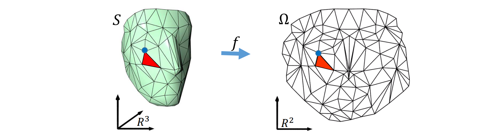   

# 回顾：几何处理中的优化问题   

   

# Geometry Problem and Modeling    

1. Formulate an objective energy \\(E(x)\\)    
2. Define constraints, if apply      
\\(\star \\) Equality / Inequality    
\\(\star \\) Linear / Nonlinear    
3. Numerical optimization     

\begin{array}{cl}
\underset{x \in \mathbb{R}^{n}}{\operatorname{minimize}} & E(x) \\\\
\text { subject to } & c_{1}(x)=d_{1} \\\\
& c_{2}(x)>d_{2}
\end{array}

# Fundamentals   

# 优化问题的一般形式   

高维实值函数：\\(f:\mathbb{R}^n\to \mathbb{R}\\)    

\\(\min_x\in \mathbb{R} ^nf(x)\\)    目标函数 or 能量函数    

S.t.\\(g(x)=0\\)    等式约束

\\(h(x)\\)\ge 0    不等式约束    

 - Two roles    
    - Client: Which optimization tool is relevant?    
      - 不同的优化**问题**须用不同的优化方法    
    - Designer: Can I design an algorithm for this problem?    
      - 特定的优化问题需要**设计**特定的优化方法达到最佳性能    
 - Optimization is a huge field.    

# 梯度 (Gradient)：一阶导数   

$$
f:\mathbb{R}^n\to \mathbb{R}
$$

$$
\to \nabla f=(\frac{\partial f}{\partial x_1} ,\frac{\partial f}{\partial x_2} ,\cdots ,\frac{\partial f}{\partial x_n})
$$

   

# Jacobian: 一阶“导数”矩阵    

$$
f:\mathbb{R}^n\to \mathbb{R}^m
$$

$$
\to (Df)_{ij}=\frac{\partial f_i}{\partial x_j} 
$$

   

# Hessian ：二阶“导数”矩阵   

$$
f:\mathbb{R}^n\to \mathbb{R} \to H_{ij}=\frac{\partial^2 f}{\partial x_i\partial x_j} 
$$

   

$$
f(x)\approx f(x_0)+\nabla f(x_0)^\top (x-x_0)+(x-x_0)^\top Hf(x_0)(x-x_0)
$$

# 驻点（Critical point）    

$$
\nabla f(x)=0
$$

(unconstrained)    

   

Critical points may not be minima.    

# 一般非线性函数的最小值    

* 仍无法求解！    
* 数值求解    
• 从某初值开始，逐步找其附近的极小值    

   

# 凸函数的驻点就是最小值    

   

Numerical Algorithms, Solomon   

# 优化问题的类型   

• Constrained / Unconstrained    
• Linear / Nonlinear    
• Global / Local    
• Convex / Nonconvex    
• Continuous / Discrete    
• Stochastic / Deterministic    
• Single objective / Multiple objectives    

minimize \\((E_1(x),E_2(x),\cdots ,E_k(x))\\)        

\\(E=\lambda _1E_1+\lambda _2E_2+\cdots +\lambda _kE_k\\)    

# 无约束的优化问题    

# Unconstrained Optimization    

$$
\min_xf(x)
$$

• Gradient descent    
• Newton    
• Quasi‐Newton    
• Coordinate descent    

   

# 梯度下降法   
(Gradient descent)   

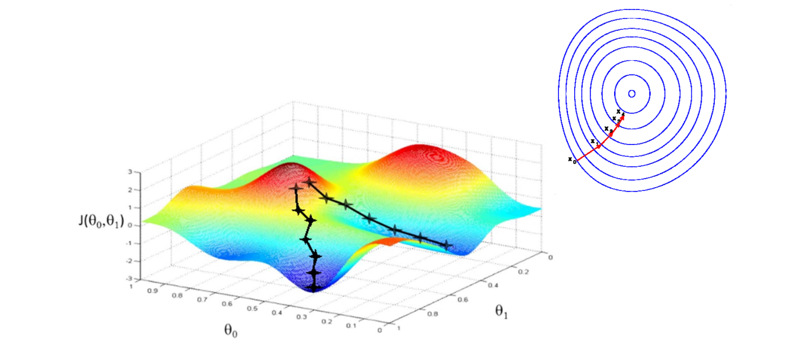   

$$
x_{k+1}=x_k-\alpha _k\nabla f(x_k)
$$

# 梯度下降法   
(Gradient descent)   

**Line search**    
\\(\Downarrow \\)    
\\(x_{k+1}=x_k-\alpha _k\nabla f(x_k)\\)    

> **Gradient descent**    

# 牛顿法 (Newton’s method)    

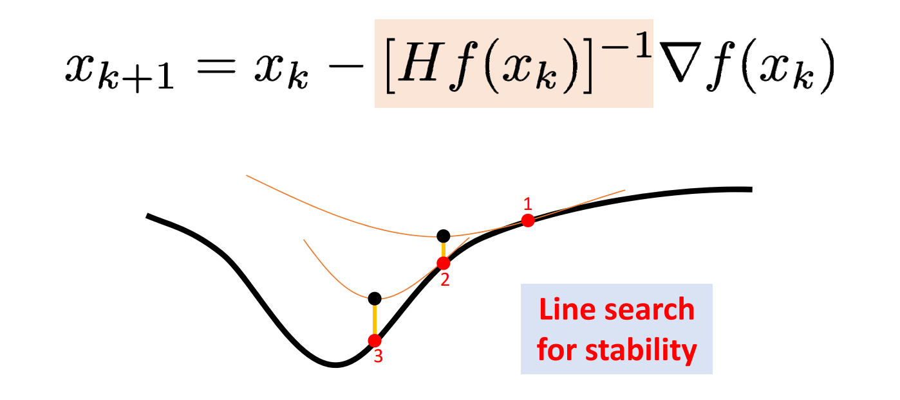   

# 拟牛顿法 (Quasi‐Newton)    

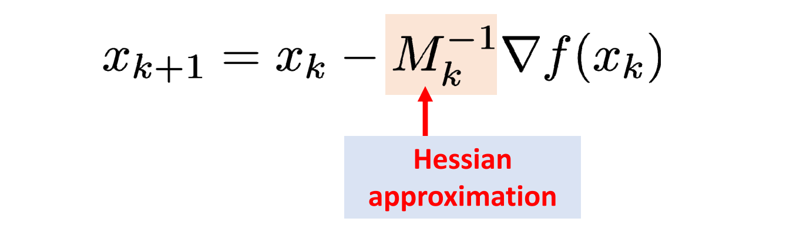   

* Estimate the Hessian based on previous gradients    
* Recursively inverse Hessian    
 > • BFGS (Broyden–Fletcher–Goldfarb–Shanno algorithm)    
  • L‐BFGS    

# 坐标下降法 (Coordinate descent)    

**Obj**: minimize\\(_{x,y},𝐸(𝑥, 𝑦)\\)     

• Alternating variables    

Repeat    
1. \\( y_{k+1}=\min_yE(x_k,y)\\)  
2. \\(x_{k+1}=\min_xE(x,y_{k+1})\\)    

# 等式约束的优化问题    

# Lagrange Multipliers: Idea   

   

# Lagrange Multipliers: Idea    

   

# Lagrange Multipliers: Idea    

   

# Use of Lagrange Multipliers     

Turns constrained optimization into     
unconstrained root‐finding.    

$$
\begin{array}{l}  
  \nabla  \mathbf{f}(x) =\lambda \nabla g(x)  \\\\     
  g(x) = 0 \\    
\end{array} 
$$

# Many Options    

• **Reparameterization**   
Eliminate constraints to reduce to unconstrained case     

• **Newton’s method**    
Approximation: quadratic function with linear constraint    

• **Penalty method**     
Augment objective with barrier term, e.g. \\(f(x)+\rho |g(x)|\\)    

# Alternating Projection    

   

# Augmented Lagrangians    

   

# Alternating Direction    
Method of Multipliers (ADMM)    

$$
\begin{array}{l}  
  \min_{x,z}& f(x)+g(z)     \\\\  
  s.t. &Ax+Bz=c   \\\\    
\end{array} 
$$

$$
\wedge _\rho (x,z;\lambda )=f(x)+g(z)+\lambda ^\top (Ax+Bz-c)+\frac{\rho }{2}||Ax+Bz-c||_2^2 
$$

<https://web.stanford.edu/~boyd/papers/pdf/admm_slides.pdf>    

# The Art of ADMM “Splitting”    

   

# 不等式约束的优化问题   

# 一般形式   

   

# 几何解释   

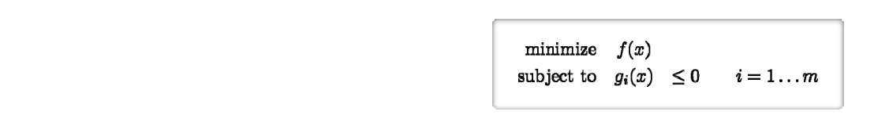   
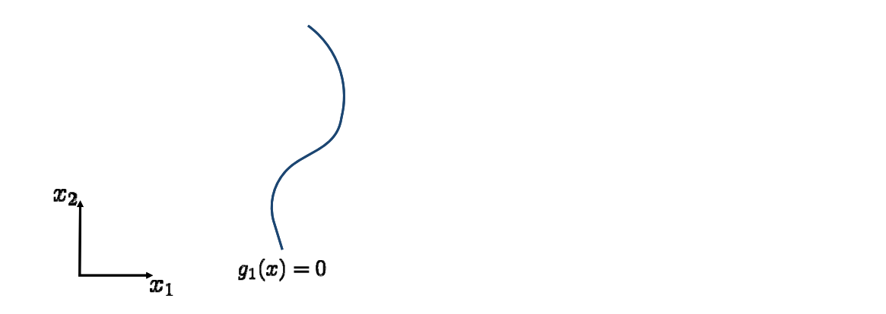   

# 几何解释   

 

# 几何解释    

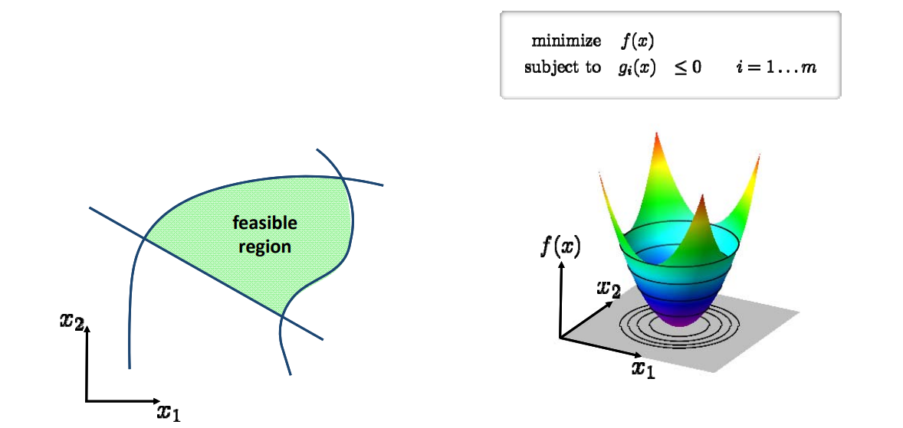 

# 几何解释    

 

# First‐Order Optimality Conditions   

 - Necessary condition for minimum of   
 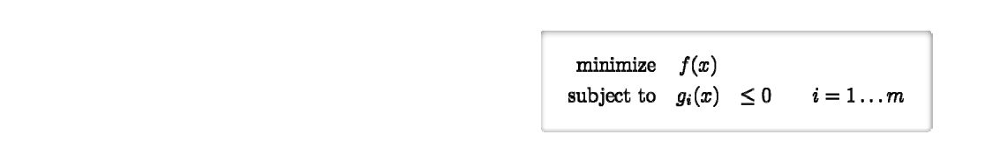 

 - Langrangian: \\(L(x,\lambda )=f(x)+\sum_{i=1}^{m} \lambda _ig_i(x)\\)  

 - Karush‐Kuhn‐Tucker (KKT)     
   conditions for **minimum**  \\(x^*\\)   
 1. Stationarity: \\(\nabla f(x^\ast )+\sum_{i=1}^{m} \lambda _i\nabla g_i(x^\ast )=0\\)    

 2. Primal feasibility:   \\(g_i(x^*)\le 0\\)   
 3. Dual feasibility:  \\(\lambda _i\ge 0\\)    
 4. Complementary slackness:   \\(\lambda _ig_i(x^*)= 0 \\)     

 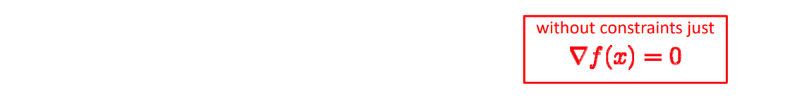 

# First‐Order Optimality Conditions    

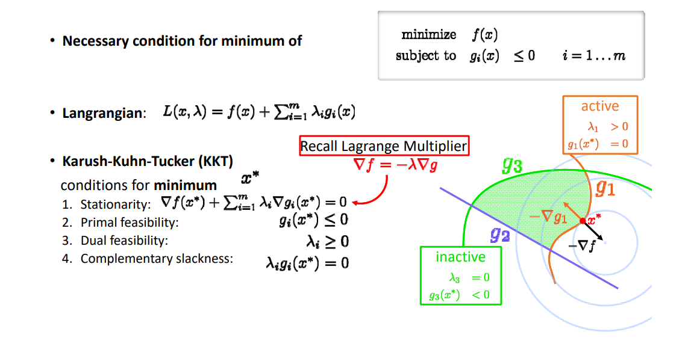    

# 优化方法     
  

    

# Convex Optimization    

# 凸函数能保证找到全局最小值    

• Searching globally optimal solutions usually requires convexity!     
• f convex if:  
\\(f((1-t)a+tb\le (1-t)f(a)+tf(b)\\),    \\(t\in [0,1]\\)    

    

# 凸优化问题   

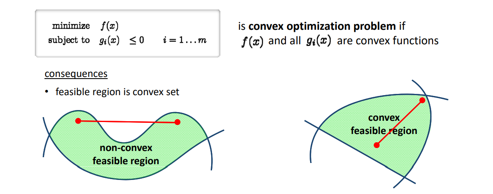    

# 凸优化问题   

    

is convex optimization problem if \\(f(x)\\) and all \\(g_i(x)\\) are convex functions     

<u>consequences</u>   

• feasible region is convex set    
• equality constraints can only be affine, i.e. \\(g_i(x)=a^Tx+b\\) since    

$$
g_i(x)=0\Longleftrightarrow 
\begin{cases}
g_i(x) &\le 0\\\\
-g_i(x) &\le 0
\end{cases}
$$

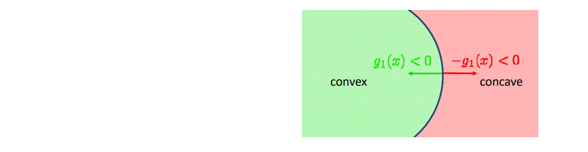  

# 凸优化的主要方法    

    

# 其他优化问题    

# Nonlinear Least Squares   

**Obj**: minimize  \\(\sum _ie_i^2(x)\\)    
• Gauss‐Newton    

• Levenberg‐Marquardt     

$$
\begin{array}{l} 
  \nabla  ^2e_i^2\approx 2(\nabla  e_i)^T\nabla  e_i \\\\
  \nabla^2\approx J^TJ \\ 
\end{array} 
$$

# Mixed‐Integer Optimization   

    

# 几何处理中的优化问题    

* 具有**特殊的几何结构**，往往能有特殊的优化方法    
• 比如：见“曲面参数化”和“几何映射”两节课    

argmin \\(\sum _jf(A_j)\\)       Separable

    

# 优化相关的软件   

• **Eigen** — linear algebra    
• **IPOPT** — fast opensource C++ interior point method    
• **Mosek** — commercial (convex) optimization in C, Java, Python…    
• **Gurobi** — commercial mixed‐integer optimization    
• **CPLEX** — commercial mixed‐integer optimization    
• **Matlab** — many algorithms, good for prototyping    
• **CVX** — prototyping for convex optimization   
• **CoMISo** — unified interface to above algorithms   
