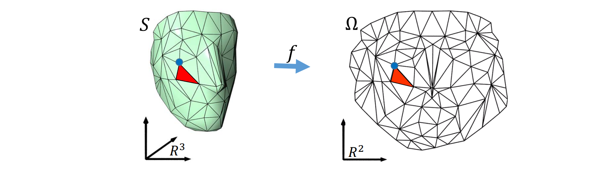

# 回顾：参数化中的优化问题   

$$
\min_{V} E(V)=\sum _{t\in T}(\sigma _1^2+\frac{1}{\sigma _1^2} +\sigma _2^2+\frac{1}{\sigma _2^2}) 
$$

s.t.  \\(\sigma _1\sigma _2>0,\forall t\\)   

   

# 回顾：几何处理中的优化问题   

   

# Geometry Problem and Modeling    

1. Formulate an objective energy \\(E(x)\\)    
2. Define constraints, if apply      
\\(\star \\) Equality / Inequality    
\\(\star \\) Linear / Nonlinear    
3. Numerical optimization     

\begin{array}{cl}
\underset{x \in \mathbb{R}^{n}}{\operatorname{minimize}} & E(x) \\\\
\text { subject to } & c_{1}(x)=d_{1} \\\\
& c_{2}(x)>d_{2}
\end{array}

