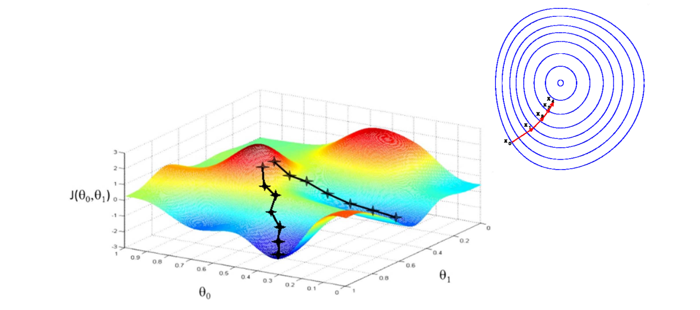
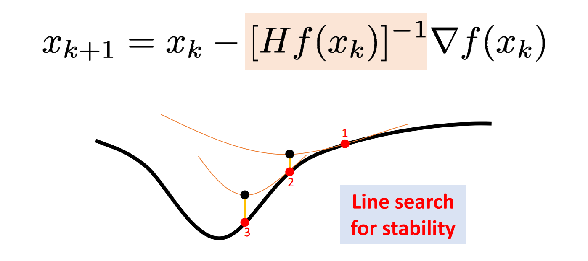
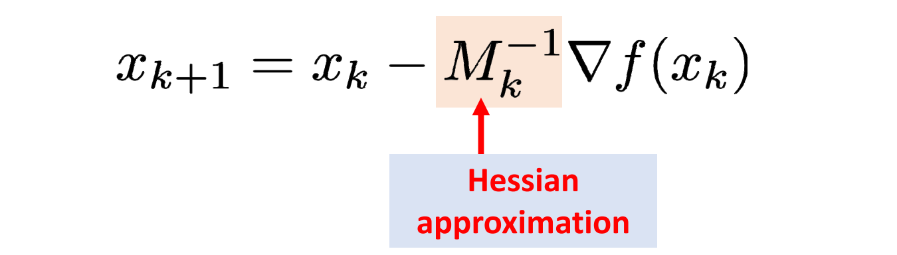

# 无约束的优化问题    

## 梯度下降法 Gradient descent   

   

$$
x_{k+1}=x_k-\alpha _k\nabla f(x_k)
$$

## 牛顿法 (Newton’s method)    

   

## 拟牛顿法 (Quasi‐Newton)    

   

用一下近似但更容易计算的H来代替真实的H：BFGS、L‐BFGS    

## 坐标下降法 (Coordinate descent)    

目标: minimize\\(_{x,y},𝐸(𝑥, 𝑦)\\)     

Repeat Alternating variables    
1. \\( y_{k+1}=\min_yE(x_k,y)\\)  
2. \\(x_{k+1}=\min_xE(x,y_{k+1})\\)    

> [1:09:31] 沿坐标轴下降，且每次只选一个坐标轴。      
