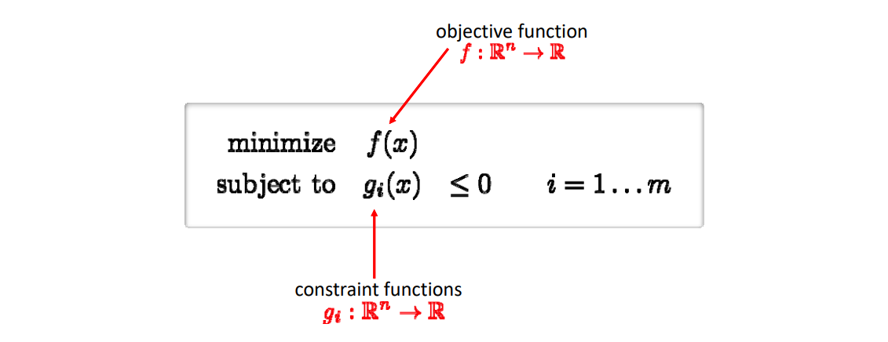
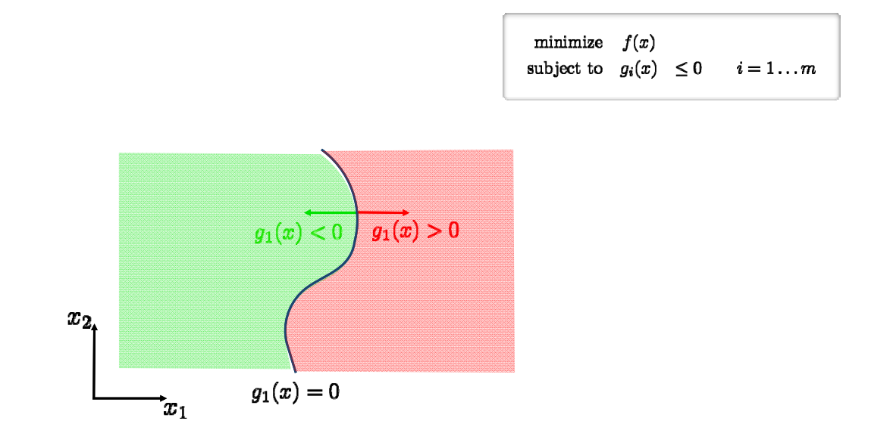
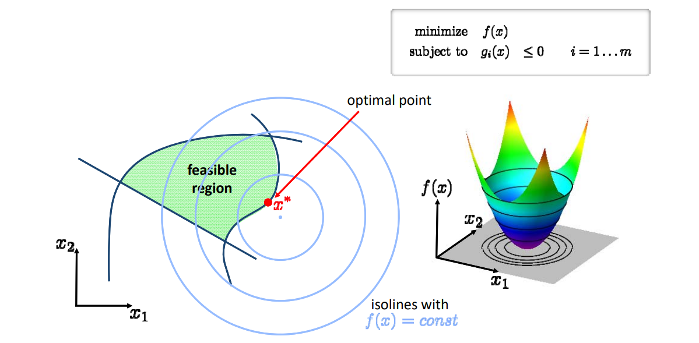
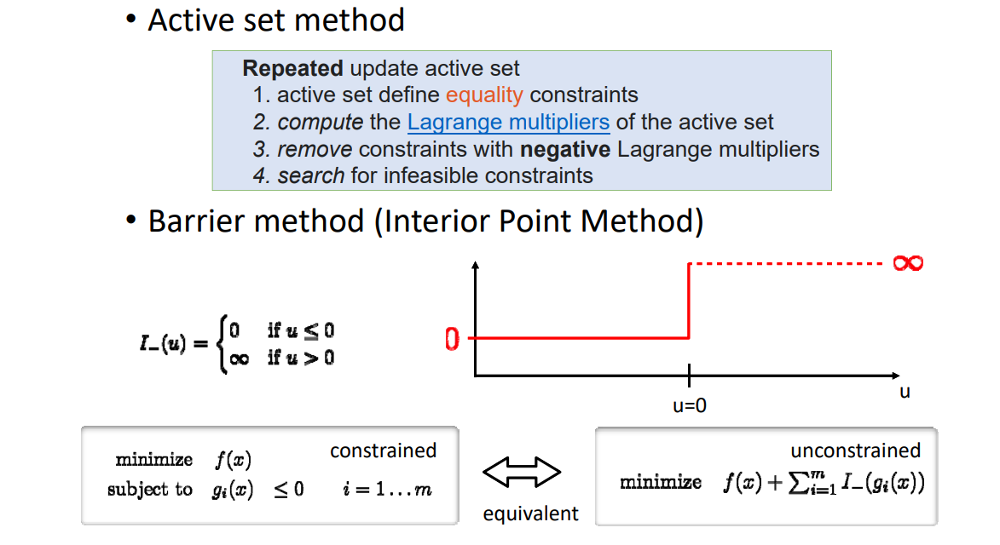

# 不等式约束的优化问题   

## 一般形式   

   

## 约束部分

 

> [1:20:17] 把流形空间分成了两部分，绿色空间为可行域 feasible domain     

## 优化部分

 

## 解优化方法

1. 把问题转化为Langrangian形式:  

$$
L(x,\lambda )=f(x)+\sum_{i=1}^{m} \lambda _ig_i(x)
$$

2. f(x)的约束为Karush‐Kuhn‐Tucker (KKT)     
- Stationarity: \\(\nabla f(x^\ast )+\sum_{i=1}^{m} \lambda _i\nabla g_i(x^\ast )=0\\)    

- Primal feasibility:   \\(g_i(x^*)\le 0\\)   
- Dual feasibility:  \\(\lambda _i\ge 0\\)    
- Complementary slackness:   \\(\lambda _ig_i(x^*)= 0 \\)     

3. 具体求解过程，没有展开

    

> [1:23:29]  Active set,积极集。    
Interior Point.内点法。   

---  

> 本文出自CaterpillarStudyGroup，转载请注明出处。
https://caterpillarstudygroup.github.io/GAMES102_mdbook/
