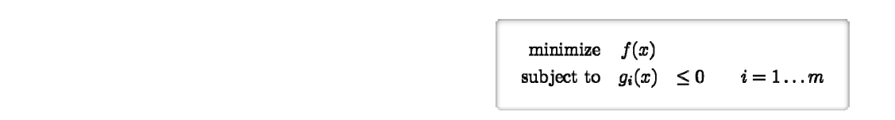
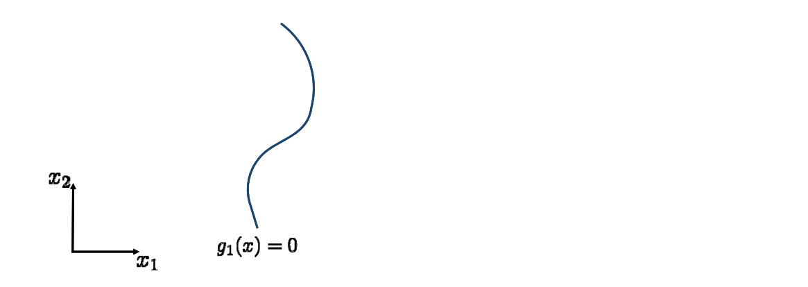
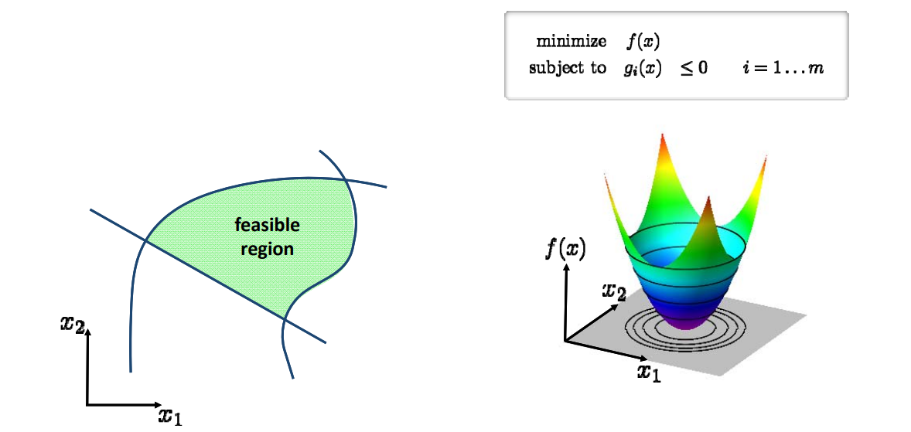
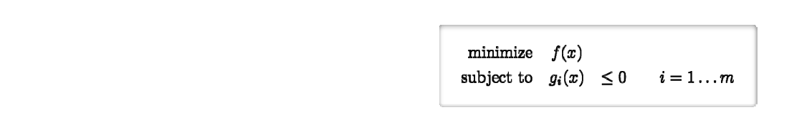

# 不等式约束的优化问题   

# 一般形式   

   

# 几何解释   

   
   

# 几何解释   

 

# 几何解释    

 

# 几何解释    

 

# First‐Order Optimality Conditions   

 - Necessary condition for minimum of   
  

 - Langrangian: \\(L(x,\lambda )=f(x)+\sum_{i=1}^{m} \lambda _ig_i(x)\\)  

 - Karush‐Kuhn‐Tucker (KKT)     
   conditions for **minimum**  \\(x^*\\)   
 1. Stationarity: \\(\nabla f(x^\ast )+\sum_{i=1}^{m} \lambda _i\nabla g_i(x^\ast )=0\\)    

 2. Primal feasibility:   \\(g_i(x^*)\le 0\\)   
 3. Dual feasibility:  \\(\lambda _i\ge 0\\)    
 4. Complementary slackness:   \\(\lambda _ig_i(x^*)= 0 \\)     

  

# First‐Order Optimality Conditions    

    

# 优化方法     
  

    

