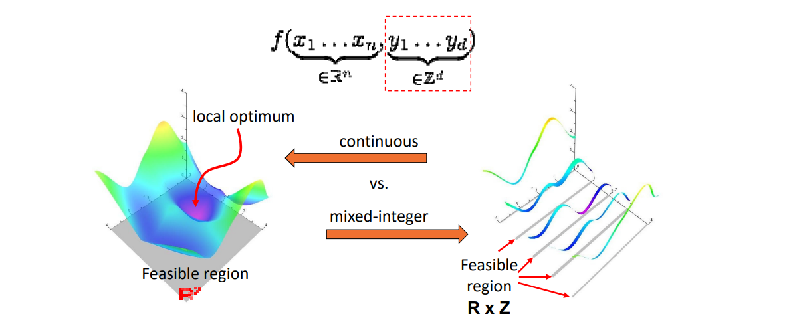
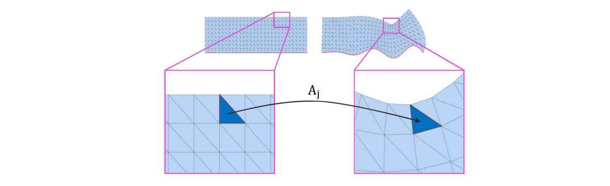

# 其他优化问题    

## Nonlinear Least Squares   

目标函数:   

$$
\sum _ie_i^2(x)
$$

解法：

- Gauss‐Newton    

- Levenberg‐Marquardt     

$$
\begin{array}{l} 
  \nabla  ^2e_i^2\approx 2(\nabla  e_i)^T\nabla  e_i \\\\
  \nabla^2\approx J^TJ \\ 
\end{array} 
$$

## Mixed‐Integer Optimization   

    

[1:26:57] 整型规划：部分变量只能取整数,先松驰成连续，再用稀疏方法限制在整数上。    

# 几何处理中的优化问题    

* 具有**特殊的几何结构**，往往能有特殊的优化方法    

> 往往是多个优化目标的结合。

$$
\mathbf{argmin} \sum _jf(A_j) 
$$

例如：  
    

# 优化相关的软件   

• **Eigen** — linear algebra    
• **IPOPT** — fast opensource C++ interior point method    
• **Mosek** — commercial (convex) optimization in C, Java, Python…    
• **Gurobi** — commercial mixed‐integer optimization    
• **CPLEX** — commercial mixed‐integer optimization    
• **Matlab** — many algorithms, good for prototyping    
• **CVX** — prototyping for convex optimization   
• **CoMISo** — unified interface to above algorithms   

---  

> 本文出自CaterpillarStudyGroup，转载请注明出处。
https://caterpillarstudygroup.github.io/GAMES102_mdbook/

