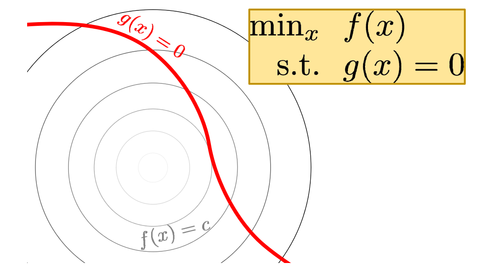
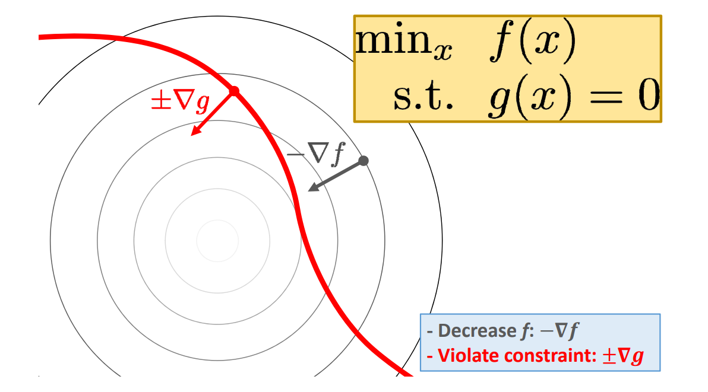
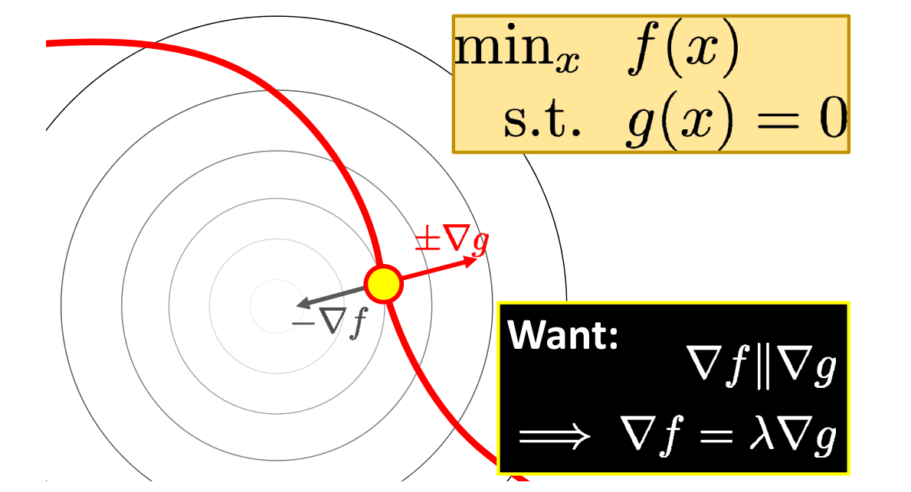
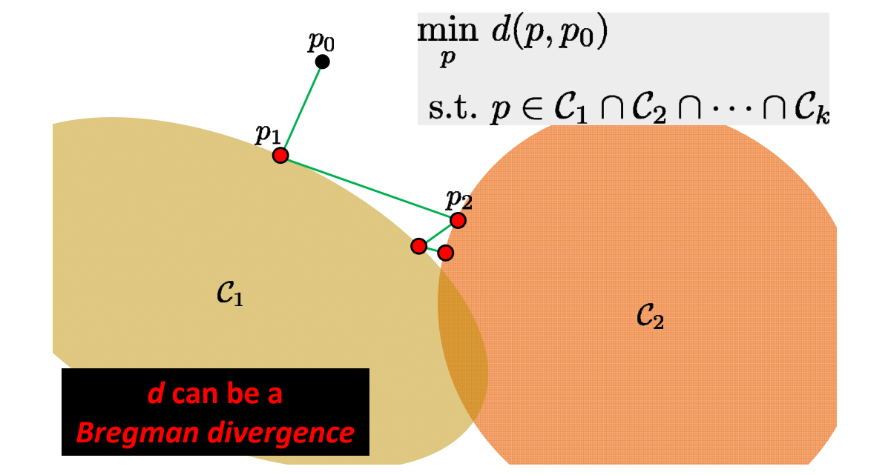
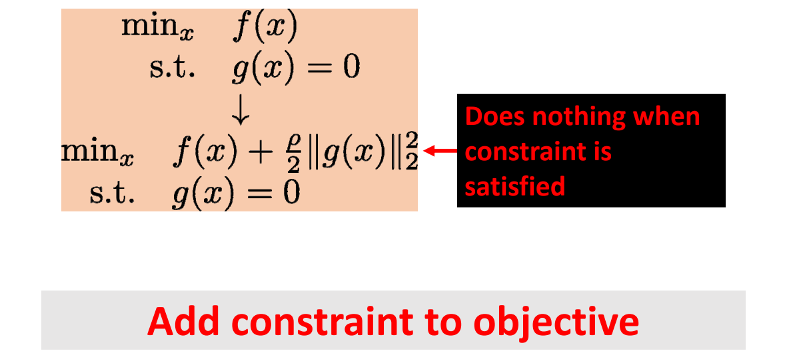
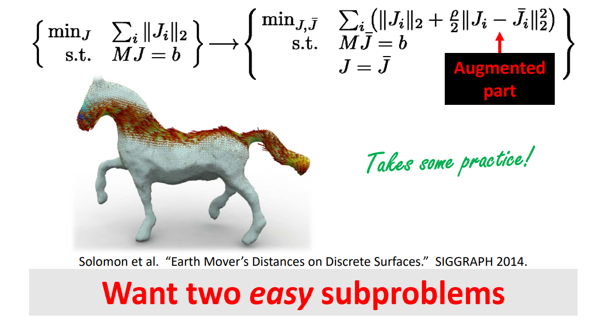

# 等式约束的优化问题    

|||
|---|---|
|||   

\\(g(x)\\)是红线，\\(f(x)\\)由等值线构成的曲面。满足约束的极小值点具有以下特点：  

\\(f(x)\\)与\\(g(x)\\)在该点上梯度方向重合，可能同向或反向。  

[1:13:26]等值约束的优化问题转化为解方程组问题       

$$
\begin{array}{l}  
  \nabla  \mathbf{f}(x) =\lambda \nabla g(x)  \\\\     
  \mathbf{g}(x) = 0 \\    
\end{array} 
$$

## Many Options    

• **Reparameterization**   
Eliminate constraints to reduce to unconstrained case     

• **Newton’s method**    
Approximation: quadratic function with linear constraint    

• **Penalty method**     
Augment objective with barrier term, e.g. \\(f(x)+\rho |g(x)|\\)    

## Alternating Projection    

   

> [1:14:18] \\(C_1,C_2,C_3\\)的代表不同的等式约束。相当于坐标法推广     

## Augmented Lagrangians    

   

> [1:15:18] 把 Constrain 作为目标函数，极小划
权\\(\rho \\)在优化过程中会改变     

## Alternating Direction Method of Multipliers (ADMM)    

> [1:15:50] ADMM.把变量分离。把问题分成若干小问题分解为：小规模局部优化问题、闭式解全局优化问题。     

$$
\begin{array}{l}  
  \min_{x,z}& f(x)+g(z)     \\\\  
  s.t. &Ax+Bz=c   \\\\    
\end{array} 
$$

$$
\wedge _\rho (x,z;\lambda )=f(x)+g(z)+\lambda ^\top (Ax+Bz-c)+\frac{\rho }{2}||Ax+Bz-c||_2^2 
$$

<https://web.stanford.edu/~boyd/papers/pdf/admm_slides.pdf>    

**The Art of ADMM “Splitting”**    

   

本文出自CaterpillarStudyGroup，转载请注明出处。
https://caterpillarstudygroup.github.io/GAMES102_mdbook/  
