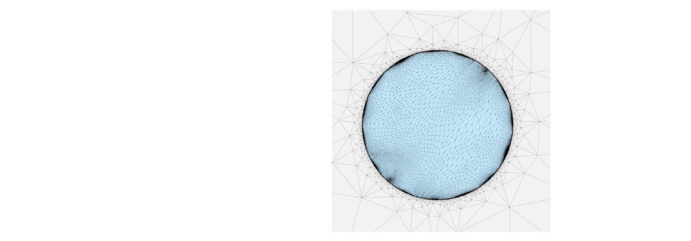
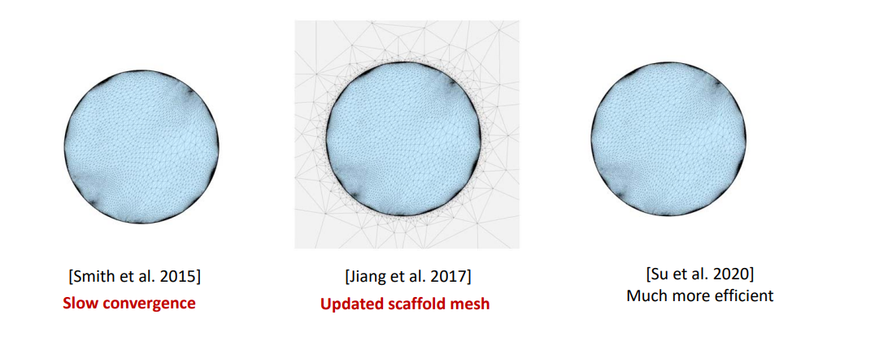
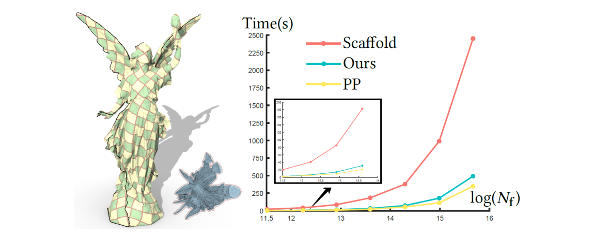
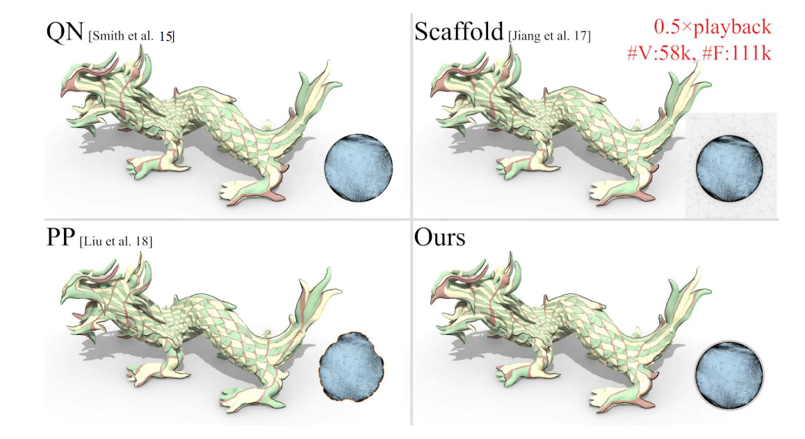
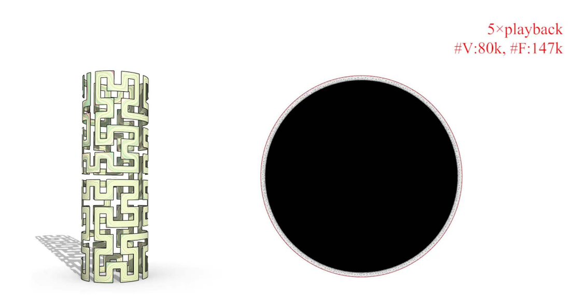

# Bijective Parameterization    

• **Globally intersection‐free**    

     

> [图32:40] 不允许全局发生碰撞    
这是一个全局问题，因此计算量大   

# Quasi‐Newton (QN) [Smith et al. 2015]    

**Quasi‐Newton solver  with slow convergence**!    

Energy: 1.027    
Time: 8.57s    
Iterations: 3553    

     

# Scaffold [Jiang et al. 2017]    

**Linear systems with updated nonzero structure matrices**!    

Energy: 1.027    
Time: 3.22s    
Iterations: 24    

     

# Efficient Bijective Parameterizations    
[Su et al. Siggraph 2020]    

     

> 在形状外面包一层更大的网格    
在更大网格上用传统方法处理  

# Comparisons    

     

     

Hilbert-curve-shaped developable surface   

     

