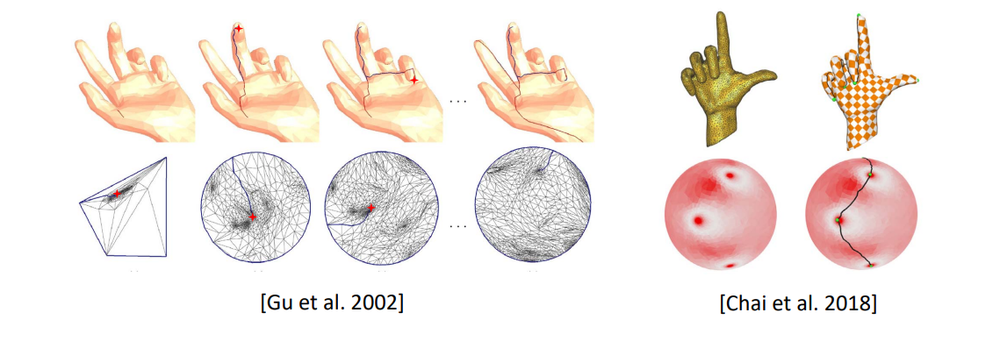
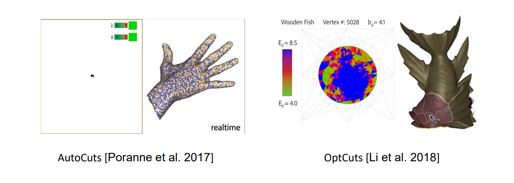
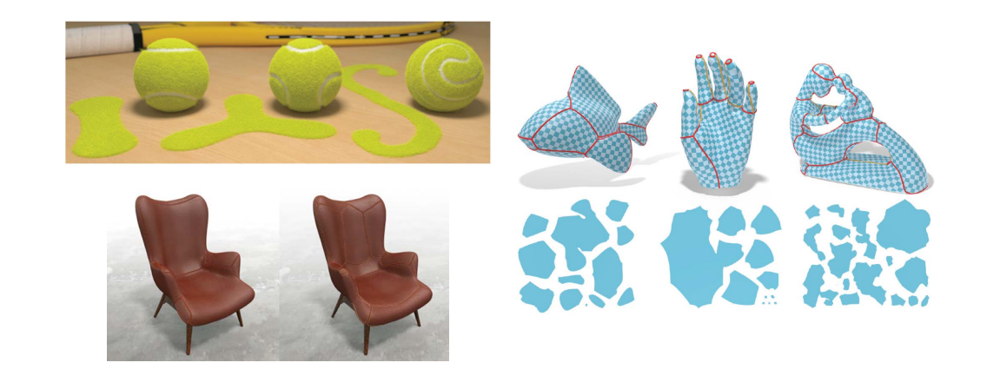

# 封闭曲面的割缝问题    

> 封闭曲面要展开必须先割缝     

# 割缝问题：封闭曲面的参数化    

• A closed surface cannot be flattened     
• A cut is needed to cut it open into a disk‐like patch     

     

# Existing Works 

* Minimum spanning tree method    
• [Sheffer 2002; Sheffer and Hart 2002; Chai et al. 2018]    
* Mesh segmentation approaches    
• [Julius et al. 2005; Lévy et al. 2002; Sander et al. 2002, 2003; Zhang et al. 2005; Zhou et al. 2004]    
* Simultaneous optimization    
• [Poranne et al. 2017; Li et al. 2018]     
* Variational method    
• [Sharp and Crane 2018]    

# Minimum spanning tree methods   

• **Nodes: extrema points with high curvature/distortion etc**.    

     

> MST 算法1:     
找最大扭曲→找边界最短路径→路径对应割缝      
MST 算法 2：
把曲面映射到球面，找最大扭曲的点，连起来   

# Simultaneous optimization     

     

# Variational Surface Cutting     
[Sharp and Crane 2018]  

     

> OptCuts 算法     
通过割缝减少中心扭曲    
AutoCuts     
可以实时割开或合并    
VSC    
扭曲小 && 割缝总长度小    
Cut Generation Problem    
输入：桔子皮曲面、2D形状    
输出：割缝、展开后接近2D形状。   

