# 回顾

## \\(R^3\\)中的参数曲面   

• 本质是二维的（二维流形）    
• 曲面的每个点对应与参数域上的一个点（称为参数）   

$$
f:\Omega \to S
$$

$$
(u,v)\to \begin{cases}
 x=x(u,v),\\\\
y=y(u,v),  \\\\
z=z(u,v),
\end{cases}
$$

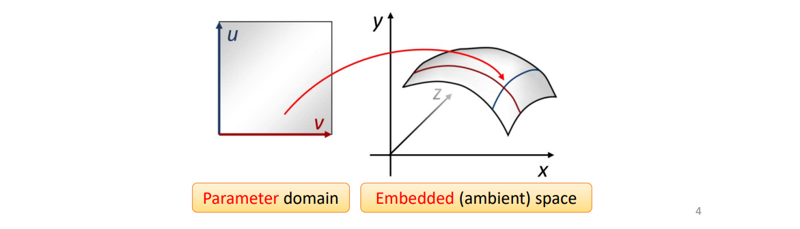    

## 逆问题：参数化(Parameterization)   

• 问题：给定一张曲面，如何找其二维的参数定义域？   
• 又称为：曲面展开(flattening)   

> Find a mapping \\(𝑓: 𝑆 ⊂ 𝑅^3 → Ω ⊂ 𝑅^2 \\)   

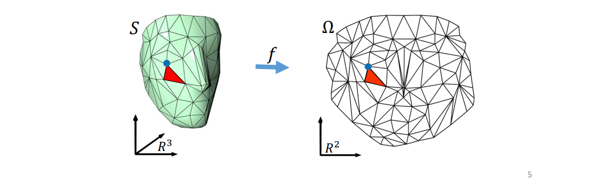    

# 参数化

## 参数化的重要性   

• 例子：B样条曲面拟合   

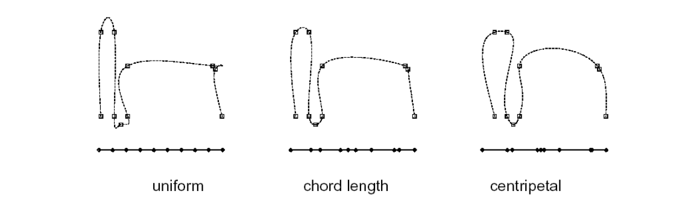    

# 参数化期望保持的几何性质   

• 保角映射(angle‐preserving)：conformal（共形）    
• 保面积映射(area‐preserving)：authalic    
• 等距映射(isometric)：conformal + authalic    

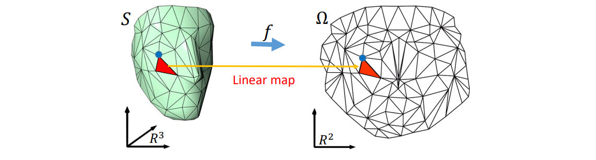    

• \\(f\\) is approximated by **piecewise linear maps** between pairs of triangles    

# Isometric Flattening    

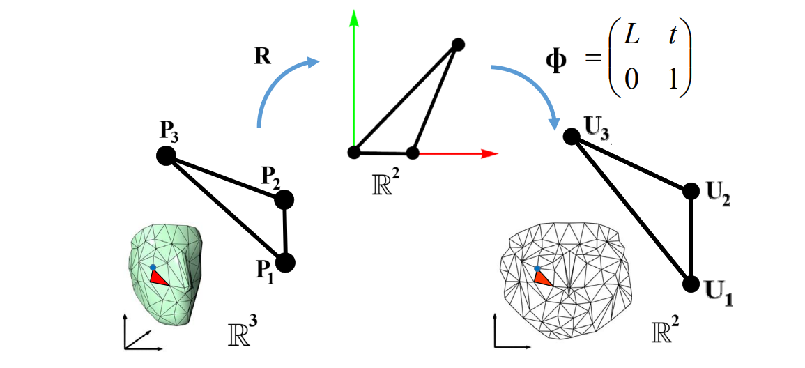    

> R 把3D三角形旋转为平面三角形。    
\\(\phi \\)是两个平面三角形之间的变形。扭曲都来自\\(\phi \\)    

\\(\phi 是奇况矩阵，因此2D是3×3.扭曲都来自L(2×2)\\)          

# Distortion Measure    

$$
L=U\begin{pmatrix}\sigma_1  & 0
\\\\0  &\sigma _2
\end{pmatrix}V^*
$$

$$
\sigma _2\ge \sigma _1
$$

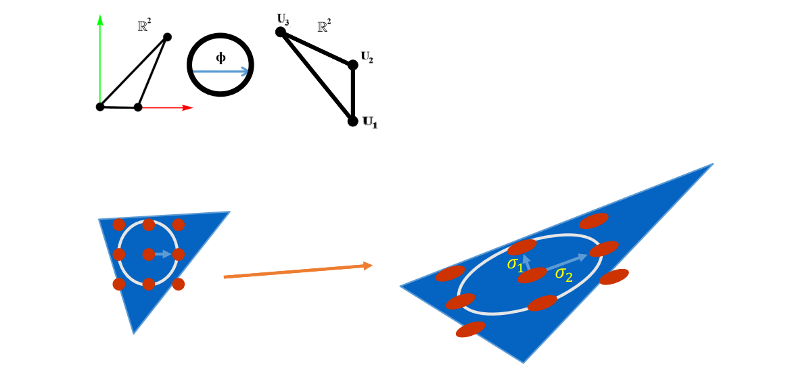    

> \\(L 是 2×2， 做SVD, \sigma_{1}和\sigma_{2}\\)是奇异值。　    

• angle‐preserving (conformal) \\(\sigma _1=\sigma _2\\)   

• area‐preserving (authalic) \\(\sigma _1\sigma _2\\)    

• length‐preserving (isometric) \\(\sigma _1=\sigma _2=1\\)   

# Desired Property

## Low distortion    

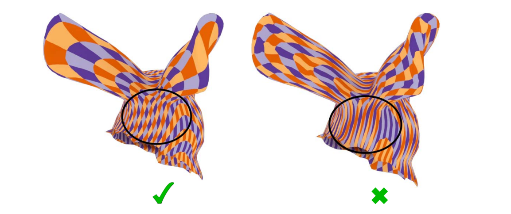    

High distortion    

## Local Injectivity   

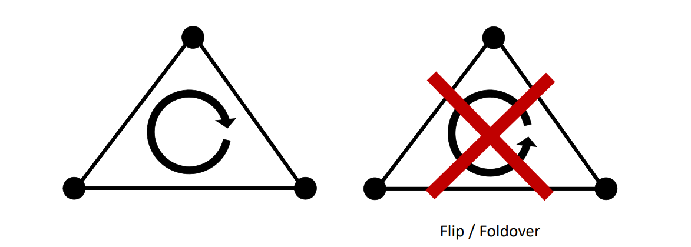    

> 翻转\\(\sigma_{1}\cdot \sigma_{2}<0 \\)     

## Flip free triangles    

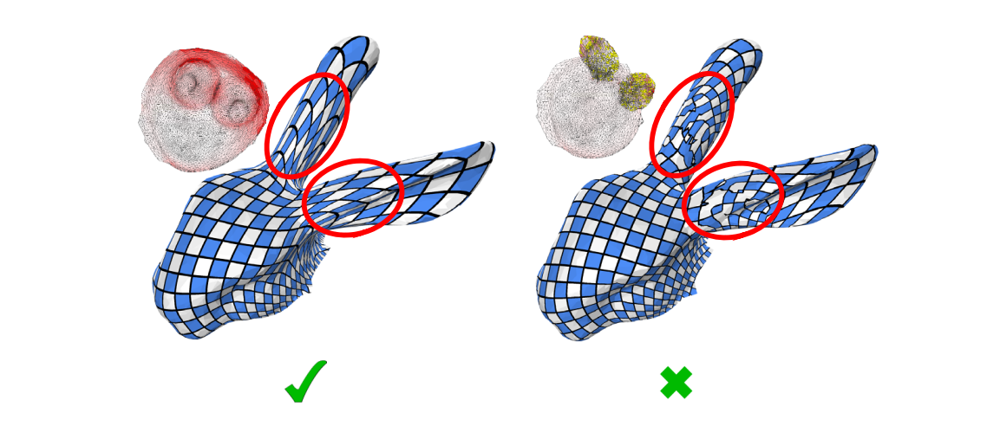    

Flip/Foldover triangles    

## Distortion (Flip/Foldover)    

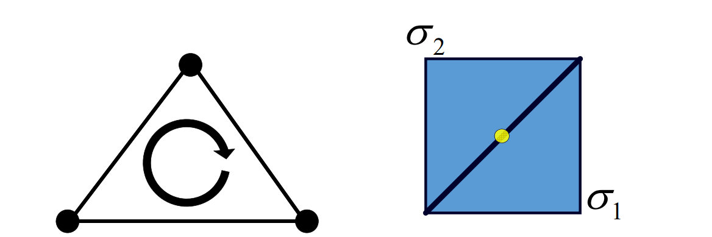    
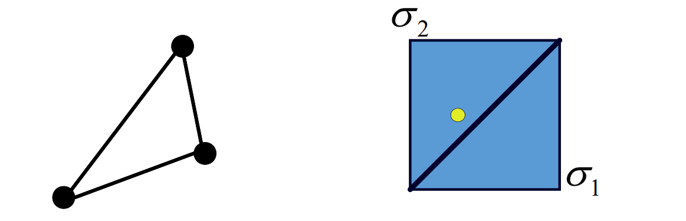    
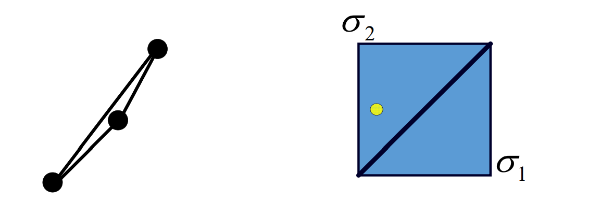    
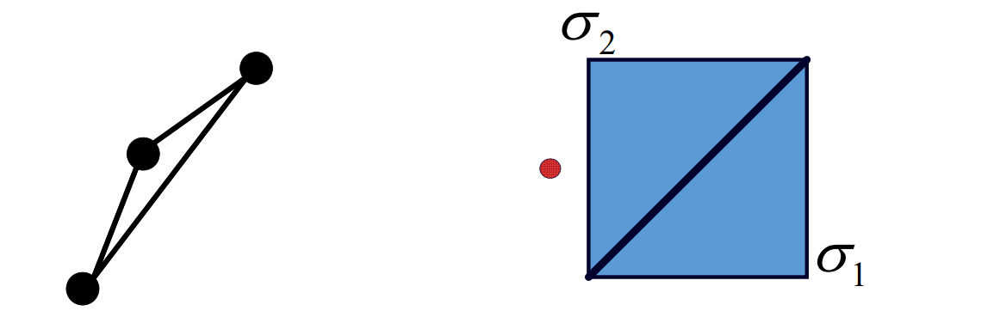    

# Methods of Mesh Parameterization    

* Tutte’s method and its variants   
• Tutte’s method [Tutte 1963; Floater 1997, 2003]   
• Variants [Weber and Zorin 2014; Aigerman and Lipman 2015,  2016; Aigerman et al. 017; Bright et al. 2017; ]    
* Geometry‐based optimization methods   
• Representation based methods [Sheffer and Sturler 2001;  Sheffer et al. 2005; Chien et al. 2016b; Fu and Liu 2016]     
• ARAP [Sorkine and Alex 2007; Liu et al. 2008]   
• Bounded distortion methods [Lipman 2012; Aigerman et al. 2014; Kovalsky et al. 015]     
* Foldover free guaranteed optimization methods    
• [Smith and Schaefer 2015; Kovalsky et al. 2016; Jiang et al. 2017; Claici et al. 2017; Rabinovich et al. 2017; Shtengel et al.  2017; Zhu et al. 2018]    

## Tutte’s embedding method   

&#x2705; Map the triangulation within a **convex** boundary by solving a sparse linear system    

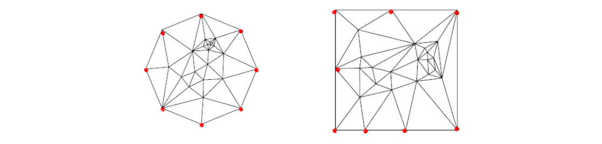    

$$
p_i=\sum_{({j:(i,j)\in edges})}\lambda_{i,jk}p_k,\sum_{k=1}^{d_i} \lambda_{i,jk}=1,\lambda_{i,jk}>0
$$

[Floater. Parametrization and smooth approximation of surfaces. CAGD 1997.]   

> 外部点：映射到 convex boundary 上。   
内部点：l 邻域点的线性组合，权自己定义。   
通过求解稀疏方程组确定点的位置。   
优点：简单、不翻转。    
缺点：扭曲大。  

&#x2705; Foldover‐free result with a theoretical **guarantee**    

> Theorem [Tutte,63], [Maxwel,1864] :    
• If G=<V,E> is a 3‐connected planar graph (triangular mesh)
then any barycentric embedding provides a valid parameterization.     

$$
Wx=b_x
$$

$$
Wy=b_y
$$

$$
W_{ij}\begin{cases}
 <0 &   (i,j)\in E\\\\
-\sum_ {j\ne i}w_{ij}   & (i,j)\\\\
0  & otherwise
\end{cases}
$$

W is symmetric: \\(w_{ij}=w_{ji}\\)     

&#x2705; Usually **high distortion**    

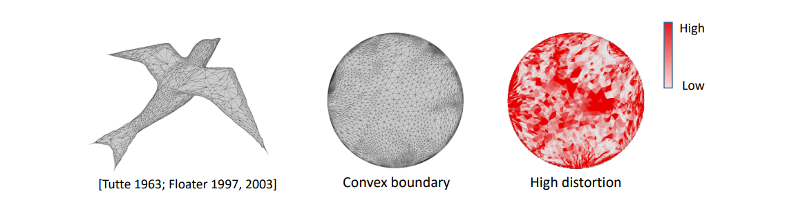    

### Variants of Tutte’s embedding method
&#x2705; Foldover‐free result with theoretical **guarantees**    

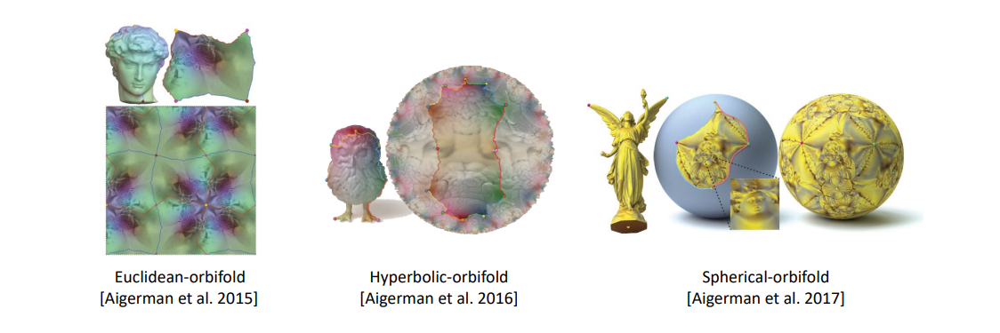    

## Angle Based Flattening (ABF) & ABF++    
[Sheffer and Sturler 2001; Sheffer et al. 2005]    

* Triangular 2D mesh is defined by its angles    
• Define problem in angle space    
* Angle based formulation    
• Distortion as function of angles    
• Validity ‐ set of angle constraints    

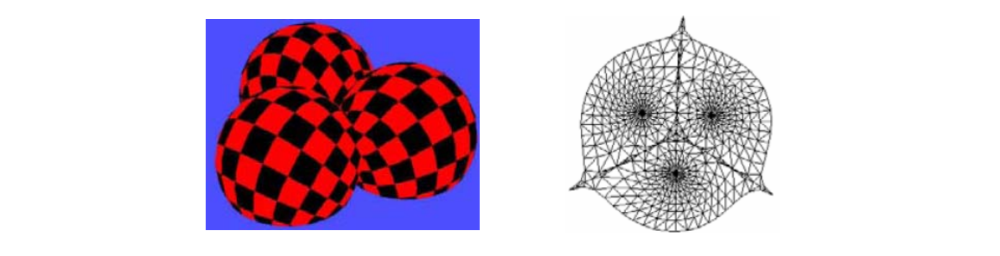     

> 基于角度的展开，把角度当作变量，求解参数化的网格 
   
### Constrained Minimization    

• Notations:    

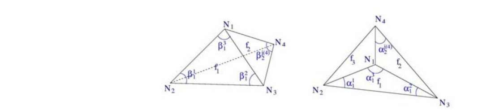     

• Objective: minimize (relative) deviation of angles     

$$
F(\alpha )=\sum_{i,j}w_i^j(\alpha _i^j-\beta _i^j)^2
$$

Initial choice for weights:    

$$
w_i^j=\beta  _i^{j^-2}
$$

### Constraints    

• To avoid flipped triangles   

$$
g^1(\alpha )\equiv \alpha _i^j\ge \varepsilon
$$

$$
g^2(\alpha )\equiv \alpha _i^1+\alpha _i^2+\alpha _i^3=\pi 
$$

$$
g^3(\alpha )\equiv \sum _k\alpha _i^j(k)=2\pi 
$$

$$
g^4(\alpha )\equiv \prod _k\sin(\alpha _i^{j(k)-1})-\prod _k\sin(\alpha _i^{j(k)+1})=0
$$

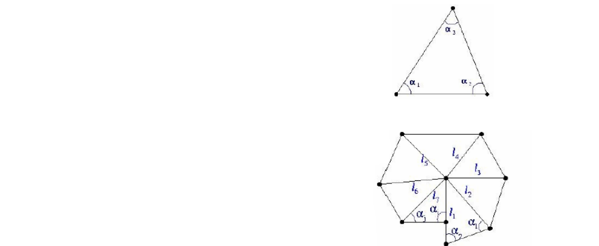     

$$
\frac{l_1}{l_2} =\frac{\sin(\alpha _1) }{\sin(\alpha _2) } 
$$

$$
\frac{l_1}{l_2} \cdots \frac{l_2}{l_1}=\frac{\sin(\alpha _1) }{\sin(\alpha _2) }\cdots \frac{\sin(\alpha _i) }{\sin(\alpha _j) }  
$$

### Solution    

• Use Lagrange Multipliers    

$$
F^*(\alpha ,\mu )=F(\alpha )+\mu _1g^2(\alpha)+\mu _2g^3(\alpha)+\mu _3g^4(\alpha )
$$

• Solve the min‐max problem (minimum on α, maximum on µ)   

$$
\min_{\alpha } \max_\mu F^*(\alpha ,\mu )
$$

• Reached when all derivatives are zero    
• Have non‐linear system of equations    
• Use Newton method to solve    

> 用 Lagrange 算法解带约束的优化问题   

### Examples    

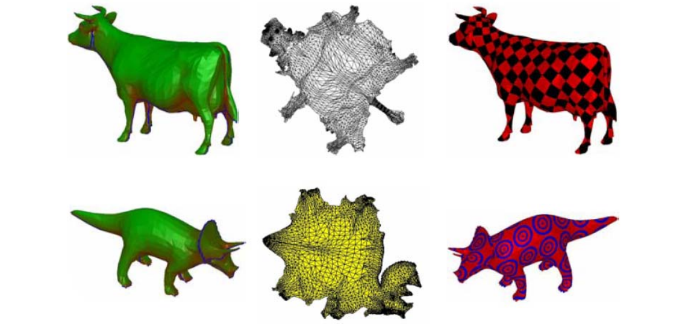     

## As‐rigid‐as‐possible (ARAP) [Liu et al. 2008]     

* Measuring the approximation between the linear mapping and the rigidity (the optimal rotation)   
* Local/global optimization    
• Local: compute singular values    
• Global: solve linear systems    
* No theoretically guaranteed to avoid foldovers     

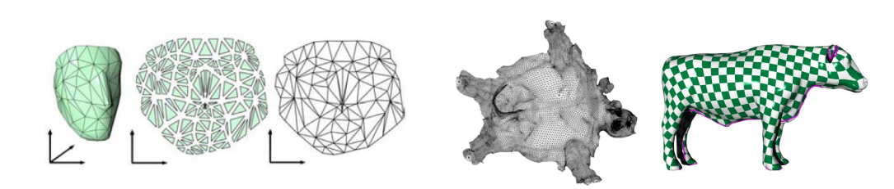     

[Ligang Liu et al. A Local/Global Approach to Mesh Parameterization.  SGP 2008.]    

## Simplex Assembly [Fu and Liu 2016]    

&#x2705;Instead of vertex positions, treat the affine transformation as variables    
&#x2705;Use a barrier function to prevent the inversion    
&#x2705;No theoretically guaranteed to avoid foldovers        

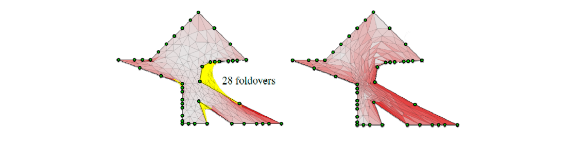     

> [Fu and Liu. Computing Inversion‐Free Mappings by Simplex Assembly. Siggraph Asia 2016]    

> 优化三角形变换的系数     

## Flip‐free parameterization methods     

* Start with a flip‐free (valid) initialization    
* Reducing the distortion while guaranteeing the validity    
• Generally non‐convex nonlinear optimization    

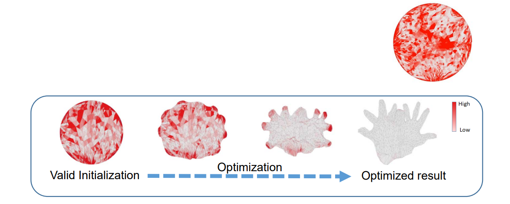     

### Low distortion cost functions     

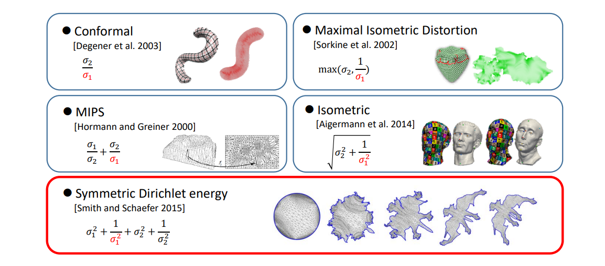     

### Formulation of Optimization    

$$
\min_{V} E(V)=\sum _{t\in T}(\sigma _1^2+\frac{1}{\sigma _1^2} +\sigma _2^2+\frac{1}{\sigma _2^2})
$$

s.t  \\(\sigma _1\sigma _2>0,\\)  \\(\forall t\\)    

• The cost function is highly **nonlinear** and **nonconvex**   
• The constraints are **nonlinear**    
• The Heissian matrix is highly **non‐definite**     

> Computationally expensive for large scale meshes!   

### Solver for the optimization    

Input: a valid parameterization initialization \\(𝑥_0\\)    
Repeat    
\\(p=-H^{-1}\nabla E(x)\\) How to find a good decent direction?   

\\(𝛼_{max}\\)← injective maximal search step    
\\(𝛼\\) ←line search by backtracking from \\(𝛼_{max}\\)        
\\(x ← 𝒙 + 𝛼p\\)    

Until converged    
**Output**: a locally injective parameterization     

### Maximal Search Step    

&#x2705; Explicitly limit the maximal line search step to 
prevent foldover    

$$
det\begin{pmatrix}(U_2+V_2t)-(U_1+V_1t)
 \\\\(U_3+V_3t)-(U_1+V_1t)
\end{pmatrix}=0
$$

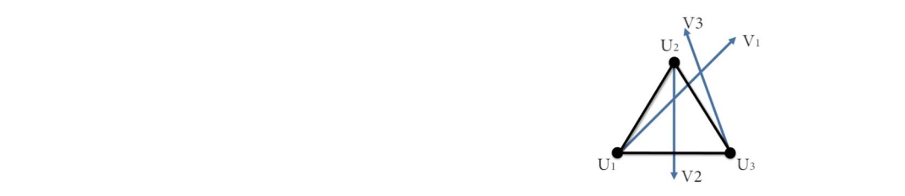  

&#x2705; Use a locally supported barrier function to 
prevent the boundary collision    

$$
\max  (0,\frac{\in }{dist(U_i,\overline{U_1U_2}) } -1)^2
$$

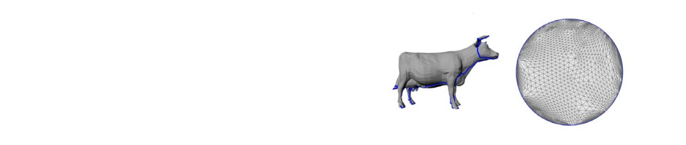     

&#x2705; Solver: L‐BFGS    

> Smith and Schaefer. Bijective Parameterization with Free Boundaries. Siggraph 2015.    

> 以 Tuttle 算法为基础，调整边界点位置，减少扭曲  
度量扭曲的方法[22:43]（最后一个最常用）    
局限性：非线性、非凸问题、且参数多    
因此优化效率低  

## Accelerated Quadratic Proxy (AQP)   

&#x2705; **H** = discrete Laplacian L    
&#x2705; Acceleration     
&#x2705; First‐order metho    

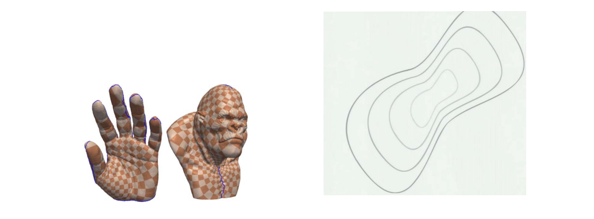     

> Kovalsky et al. Accelerated Quadratic Proxy for eometric Optimization. Siggraph 2016.     

> 利用离散 Laplacian 作为 Hessian 的近似     
SLIM: \\(\dots ，加机 \dots \\)     
ANVF:\\(\dots 向量场算子\dots\\)      
CM：使用隐式 Laplacian 矩阵，二阶方法、速度更快   
各种方法都是找更好的H近似，使得优化过程更快更稳定。    

## Scalable Locally Injective Mappings (SLIM)

&#x2705; **H** = reweighted Laplacian L    
&#x2705; Compute the weight matrix \\(W_J\\) by the matching  gradients condition     

$$
\nabla_JE_W^R = \nabla_JE_{RI}
$$

&#x2705; Quickly recovers from a bad initialization, but slowly converge to a local minimum     
&#x2705; First‐order method    

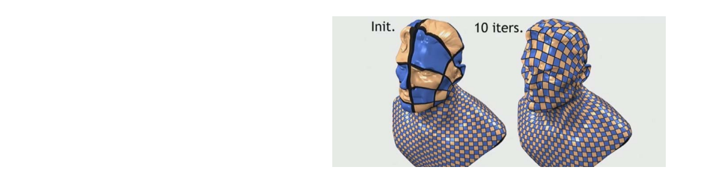     

> Rabinovich et al. Scalable Locally Injective Mappings. Siggraph 2017.   

## Isometry‐Aware Preconditioning (AKVF)   

&#x2705; **H** = approximate killing vector field perator \\(K(x)\\)    
&#x2705; \\(K(x)\\) converts the local distortion gradient into a global near‐rigid decent direction     
&#x2705; First‐order method    

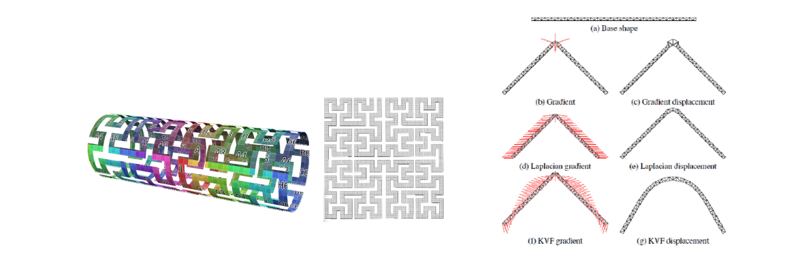     

> Claici et al. Isometry‐Aware Preconditioning for Mesh Parameterization. SGP 2017.     

## Composite Majorization (CM)   

&#x2705; Use a tight convex proxy to approximate the 
objective function by convex‐concave decomposition    

$$
E=E^++E^-
$$

&#x2705;  \\(H = \nabla^2E^+\\)     
&#x2705; Second‐order method    

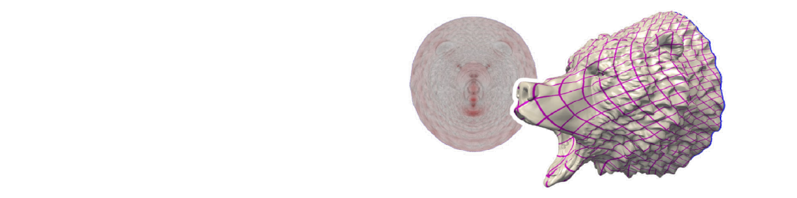     

> Shtengel et al. Geometric Optimization via Composite Majorization. Siggraph 2017.

## Blended Cured Quasi‐Newton (BCQN)    

&#x2705; Blended quasi‐Newton method    
&#x2705; Barrier‐aware line search filtering     
&#x2705; Second‐order method    

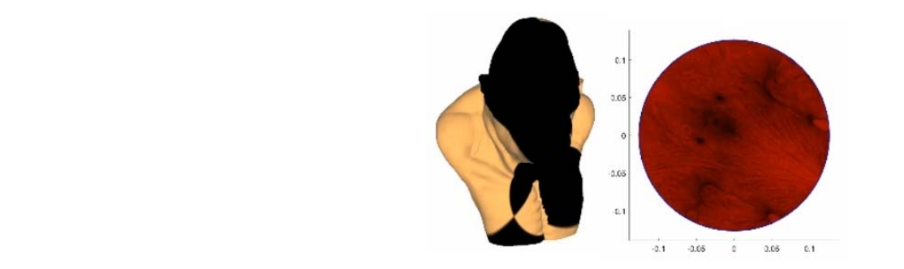     

> Zhu et al. Blended Cured quasi‐Newton for Distortion Optimization. Siggraph 2018.

# Progressive Paramerization    

* Key observations    
• Near‐degenerate triangles (i.e., large distortion) in the initializations by Tutte’s method    
• Small iterative step and slow convergence in existing methods    
• Key: even one **extremely large distortion** term can **restrict** the line search **step** size!    

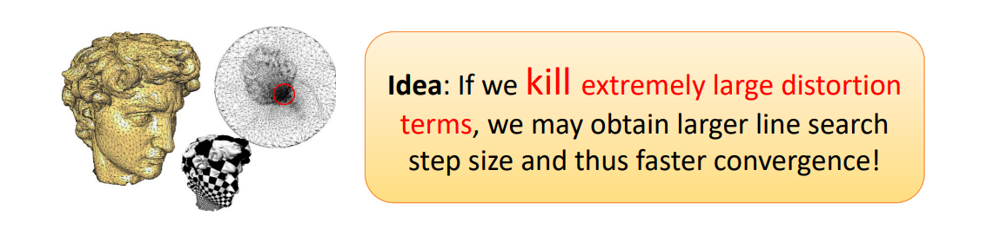     

> [Ligang Liu et al.  Progressive Parameterizations. Siggraph 2018]     

> 问题描述：   
[图28:52]了脖子为边界.头挤在中间，中间扭曲很大⇒能量大⇒下降慢     
解决方法：    
[图29:29] 不优化整体，而是中间那区域     
*个人感觉不 make sense *    
[图30:35]

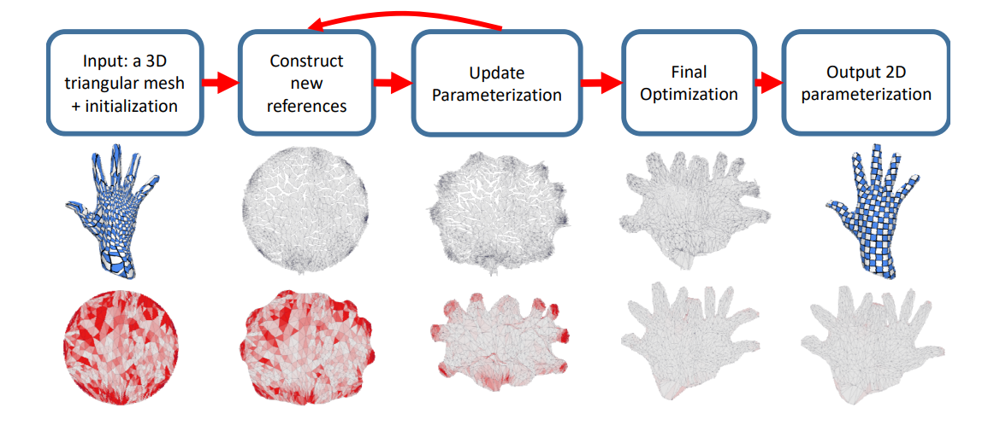     

> [Ligang Liu et al.  Progressive Parameterizations. Siggraph 2018]   

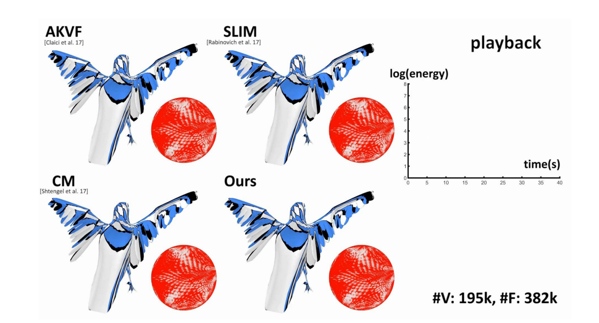     

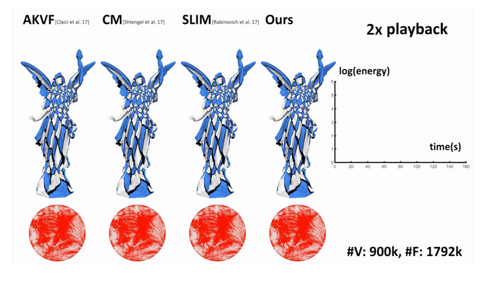     

