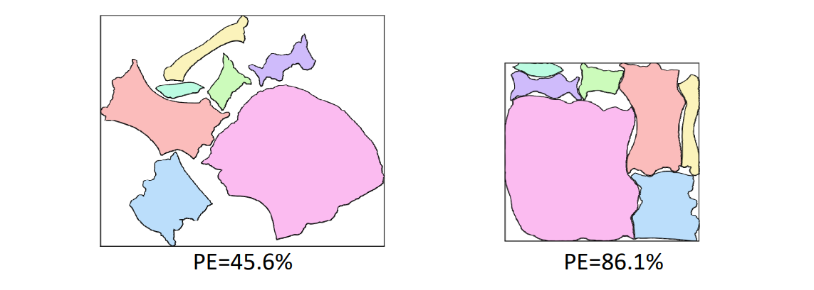
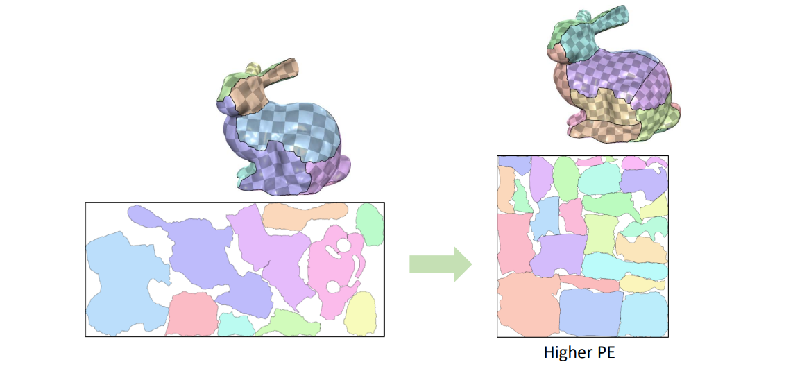
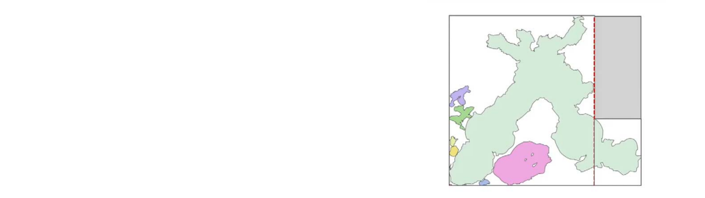
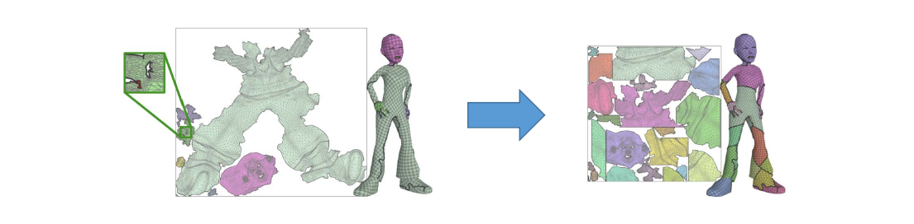
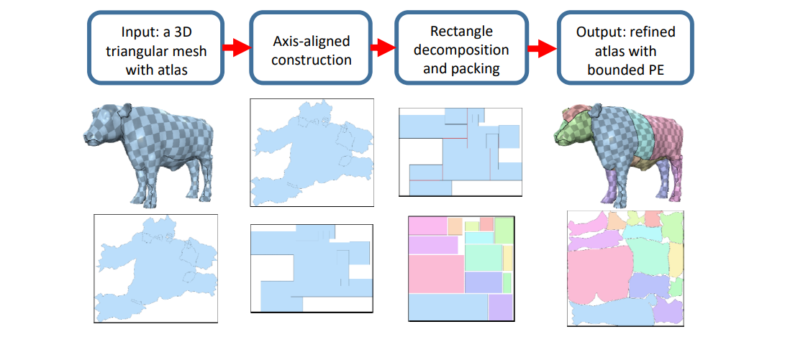

# 纹理地图：多片参数化    

Texture Atlas，Multi‐charts Parameterization    

> [43:48]     
单片参数化扭曲大，因此切成小片，分别参数化、再拼起来。    
拼起来时尽量少的面积浪费[44:54]，即Minimizing **Packing Efficiency** (**PE**)      

     

# Atlas Generation 集装箱问题    

* Low Distortion   
• [Golla et al. 2018; Liu et al. 2018; Shtengel et al. 2017; Zhu et al. 2018]    
* Consistent orientation     
• [Floater 2003; Tutte 1963; Claici et al. 2017; Hormann and Greiner 2000; Rabinovich et al. 2017; Schüller et al. 2013]    
* Bijection    
• [Jiang et al. 2017; Smith and Schaefer 2015]    
* Low boundary length    
• [Li et al. 2018; Poranne et al. 2017; Sorkine et al. 2002]    
* Packing efficiency    
• Box cutter [Limper et al. 2018]    
• **Bounded Packing Efficiency** [**Liu et al. 2019**]    

# Atlas Refinement: Higher PE   

     

# Box Cutter [Limper et al. 2018]    

* Atlas refinement    
• Remove overlaps    
• Improve **packing efficiency**    

     

* No additional distortion
* Bounded boundary length elongation   

     

> Boater:割开与填补    

# Bounded Packing Efficiency   

     

> [Liu et al. Atlas Refinement with Bounded Packing Efficiency. Siggraph 2019.]    

> 把网格参数化为box align.装箱之后再对边界优化     
