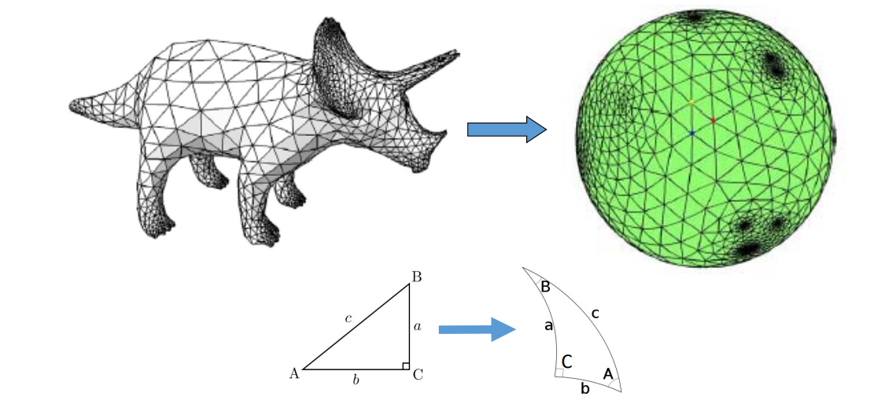
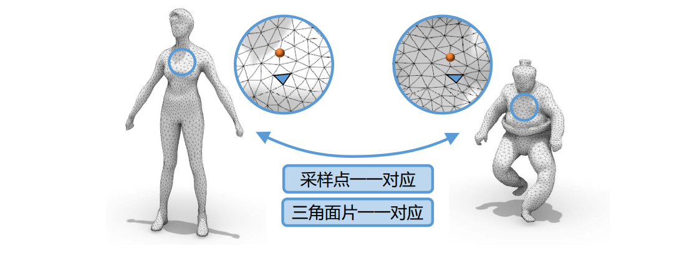

# 球面参数化   

# 问题：球面参数化    

• 输入：亏格为0的封闭曲面（拓扑同胚于球面）    

     

# 球面参数化的主要方法   

* Direct methods    
• [Kent et al. 1992], [Kobbelt et al. 99], [Gu et al. 03]    
* Optimization methods    
• [Sheffer et al. 04], [Li et al.06&07], [Zayer et al.06], [Friedel et al., 07], [Kazhdan et al. 2012], [Wan et al. 
12&13], [Wang et al., 14&16]    
* Coarse‐to‐fine methods    
• [Praun and Hoppe 04], [Tang et al. 16], [Hu et al. 17]   

# Our Works on Spherical Parameterization    

<http://staff.ustc.edu.cn/~lgliu>   

# Mapping between Mesh Surfaces    

\\(\star\\) 相容性网格（Compatible mesh）：一组具有相同连接关系且与给定模型形状近似的网格    

     

# Our Works on Compatible Mappings    

<http://staff.ustc.edu.cn/~lgliu>    

# 总结：曲面参数化    

• 几何处理的基本问题：大量的应用    
• 是一个从3D到2D的降维问题：将几何数据表达为图像     
• 特殊的几何结构（三角网格）：特殊的优化方法    
• **Next**: 大型场景的压缩、传输、调度、渲染…    

# Future Work and Challenges     

* Fundamental problem for CG     
(geometry/simulation/rendering)   
* Trade‐of quality/efficiency/complexity    
* Coupled solution    
• Parameterizaiton, cutting, atlas    
* Other methods     
• Diffusion for optimization    
• Better initializations than Tutte’s method    
• Learning based methods    

