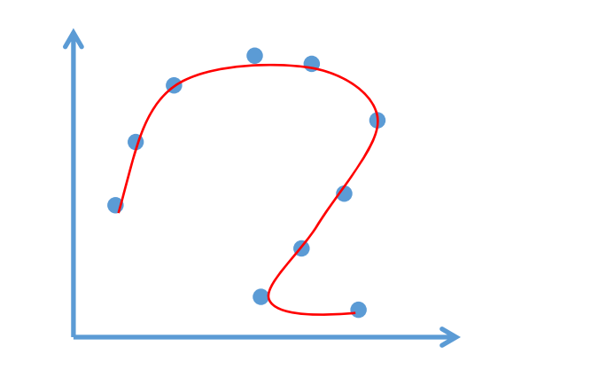
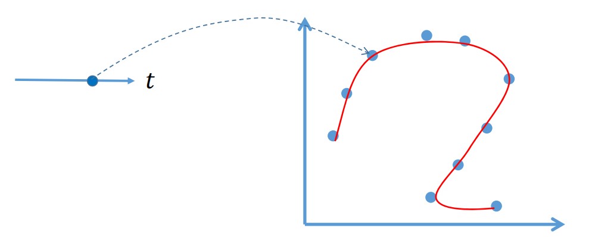
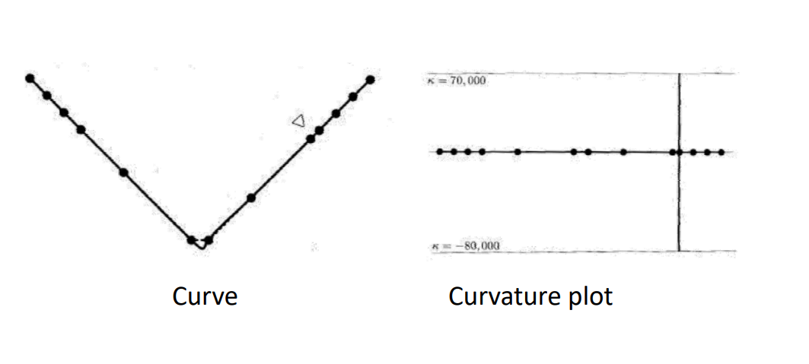
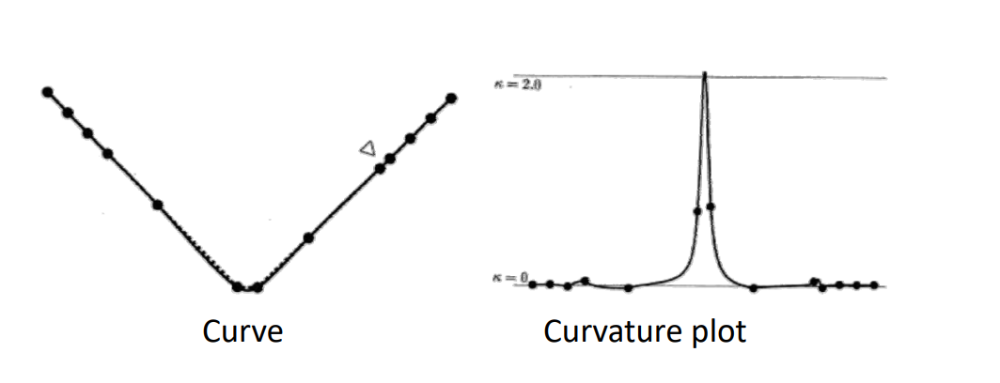
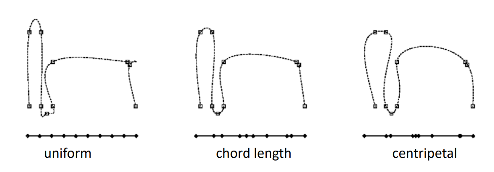
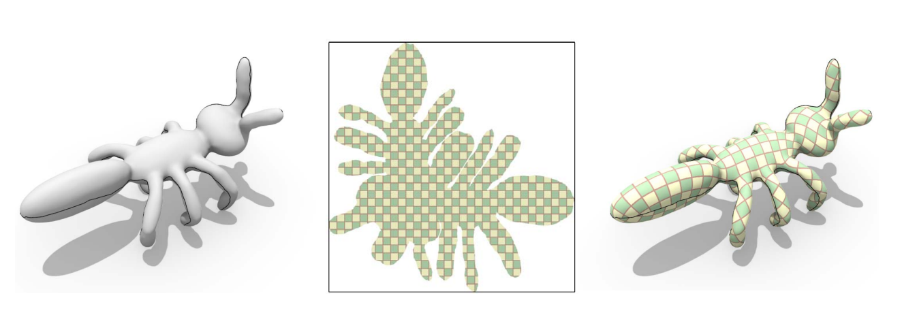

> [42:43]

# 曲线拟合问题

• 输入：给定平面上系列点\\((x_i,y_i),i=1,2,...,n\\)     

• 输出：一条参数曲线，拟合这些点   

$$
f:R^1 → R^2 
$$ 

$$
\begin{cases}
 x=x(t)\\\\
y=y(t) 
\end{cases}
$$

$$
t\in [0,1]
$$

  

> [42：50]图,非函数型
> \\(x=x(t)\\)，用\\(x(t)\\)拟合数据点\\(x_i\\)，但\\(x_i\\)与\\(t\\)没有关系，需要人为构造这个关系。即构造\\((t_i,x_i)\\)，这个过程称为参数化，\\(t_i\\)是参数。    
\\(x(t)\\)拟合点\\((t_i,x_i)\\)，\\(y(t)\\)拟合点\\((t_i,y_i)\\)  

**应该怎么做？**   

# 曲线参数化

   

$$
\begin{cases}
 x=x(t)\\\\
y=y(t) 
\end{cases}
$$

$$
t\in [0,1]
$$

> 矢量符号化表达：
$$
p=p(t)=\binom{x(t)}{y(t)} 
$$

问题：对数据点\\((x_i,y_i)\\)，对应哪个参数\\(𝑡_i\\)？  
答：求数据点所对应的参数（点列的参数化）：一个降维的问题！      

> 构造\\((t_i,x_i)\\)和\\((t_i,y_i)\\)主要是如何取\\(t_i\\)   
通常\\(t_0=0,t_n=1\\)    

然后极小化误差度量：  

• 误差度量： 
$$
E= {\textstyle \sum_{i=1}^{n}} ||\binom{x(t_i)}{ y(t_i)}-\binom{x_i}{y_i} ||^2= {\textstyle \sum_{i=1}^{n}}||p(t_i)-p_i||^2
$$

## Equidistant (uniform) parameterization     

• \\(𝑡_{i+1}-𝑡_i=const\\)   
• \\(e.g.𝑡_i=i\\)   
• Geometry of the data points is not considered     

 

> 用 uniform 角处比较尖锐，更好的参数化方法会得到更平滑的曲线。

## Chordal parameterization      
• \\(𝑡_{i+1}-𝑡_i=||k_{i+1}-k_i||\\)    
• Parameter intervals proportional to the distances of
neighbored control points      

> Chordal 参数的距离与点的距离成正比    

  

## Centripetal parameterization   
• \\(𝑡_{i+1}-𝑡_i=\sqrt{||k_{i+1}-k_i||} \\)  

   

## Foley parameterization     
• Involvement of angles in the control polygon      

$$
t_{i+1}-t_i=||k_{i+1}-k_i||\cdot (1+\frac{3}{2}\frac{\hat{\alpha } _i||k_{i}-k_{i-1}||}{||k_i-k_{i-1}||+||k_{i+1}-K_i||}+\frac{3}{2} \frac{\hat{\alpha}_{i+1}||k_{i+1}-k_i|| }{||k_{i+1}-k_i||+||k_{i+2}-k{i+1}||}  )
$$

with

$$
\hat{\alpha } _i=\min (\pi -\alpha _i,\frac{\pi }{2} )
$$

and

$$
\alpha_{i}=angle(k_{i-1},k_i,k_{i+1})
$$

  

## 四种方法的比较  

   

点的参数化对曲线拟合的影响很大，需要**好的参数化**！  

> 参数化的本质是降维。    
如果降维的维度不对。或维度对了但分布不好，都会导致降维结果不好。[58:40]

# 曲面参数化  

• 三维的点找二维的参数：一个降维的问题！   

   

> 参数化约束，保持边长、网格面积。角度，就能得到比较好的参数结果。    

## 曲面参数化的应用

- 纹理映射  

   

- 地图绘制     

可展曲面展成平面不会扭曲。    
球面不可展，展开必定扭曲。  