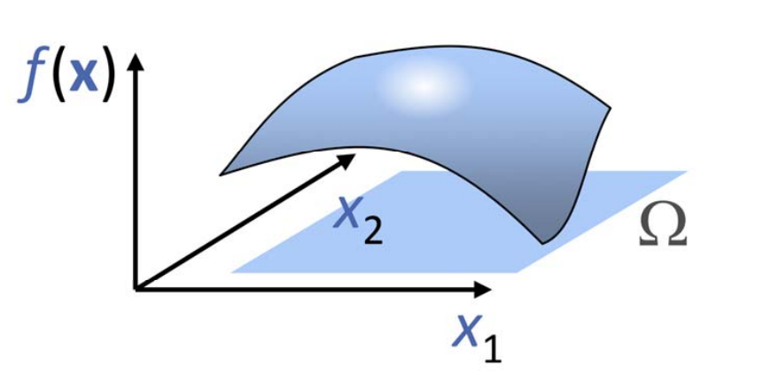
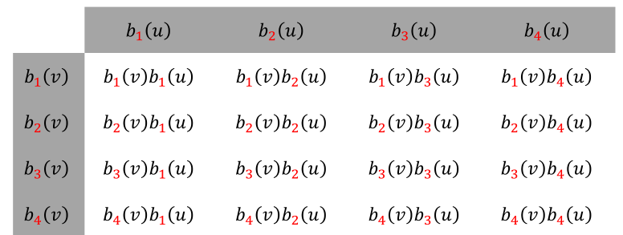
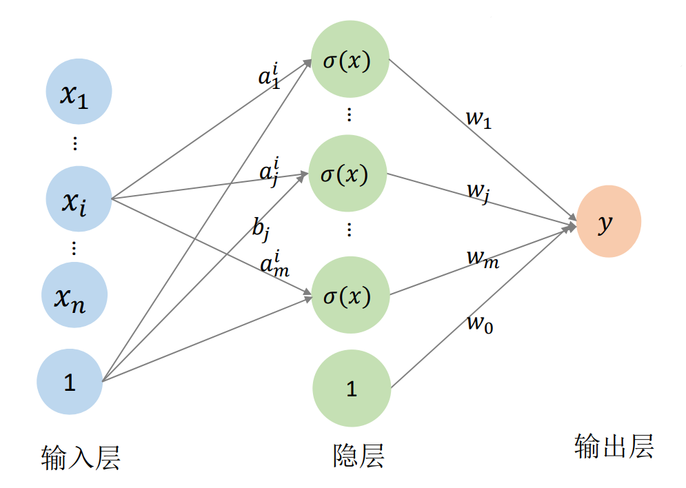

# 多元函数（多变量）

$$
f: R^n \rightarrow R^1
$$

$$
\begin{pmatrix}x_1
 \\\\\vdots 
 \\\\x_n
\end{pmatrix}
\rightarrow y
$$

$$
y = f(x_1,x_2, \cdots, x_n)
$$

例子：通过升级实现二元函数的可视化
$$
z=f(x,y),(x,y)\in[0,1]\times[0,1]
$$

  

# 二元函数的基函数构造   

**张量积**，即用两个一元函数的基函数的相互乘积来定义，

例1：二次二元多项式函数\\(z=f(x,y)\\)的基函数{\\(1,x,y,x^2,xy,y^2\\)}   

> &#x2705; [10:23] 例子中幂基最高为二次，因此只取不超过二次的项。   

例2： 以任意函数为基函数

  
> &#x1F446; [11:22] 例子：任意基。横轴和竖轴可以用不同的函数，但很少这样做。

# 多元函数的基函数构造

## 多元函数的张量积定义

优点：**定义简单，多个一元基函数的乘积形式**  
不足：随着维数增加，基函数个数急剧增加，导致**变量急据增加**

> 求解系统规模急剧增加、求解代价大、占用内存空间大

## 多元函数的神经网络表达

用一个单变量函数\\(\sigma (x)\\)（称为激活函数）的不同仿射变换来构造 “基函数”：**基函数数目可控**    
$$
y=f(x_1,x_2,...,x_n)
$$
$$
=w_0+\sum_{j-1}^{m} w_j\sigma (a_j^1x_1+...a_j^ix_i+...+a_j^nx_n+b_j)
$$

  

> &#x1F50E; [16:12]   
> &#x2705; 神网络方式的优点：  
> （1）可以解决张量积方式的维数膨胀问题，因为张量积的维度是指数级增长，而神经网络的\\(m\\)可以控制。  
> （2）有统一的优化方法和优化框架   
> &#x2757; 存在的问题：仍需要调参   

> &#x1F4A1; **我的思考**  
> 能用低维的神经网络代替高维的张量积，是因为，虽然张量积的各维­度独立，但它对于要拟合的数据来说是有冗余的。    
神经网络 hidden layer 的本质，把\\(n\\)维空间的点映射到m维空间的点，网络学习点在不同维度空间中的性质。   

本文出自CaterpillarStudyGroup，转载请注明出处。
<https://caterpillarstudygroup.github.io/GAMES102_mdbook/>
