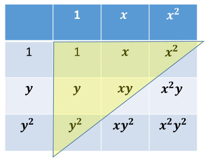
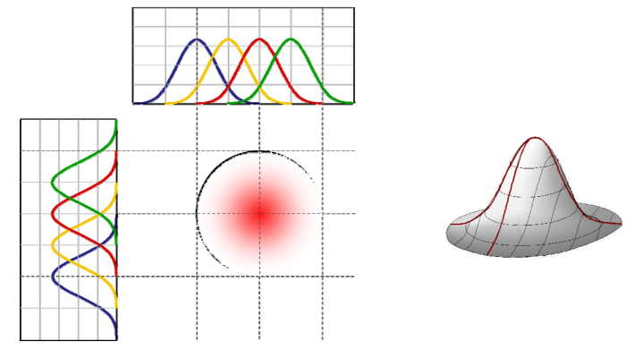

# 多元函数（多变量）
• 多个变量的函数

$$
f: R^n \rightarrow R^1
$$

或

$$
\begin{pmatrix}
x_1 \\
\vdots  \\
x_n
\end{pmatrix} \rightarrow y
$$

或

$$
y = f(x_1, \cdots, x_n)
$$

• 例子：二元函数
𝑓:𝑅 ? → 𝑅 ?
𝑦 ? 𝑓 𝑥 ? ,𝑥 ? ,…,𝑥 ?
𝑥 ?
⋮
𝑥 ?
→ 𝑦

# 二元函数的基函数构造

• 方法：张量积形式，即用两个一元函数的基函数
的相互乘积来定义
• 比如：二次二元多项式函数 的基函数

  
> &#x1F446; [10:23] 例子：幂基

# 三次张量积多项式

# 三次张量积函数

  
> &#x1F446; [13:00] 例子：高斯基

# 张量积基函数

  
> &#x1F446; [11:22] 例子：任意基。横轴和竖轴可以用不同的函数，但很少这样做

# 多元函数的张量积定义

• 优点：**定义简单，多个一元基函数的乘积形式**  
• 不足：  
• 随着维数增加，基函数个数急剧增加，导致**变量急据增加**（求解系统规模急剧增加，求解代价大）

# 多元函数的神经网络表达

• 用一个**单变量函数 （称为激活函数）的不同仿射变换来构造** “基函数”：**基函数数目可控**

  

> &#x1F50E; [16:12] 

